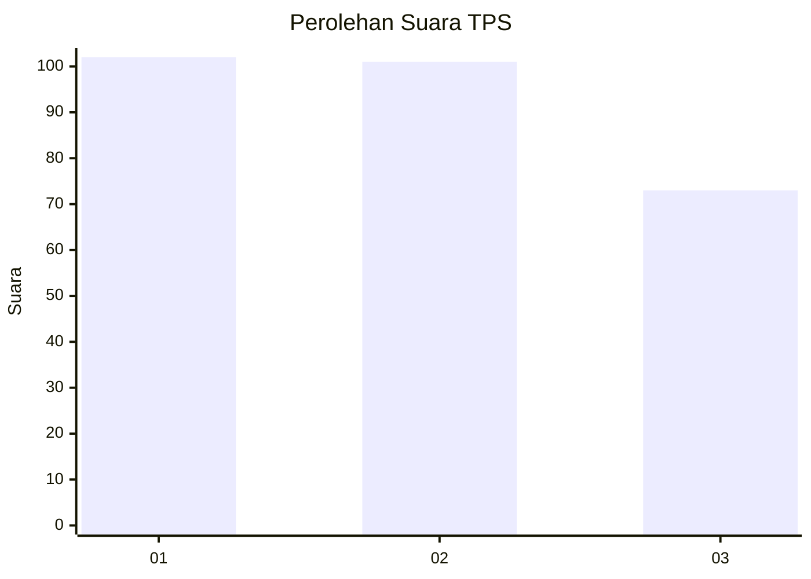
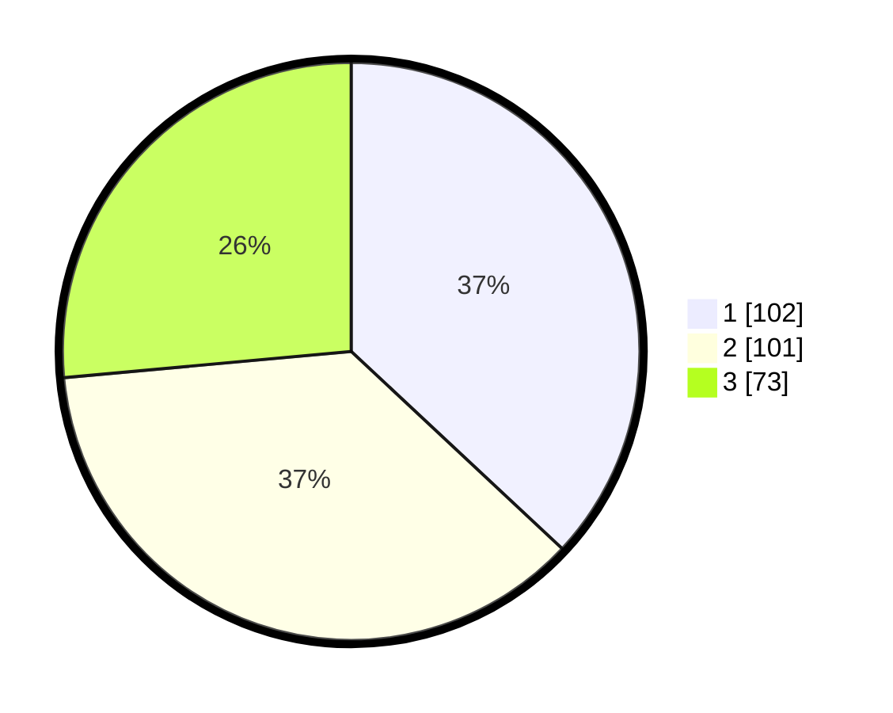

# Hasil

## Grafik

## Tabel

| No. | Nama Paslon    | Suara | Suara (raw) | Persentase |
|:--- |:-------------- | -----:| -----------:| ----------:|
| 1   | ANIES MUHAIMIN | 102   | [102][p-1]  | 36,96      |
| 2   | PRABOWO GIBRAN | 101   | [101][p-2]  | 36,59      |
| 3   | GANJAR MAHFUD  | 73    | [73][p-3]   | 26,45      |

[p-1]: https://github.com/gigit-pemilu/pemilu-2024-35-jawa-timur/blob/main/pilpres/hitung-suara/sub/35-jawa-timur/sub/26-bangkalan/sub/06-geger/sub/2006-geger/sub/019-tps/sub/paslon-1.txt
[p-2]: https://github.com/gigit-pemilu/pemilu-2024-35-jawa-timur/blob/main/pilpres/hitung-suara/sub/35-jawa-timur/sub/26-bangkalan/sub/06-geger/sub/2006-geger/sub/019-tps/sub/paslon-2.txt
[p-3]: https://github.com/gigit-pemilu/pemilu-2024-35-jawa-timur/blob/main/pilpres/hitung-suara/sub/35-jawa-timur/sub/26-bangkalan/sub/06-geger/sub/2006-geger/sub/019-tps/sub/paslon-3.txt

## Foto C Plano

https://sirekap-obj-formc.kpu.go.id/28ce/pemilu/ppwp/35/26/06/20/06/3526062006019-20240214-204048--63fc7b5c-c46b-45fa-9702-2eafa86ce5aa.jpg

https://sirekap-obj-formc.kpu.go.id/28ce/pemilu/ppwp/35/26/06/20/06/3526062006019-20240214-204101--c98d6a62-c4db-4867-aa03-cad9624efbcd.jpg

https://sirekap-obj-formc.kpu.go.id/28ce/pemilu/ppwp/35/26/06/20/06/3526062006019-20240214-204114--0d2765fb-181d-4849-a355-b8c2e6d6a59e.jpg

## Metadata

| Key        | Value               |
| ---------- | ------------------- |
| Time Stamp | 2024-02-19 06:16:00 |

