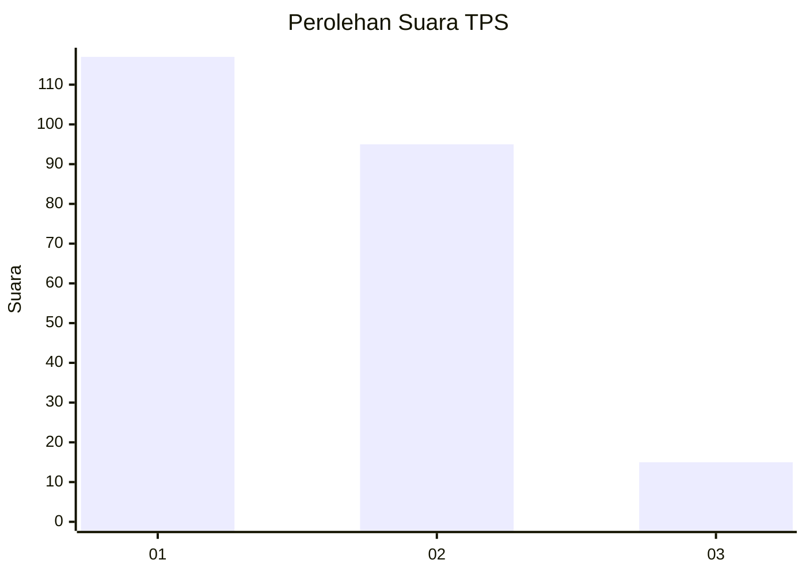
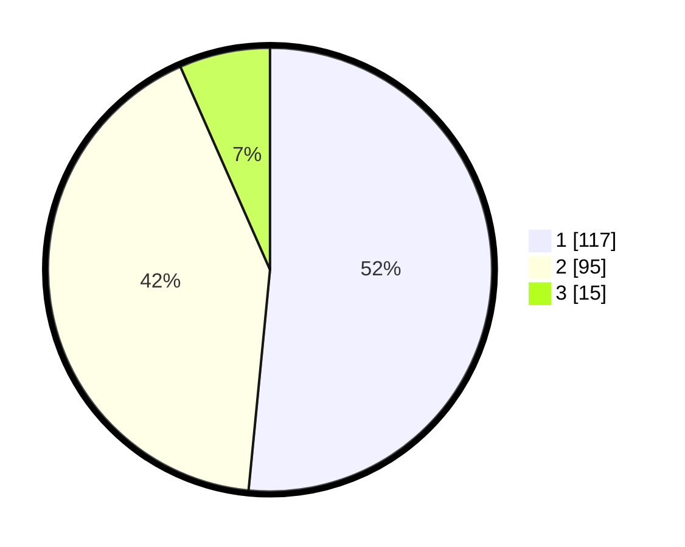

# Hasil

## Grafik

## Tabel

| No. | Nama Paslon    | Suara | Suara (raw) | Persentase |
|:--- |:-------------- | -----:| -----------:| ----------:|
| 1   | ANIES MUHAIMIN | 117   | [117][p-1]  | 51,54      |
| 2   | PRABOWO GIBRAN | 95    | [95][p-2]   | 41,85      |
| 3   | GANJAR MAHFUD  | 15    | [15][p-3]   | 6,61       |

[p-1]: https://github.com/gigit-pemilu/pemilu-2024/blob/main/pilpres/hitung-suara/sub/35-jawa-timur/sub/26-bangkalan/sub/06-geger/sub/2006-geger/sub/020-tps/sub/paslon-1.txt
[p-2]: https://github.com/gigit-pemilu/pemilu-2024/blob/main/pilpres/hitung-suara/sub/35-jawa-timur/sub/26-bangkalan/sub/06-geger/sub/2006-geger/sub/020-tps/sub/paslon-2.txt
[p-3]: https://github.com/gigit-pemilu/pemilu-2024/blob/main/pilpres/hitung-suara/sub/35-jawa-timur/sub/26-bangkalan/sub/06-geger/sub/2006-geger/sub/020-tps/sub/paslon-3.txt

## Foto C Plano

https://sirekap-obj-formc.kpu.go.id/0fa9/pemilu/ppwp/35/26/06/20/06/3526062006020-20240216-201138--c3f7eeee-b857-43f4-989c-07adbd6b7376.jpg

https://sirekap-obj-formc.kpu.go.id/0fa9/pemilu/ppwp/35/26/06/20/06/3526062006020-20240214-224926--1662eb6e-aebd-4298-8ae6-cbbcd0a65a5b.jpg

https://sirekap-obj-formc.kpu.go.id/0fa9/pemilu/ppwp/35/26/06/20/06/3526062006020-20240214-225124--22de6459-7a84-4826-af9e-f8397ed3ec16.jpg

## Metadata

| Key        | Value               |
| ---------- | ------------------- |
| Time Stamp | 2024-02-22 09:00:00 |

