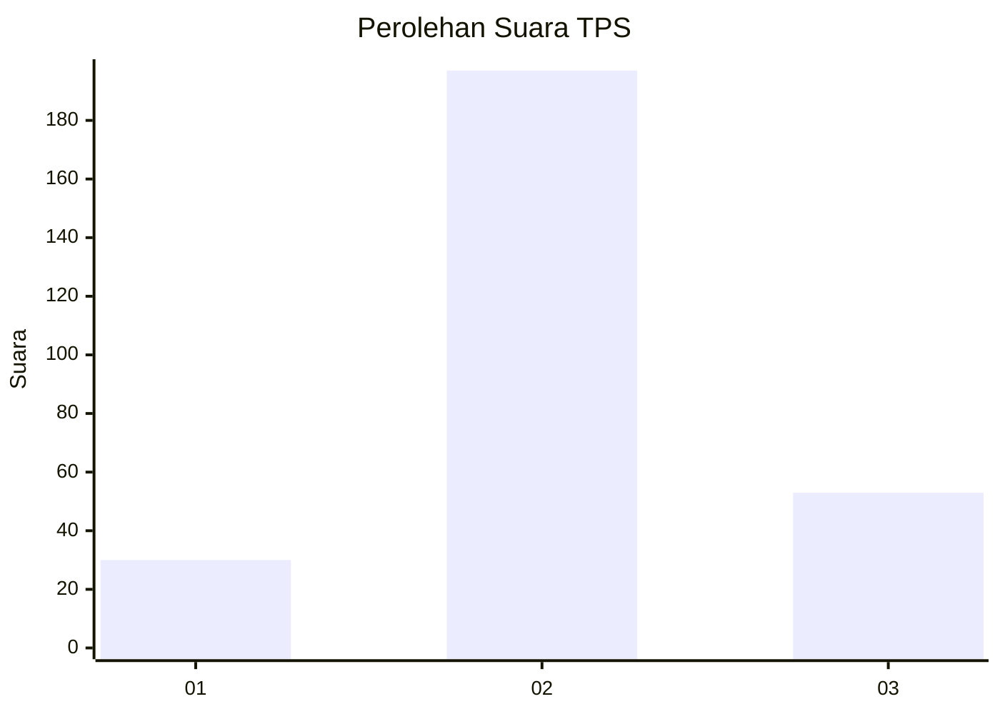
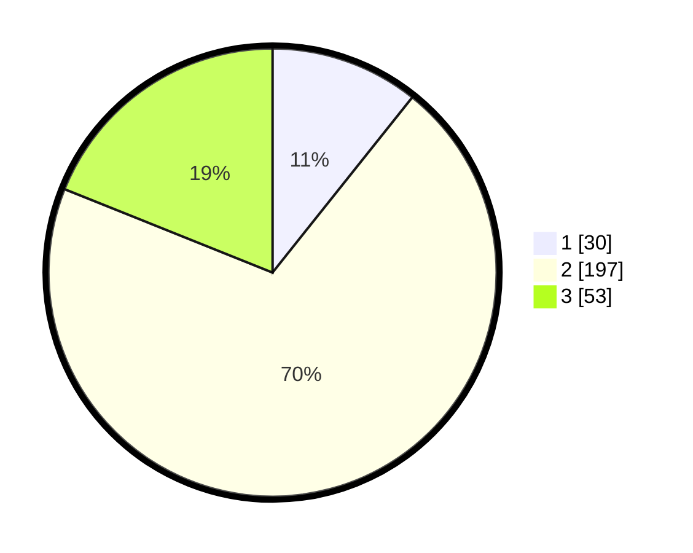

# Hasil

## Grafik

## Tabel

| No. | Nama Paslon    | Suara | Suara (raw) | Persentase |
|:--- |:-------------- | -----:| -----------:| ----------:|
| 1   | ANIES MUHAIMIN | 30    | [30][p-1]   | 10,71      |
| 2   | PRABOWO GIBRAN | 197   | [197][p-2]  | 70,36      |
| 3   | GANJAR MAHFUD  | 53    | [53][p-3]   | 18,93      |

[p-1]: https://github.com/gigit-pemilu/pemilu-2024/blob/main/pilpres/hitung-suara/sub/35-jawa-timur/sub/26-bangkalan/sub/06-geger/sub/2006-geger/sub/021-tps/sub/paslon-1.txt
[p-2]: https://github.com/gigit-pemilu/pemilu-2024/blob/main/pilpres/hitung-suara/sub/35-jawa-timur/sub/26-bangkalan/sub/06-geger/sub/2006-geger/sub/021-tps/sub/paslon-2.txt
[p-3]: https://github.com/gigit-pemilu/pemilu-2024/blob/main/pilpres/hitung-suara/sub/35-jawa-timur/sub/26-bangkalan/sub/06-geger/sub/2006-geger/sub/021-tps/sub/paslon-3.txt

## Foto C Plano

https://sirekap-obj-formc.kpu.go.id/89e3/pemilu/ppwp/35/26/06/20/06/3526062006021-20240214-204723--096acad9-27a3-4e63-ad04-8d21216e275d.jpg

https://sirekap-obj-formc.kpu.go.id/89e3/pemilu/ppwp/35/26/06/20/06/3526062006021-20240214-204817--287a9550-1443-41a3-9b95-cef6db39d41c.jpg

https://sirekap-obj-formc.kpu.go.id/89e3/pemilu/ppwp/35/26/06/20/06/3526062006021-20240214-204831--879858f0-b8fd-48b8-92cb-1014ac12c482.jpg

## Metadata

| Key        | Value               |
| ---------- | ------------------- |
| Time Stamp | 2024-02-19 06:16:00 |

