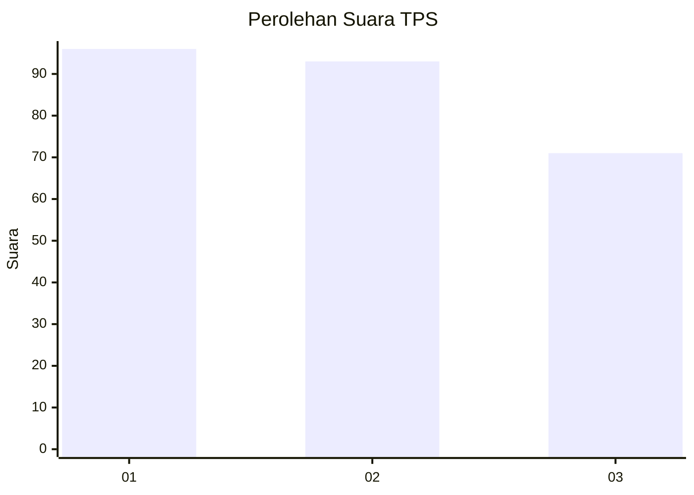
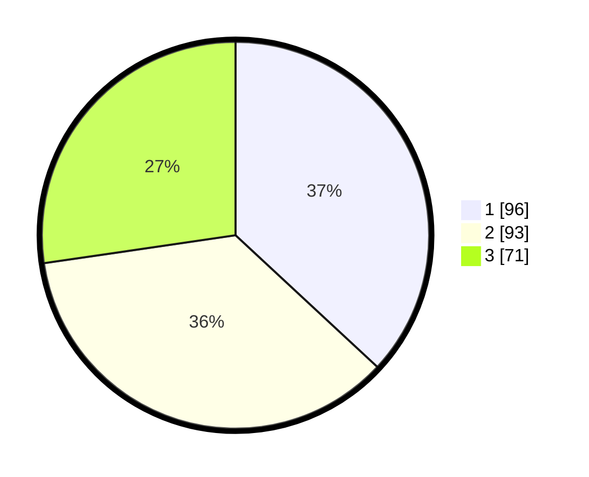

# Hasil

## Grafik

## Tabel

| No. | Nama Paslon    | Suara | Suara (raw) | Persentase |
|:--- |:-------------- | -----:| -----------:| ----------:|
| 1   | ANIES MUHAIMIN | 96    | [96][p-1]   | 36,92      |
| 2   | PRABOWO GIBRAN | 93    | [93][p-2]   | 35,77      |
| 3   | GANJAR MAHFUD  | 71    | [71][p-3]   | 27,31      |

[p-1]: https://github.com/gigit-pemilu/pemilu-2024/blob/main/pilpres/hitung-suara/sub/35-jawa-timur/sub/26-bangkalan/sub/06-geger/sub/2006-geger/sub/022-tps/sub/paslon-1.txt
[p-2]: https://github.com/gigit-pemilu/pemilu-2024/blob/main/pilpres/hitung-suara/sub/35-jawa-timur/sub/26-bangkalan/sub/06-geger/sub/2006-geger/sub/022-tps/sub/paslon-2.txt
[p-3]: https://github.com/gigit-pemilu/pemilu-2024/blob/main/pilpres/hitung-suara/sub/35-jawa-timur/sub/26-bangkalan/sub/06-geger/sub/2006-geger/sub/022-tps/sub/paslon-3.txt

## Foto C Plano

https://sirekap-obj-formc.kpu.go.id/3181/pemilu/ppwp/35/26/06/20/06/3526062006022-20240214-184456--068984c9-5b3b-427a-9d77-400b2cdc552a.jpg

https://sirekap-obj-formc.kpu.go.id/3181/pemilu/ppwp/35/26/06/20/06/3526062006022-20240214-184509--1ad3c9ec-2263-41f5-9c8b-24e0dd8c298a.jpg

https://sirekap-obj-formc.kpu.go.id/3181/pemilu/ppwp/35/26/06/20/06/3526062006022-20240214-162209--95190df2-2218-47a7-98df-11a8c035cc30.jpg

## Metadata

| Key        | Value               |
| ---------- | ------------------- |
| Time Stamp | 2024-02-19 06:16:00 |

