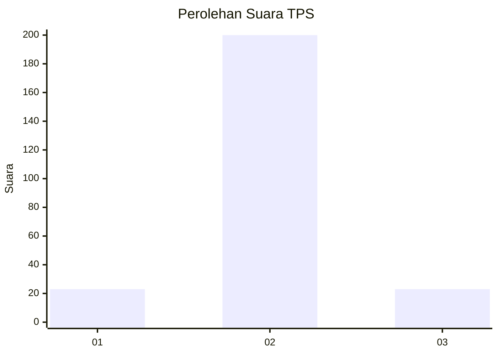
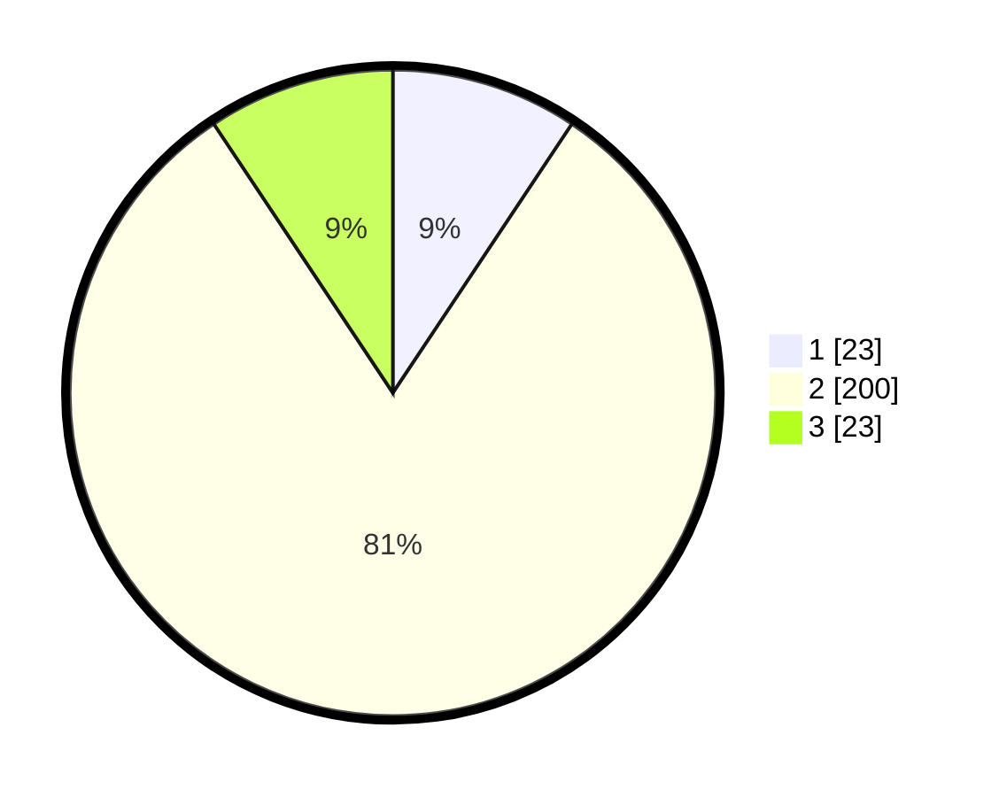

# Hasil

## Grafik

## Tabel

| No. | Nama Paslon    | Suara | Suara (raw) | Persentase |
|:--- |:-------------- | -----:| -----------:| ----------:|
| 1   | ANIES MUHAIMIN | 23    | [23][p-1]   | 9,35       |
| 2   | PRABOWO GIBRAN | 200   | [200][p-2]  | 81,30      |
| 3   | GANJAR MAHFUD  | 23    | [23][p-3]   | 9,35       |

[p-1]: https://github.com/gigit-pemilu/pemilu-2024/blob/main/pilpres/hitung-suara/sub/35-jawa-timur/sub/26-bangkalan/sub/06-geger/sub/2007-togubang/sub/003-tps/sub/paslon-1.txt
[p-2]: https://github.com/gigit-pemilu/pemilu-2024/blob/main/pilpres/hitung-suara/sub/35-jawa-timur/sub/26-bangkalan/sub/06-geger/sub/2007-togubang/sub/003-tps/sub/paslon-2.txt
[p-3]: https://github.com/gigit-pemilu/pemilu-2024/blob/main/pilpres/hitung-suara/sub/35-jawa-timur/sub/26-bangkalan/sub/06-geger/sub/2007-togubang/sub/003-tps/sub/paslon-3.txt

## Foto C Plano

https://sirekap-obj-formc.kpu.go.id/828e/pemilu/ppwp/35/26/06/20/07/3526062007003-20240215-034539--bafb3315-5237-4aed-b656-7b3551869cb3.jpg

https://sirekap-obj-formc.kpu.go.id/828e/pemilu/ppwp/35/26/06/20/07/3526062007003-20240215-034652--0572172b-b2ba-404e-b054-3e7270313e9d.jpg

https://sirekap-obj-formc.kpu.go.id/828e/pemilu/ppwp/35/26/06/20/07/3526062007003-20240215-070630--c17ad15e-47c5-4e14-98b2-dfaf06d73507.jpg

## Metadata

| Key        | Value               |
| ---------- | ------------------- |
| Time Stamp | 2024-02-24 22:31:28 |

