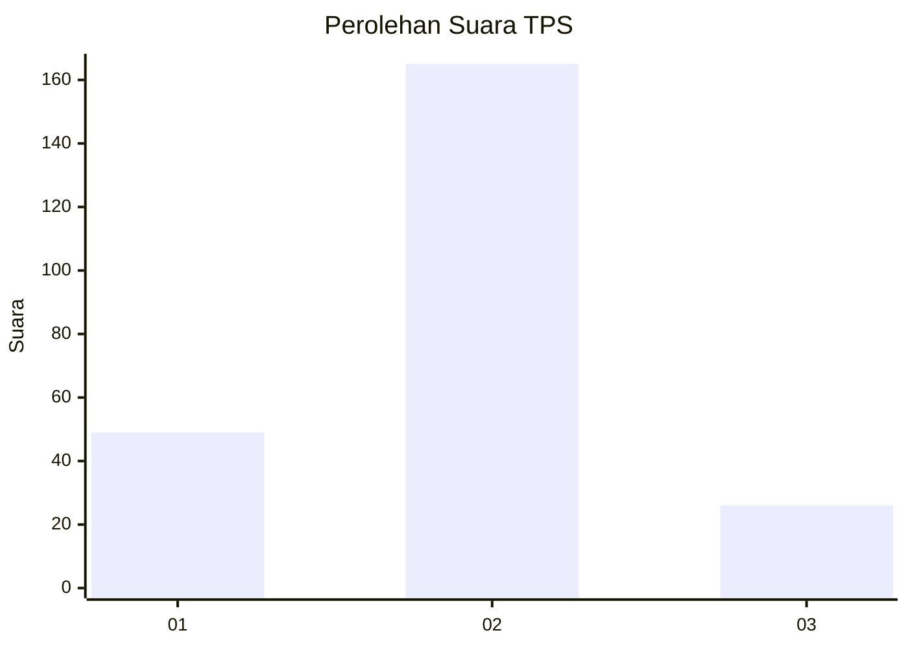
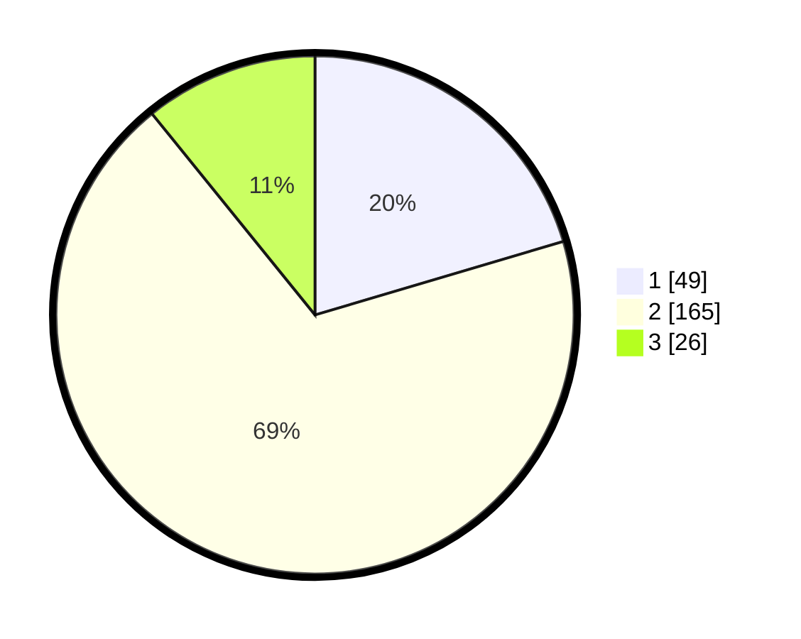

# Hasil

## Grafik

## Tabel

| No. | Nama Paslon    | Suara | Suara (raw) | Persentase |
|:--- |:-------------- | -----:| -----------:| ----------:|
| 1   | ANIES MUHAIMIN | 49    | [49][p-1]   | 20,42      |
| 2   | PRABOWO GIBRAN | 165   | [165][p-2]  | 68,75      |
| 3   | GANJAR MAHFUD  | 26    | [26][p-3]   | 10,83      |

[p-1]: https://github.com/gigit-pemilu/pemilu-2024/blob/main/pilpres/hitung-suara/sub/35-jawa-timur/sub/26-bangkalan/sub/06-geger/sub/2007-togubang/sub/005-tps/sub/paslon-1.txt
[p-2]: https://github.com/gigit-pemilu/pemilu-2024/blob/main/pilpres/hitung-suara/sub/35-jawa-timur/sub/26-bangkalan/sub/06-geger/sub/2007-togubang/sub/005-tps/sub/paslon-2.txt
[p-3]: https://github.com/gigit-pemilu/pemilu-2024/blob/main/pilpres/hitung-suara/sub/35-jawa-timur/sub/26-bangkalan/sub/06-geger/sub/2007-togubang/sub/005-tps/sub/paslon-3.txt

## Foto C Plano

https://sirekap-obj-formc.kpu.go.id/f8ca/pemilu/ppwp/35/26/06/20/07/3526062007005-20240214-215218--c08ffd66-9886-41f7-9ef0-f311e1cf9bc8.jpg

https://sirekap-obj-formc.kpu.go.id/f8ca/pemilu/ppwp/35/26/06/20/07/3526062007005-20240214-215310--fd76a427-ac7f-48e4-8f7c-f24a66ec4ec0.jpg

https://sirekap-obj-formc.kpu.go.id/f8ca/pemilu/ppwp/35/26/06/20/07/3526062007005-20240214-215415--d385a673-b494-4322-ba85-c9746a3c42f1.jpg

## Metadata

| Key        | Value               |
| ---------- | ------------------- |
| Time Stamp | 2024-02-19 06:16:00 |

