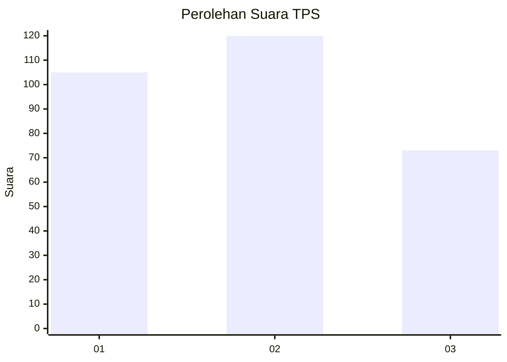
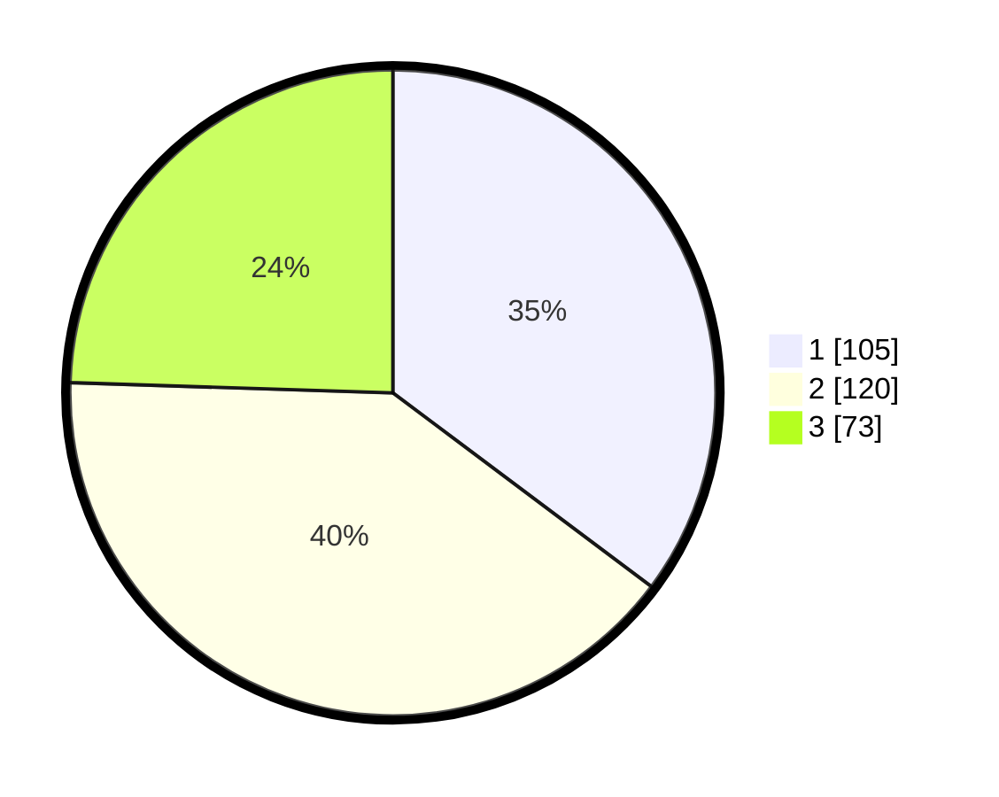

# Hasil

## Grafik

## Tabel

| No. | Nama Paslon    | Suara | Suara (raw) | Persentase |
|:--- |:-------------- | -----:| -----------:| ----------:|
| 1   | ANIES MUHAIMIN | 105   | [105][p-1]  | 35,23      |
| 2   | PRABOWO GIBRAN | 120   | [120][p-2]  | 40,27      |
| 3   | GANJAR MAHFUD  | 73    | [73][p-3]   | 24,50      |

[p-1]: https://github.com/gigit-pemilu/pemilu-2024-35-jawa-timur/blob/main/pilpres/hitung-suara/sub/35-jawa-timur/sub/26-bangkalan/sub/06-geger/sub/2007-togubang/sub/016-tps/sub/paslon-1.txt
[p-2]: https://github.com/gigit-pemilu/pemilu-2024-35-jawa-timur/blob/main/pilpres/hitung-suara/sub/35-jawa-timur/sub/26-bangkalan/sub/06-geger/sub/2007-togubang/sub/016-tps/sub/paslon-2.txt
[p-3]: https://github.com/gigit-pemilu/pemilu-2024-35-jawa-timur/blob/main/pilpres/hitung-suara/sub/35-jawa-timur/sub/26-bangkalan/sub/06-geger/sub/2007-togubang/sub/016-tps/sub/paslon-3.txt

## Foto C Plano

https://sirekap-obj-formc.kpu.go.id/74ef/pemilu/ppwp/35/26/06/20/07/3526062007016-20240215-033606--711405ee-0836-4349-978c-ec3ac668407a.jpg

https://sirekap-obj-formc.kpu.go.id/74ef/pemilu/ppwp/35/26/06/20/07/3526062007016-20240215-033647--ac3222fe-b25e-40a9-a044-ce6792fc5d6c.jpg

https://sirekap-obj-formc.kpu.go.id/74ef/pemilu/ppwp/35/26/06/20/07/3526062007016-20240215-033712--2f8e1e4b-7858-4351-b8bf-2553ff36861f.jpg

## Metadata

| Key        | Value               |
| ---------- | ------------------- |
| Time Stamp | 2024-02-19 06:16:00 |

