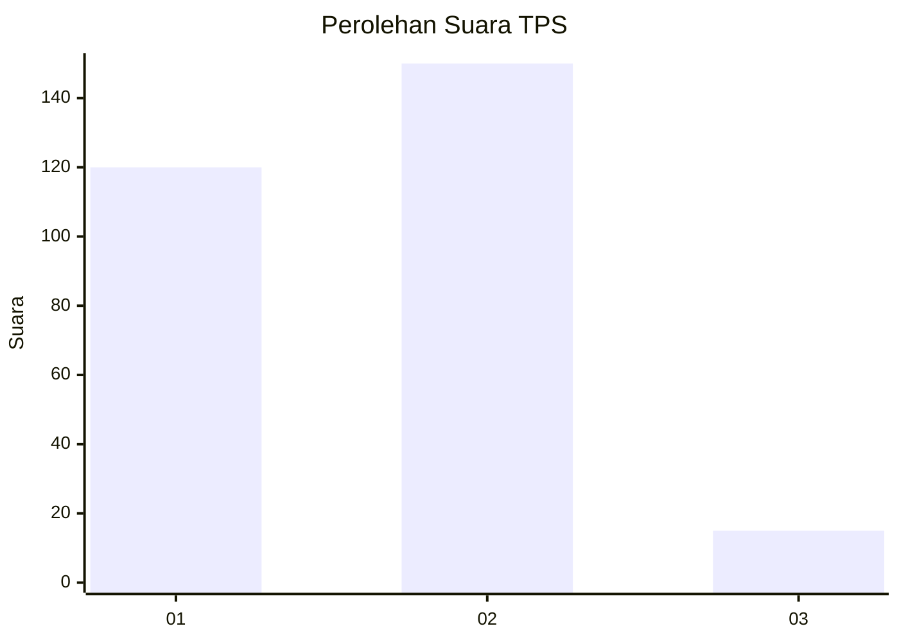
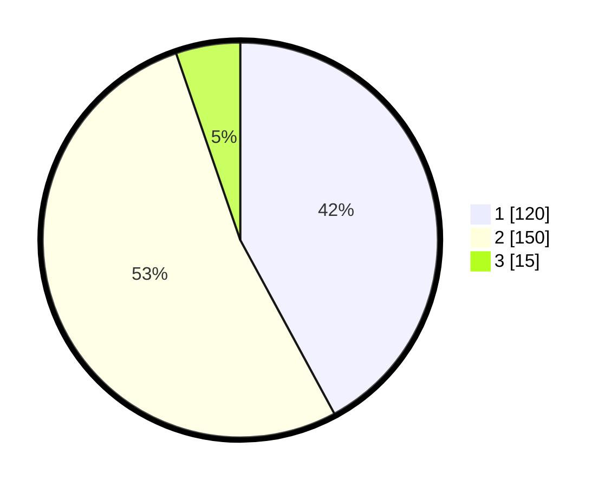

# Hasil

## Grafik

## Tabel

| No. | Nama Paslon    | Suara | Suara (raw) | Persentase |
|:--- |:-------------- | -----:| -----------:| ----------:|
| 1   | ANIES MUHAIMIN | 120   | [120][p-1]  | 42,11      |
| 2   | PRABOWO GIBRAN | 150   | [150][p-2]  | 52,63      |
| 3   | GANJAR MAHFUD  | 15    | [15][p-3]   | 5,26       |

[p-1]: https://github.com/gigit-pemilu/pemilu-2024/blob/main/pilpres/hitung-suara/sub/35-jawa-timur/sub/26-bangkalan/sub/06-geger/sub/2009-kampak/sub/001-tps/sub/paslon-1.txt
[p-2]: https://github.com/gigit-pemilu/pemilu-2024/blob/main/pilpres/hitung-suara/sub/35-jawa-timur/sub/26-bangkalan/sub/06-geger/sub/2009-kampak/sub/001-tps/sub/paslon-2.txt
[p-3]: https://github.com/gigit-pemilu/pemilu-2024/blob/main/pilpres/hitung-suara/sub/35-jawa-timur/sub/26-bangkalan/sub/06-geger/sub/2009-kampak/sub/001-tps/sub/paslon-3.txt

## Foto C Plano

https://sirekap-obj-formc.kpu.go.id/ea3a/pemilu/ppwp/35/26/06/20/09/3526062009001-20240215-104324--646d7de0-6e37-4811-a329-3f4374f5cb88.jpg

https://sirekap-obj-formc.kpu.go.id/ea3a/pemilu/ppwp/35/26/06/20/09/3526062009001-20240215-104649--0bf70472-fed8-4252-b8f3-a27a94ed0b62.jpg

https://sirekap-obj-formc.kpu.go.id/ea3a/pemilu/ppwp/35/26/06/20/09/3526062009001-20240215-104850--4c9e15ff-55ec-4205-83d2-51c2b0eef2b9.jpg

## Metadata

| Key        | Value               |
| ---------- | ------------------- |
| Time Stamp | 2024-02-19 06:16:00 |

