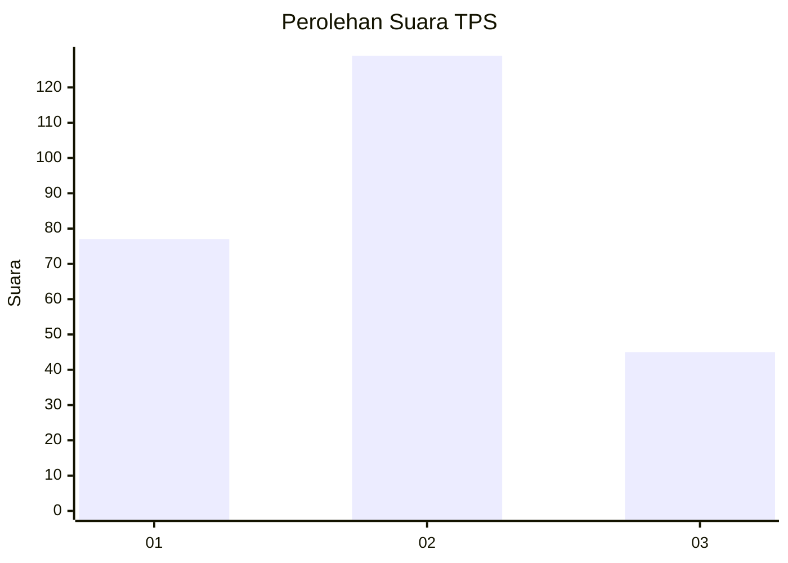
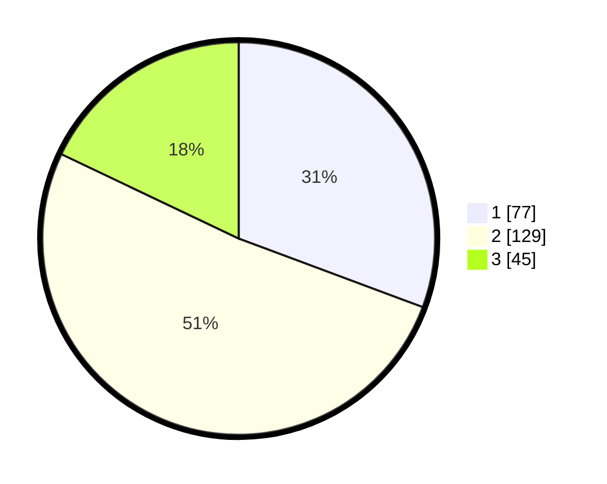

# Hasil

## Grafik

## Tabel

| No. | Nama Paslon    | Suara | Suara (raw) | Persentase |
|:--- |:-------------- | -----:| -----------:| ----------:|
| 1   | ANIES MUHAIMIN | 77    | [77][p-1]   | 30,68      |
| 2   | PRABOWO GIBRAN | 129   | [129][p-2]  | 51,39      |
| 3   | GANJAR MAHFUD  | 45    | [45][p-3]   | 17,93      |

[p-1]: https://github.com/gigit-pemilu/pemilu-2024/blob/main/pilpres/hitung-suara/sub/35-jawa-timur/sub/26-bangkalan/sub/06-geger/sub/2009-kampak/sub/003-tps/sub/paslon-1.txt
[p-2]: https://github.com/gigit-pemilu/pemilu-2024/blob/main/pilpres/hitung-suara/sub/35-jawa-timur/sub/26-bangkalan/sub/06-geger/sub/2009-kampak/sub/003-tps/sub/paslon-2.txt
[p-3]: https://github.com/gigit-pemilu/pemilu-2024/blob/main/pilpres/hitung-suara/sub/35-jawa-timur/sub/26-bangkalan/sub/06-geger/sub/2009-kampak/sub/003-tps/sub/paslon-3.txt

## Foto C Plano

https://sirekap-obj-formc.kpu.go.id/b15c/pemilu/ppwp/35/26/06/20/09/3526062009003-20240215-015936--061dab01-798a-4a6a-9931-0503a9a5798a.jpg

https://sirekap-obj-formc.kpu.go.id/b15c/pemilu/ppwp/35/26/06/20/09/3526062009003-20240215-020122--4a639565-38d3-4919-b882-3b14d1deda77.jpg

https://sirekap-obj-formc.kpu.go.id/b15c/pemilu/ppwp/35/26/06/20/09/3526062009003-20240215-020301--1125298d-bc04-409f-830d-54c3e8fb7b28.jpg

## Metadata

| Key        | Value               |
| ---------- | ------------------- |
| Time Stamp | 2024-02-19 06:16:00 |

