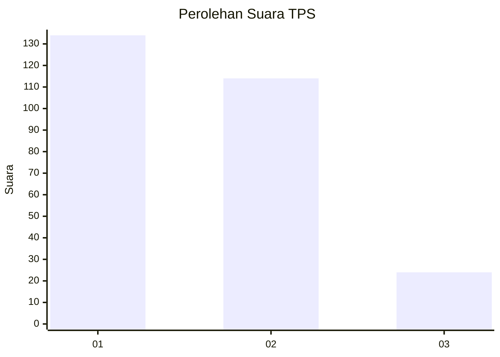
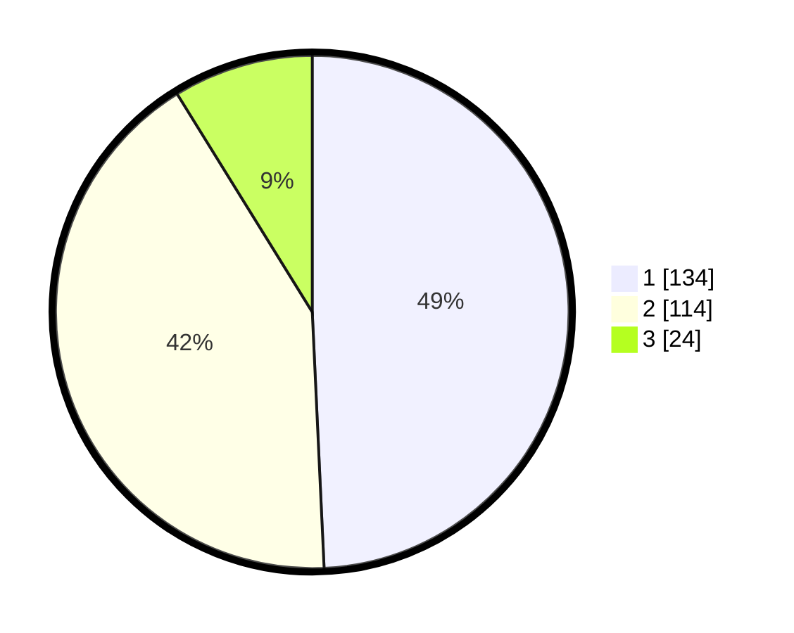

# Hasil

## Grafik

## Tabel

| No. | Nama Paslon    | Suara | Suara (raw) | Persentase |
|:--- |:-------------- | -----:| -----------:| ----------:|
| 1   | ANIES MUHAIMIN | 134   | [134][p-1]  | 49,26      |
| 2   | PRABOWO GIBRAN | 114   | [114][p-2]  | 41,91      |
| 3   | GANJAR MAHFUD  | 24    | [24][p-3]   | 8,82       |

[p-1]: https://github.com/gigit-pemilu/pemilu-2024/blob/main/pilpres/hitung-suara/sub/35-jawa-timur/sub/26-bangkalan/sub/06-geger/sub/2009-kampak/sub/009-tps/sub/paslon-1.txt
[p-2]: https://github.com/gigit-pemilu/pemilu-2024/blob/main/pilpres/hitung-suara/sub/35-jawa-timur/sub/26-bangkalan/sub/06-geger/sub/2009-kampak/sub/009-tps/sub/paslon-2.txt
[p-3]: https://github.com/gigit-pemilu/pemilu-2024/blob/main/pilpres/hitung-suara/sub/35-jawa-timur/sub/26-bangkalan/sub/06-geger/sub/2009-kampak/sub/009-tps/sub/paslon-3.txt

## Foto C Plano

https://sirekap-obj-formc.kpu.go.id/7aac/pemilu/ppwp/35/26/06/20/09/3526062009009-20240215-073825--c5726f7a-8a10-48a1-a9a2-b606e7e4d9e3.jpg

https://sirekap-obj-formc.kpu.go.id/7aac/pemilu/ppwp/35/26/06/20/09/3526062009009-20240214-213321--3736ae13-694e-4297-97ea-172205c1e3cf.jpg

https://sirekap-obj-formc.kpu.go.id/7aac/pemilu/ppwp/35/26/06/20/09/3526062009009-20240214-213442--e8e7dae9-cbbe-4781-bfe4-2095bac5d2f7.jpg

## Metadata

| Key        | Value               |
| ---------- | ------------------- |
| Time Stamp | 2024-02-21 21:00:04 |

