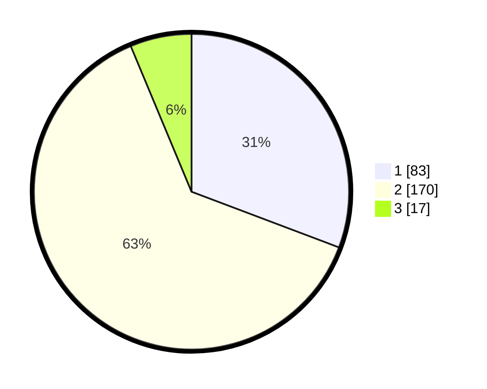

# Hasil

## Grafik

## Tabel

| No. | Nama Paslon    | Suara | Suara (raw) | Persentase |
|:--- |:-------------- | -----:| -----------:| ----------:|
| 1   | ANIES MUHAIMIN | 83    | [83][p-1]   | 30,74      |
| 2   | PRABOWO GIBRAN | 170   | [170][p-2]  | 62,96      |
| 3   | GANJAR MAHFUD  | 17    | [17][p-3]   | 6,30       |

[p-1]: https://github.com/gigit-pemilu/pemilu-2024-35-jawa-timur/blob/main/pilpres/hitung-suara/sub/35-jawa-timur/sub/26-bangkalan/sub/06-geger/sub/2009-kampak/sub/013-tps/sub/paslon-1.txt
[p-2]: https://github.com/gigit-pemilu/pemilu-2024-35-jawa-timur/blob/main/pilpres/hitung-suara/sub/35-jawa-timur/sub/26-bangkalan/sub/06-geger/sub/2009-kampak/sub/013-tps/sub/paslon-2.txt
[p-3]: https://github.com/gigit-pemilu/pemilu-2024-35-jawa-timur/blob/main/pilpres/hitung-suara/sub/35-jawa-timur/sub/26-bangkalan/sub/06-geger/sub/2009-kampak/sub/013-tps/sub/paslon-3.txt

## Foto C Plano

https://sirekap-obj-formc.kpu.go.id/3489/pemilu/ppwp/35/26/06/20/09/3526062009013-20240215-103557--58d11a86-424f-406a-b67d-08752313255c.jpg

https://sirekap-obj-formc.kpu.go.id/3489/pemilu/ppwp/35/26/06/20/09/3526062009013-20240215-103749--05264876-8df9-48a7-add0-1e83a56ac4ce.jpg

https://sirekap-obj-formc.kpu.go.id/3489/pemilu/ppwp/35/26/06/20/09/3526062009013-20240215-103930--4be8447c-26d3-4547-b60c-77de0c3214dd.jpg

## Metadata

| Key        | Value               |
| ---------- | ------------------- |
| Time Stamp | 2024-02-19 06:16:00 |

