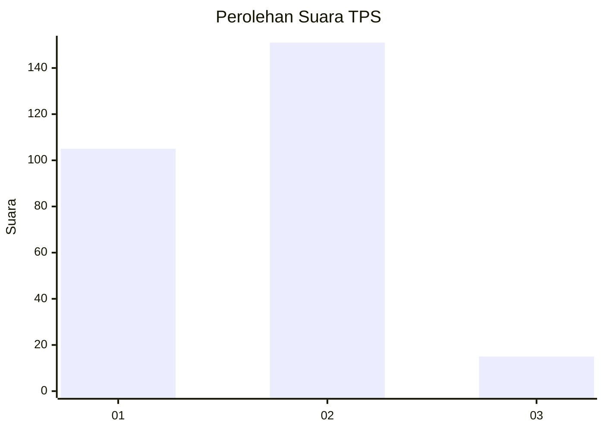
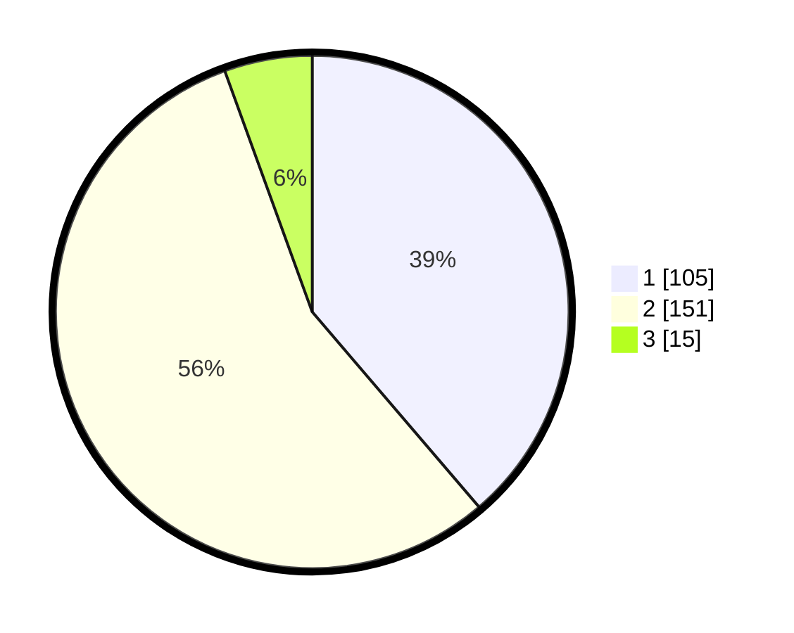

# Hasil

## Grafik

## Tabel

| No. | Nama Paslon    | Suara | Suara (raw) | Persentase |
|:--- |:-------------- | -----:| -----------:| ----------:|
| 1   | ANIES MUHAIMIN | 105   | [105][p-1]  | 38,75      |
| 2   | PRABOWO GIBRAN | 151   | [151][p-2]  | 55,72      |
| 3   | GANJAR MAHFUD  | 15    | [15][p-3]   | 5,54       |

[p-1]: https://github.com/gigit-pemilu/pemilu-2024-35-jawa-timur/blob/main/pilpres/hitung-suara/sub/35-jawa-timur/sub/26-bangkalan/sub/06-geger/sub/2009-kampak/sub/016-tps/sub/paslon-1.txt
[p-2]: https://github.com/gigit-pemilu/pemilu-2024-35-jawa-timur/blob/main/pilpres/hitung-suara/sub/35-jawa-timur/sub/26-bangkalan/sub/06-geger/sub/2009-kampak/sub/016-tps/sub/paslon-2.txt
[p-3]: https://github.com/gigit-pemilu/pemilu-2024-35-jawa-timur/blob/main/pilpres/hitung-suara/sub/35-jawa-timur/sub/26-bangkalan/sub/06-geger/sub/2009-kampak/sub/016-tps/sub/paslon-3.txt

## Foto C Plano

https://sirekap-obj-formc.kpu.go.id/e6ca/pemilu/ppwp/35/26/06/20/09/3526062009016-20240215-024133--a061522f-3e4f-40d6-98c9-a28f95158bdc.jpg

https://sirekap-obj-formc.kpu.go.id/e6ca/pemilu/ppwp/35/26/06/20/09/3526062009016-20240215-024257--021effbc-c89f-4dd2-8b98-052c5751177f.jpg

https://sirekap-obj-formc.kpu.go.id/e6ca/pemilu/ppwp/35/26/06/20/09/3526062009016-20240215-024406--9da12413-fbb4-4b82-b226-da606bdafb1f.jpg

## Metadata

| Key        | Value               |
| ---------- | ------------------- |
| Time Stamp | 2024-02-19 06:16:00 |

