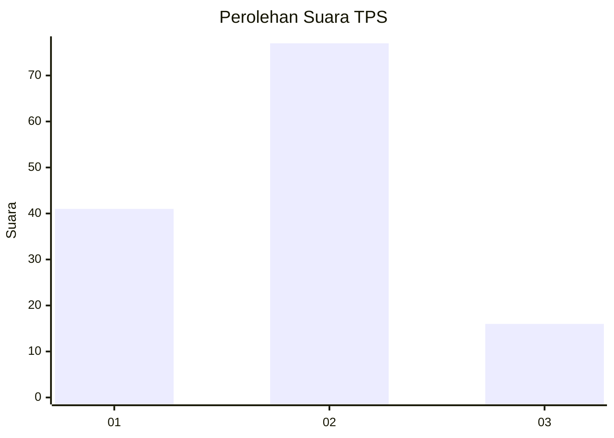
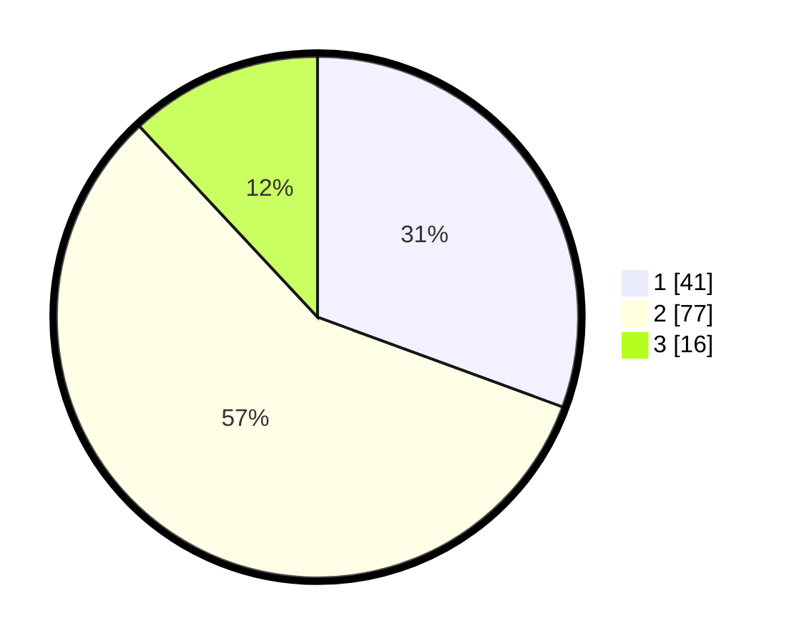

# Hasil

## Grafik

## Tabel

| No. | Nama Paslon    | Suara | Suara (raw) | Persentase |
|:--- |:-------------- | -----:| -----------:| ----------:|
| 1   | ANIES MUHAIMIN | 41    | [41][p-1]   | 30,60      |
| 2   | PRABOWO GIBRAN | 77    | [77][p-2]   | 57,46      |
| 3   | GANJAR MAHFUD  | 16    | [16][p-3]   | 11,94      |

[p-1]: https://github.com/gigit-pemilu/pemilu-2024/blob/main/pilpres/hitung-suara/sub/35-jawa-timur/sub/26-bangkalan/sub/06-geger/sub/2009-kampak/sub/017-tps/sub/paslon-1.txt
[p-2]: https://github.com/gigit-pemilu/pemilu-2024/blob/main/pilpres/hitung-suara/sub/35-jawa-timur/sub/26-bangkalan/sub/06-geger/sub/2009-kampak/sub/017-tps/sub/paslon-2.txt
[p-3]: https://github.com/gigit-pemilu/pemilu-2024/blob/main/pilpres/hitung-suara/sub/35-jawa-timur/sub/26-bangkalan/sub/06-geger/sub/2009-kampak/sub/017-tps/sub/paslon-3.txt

## Foto C Plano

https://sirekap-obj-formc.kpu.go.id/3c43/pemilu/ppwp/35/26/06/20/09/3526062009017-20240214-234112--f69348a0-5b9a-4660-98dd-bb787083d460.jpg

https://sirekap-obj-formc.kpu.go.id/3c43/pemilu/ppwp/35/26/06/20/09/3526062009017-20240214-234418--f74f7aa4-9fed-41dd-96cf-4c981575ed8c.jpg

https://sirekap-obj-formc.kpu.go.id/3c43/pemilu/ppwp/35/26/06/20/09/3526062009017-20240214-234652--1af4f0bc-afe1-4136-8c5d-b20f4bc0eb81.jpg

## Metadata

| Key        | Value               |
| ---------- | ------------------- |
| Time Stamp | 2024-02-19 06:16:00 |

