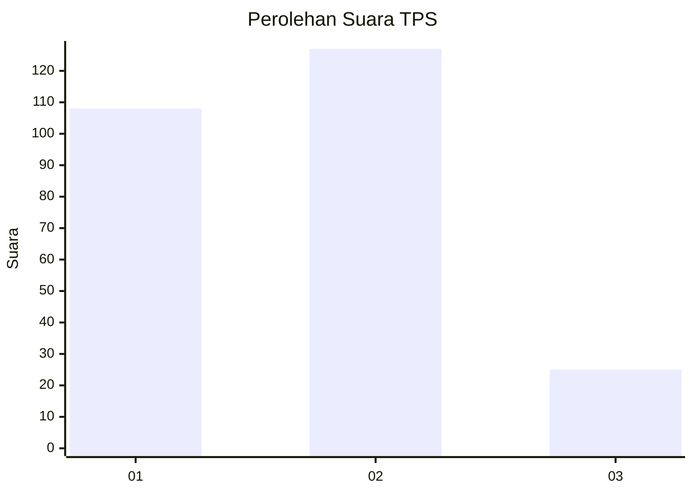
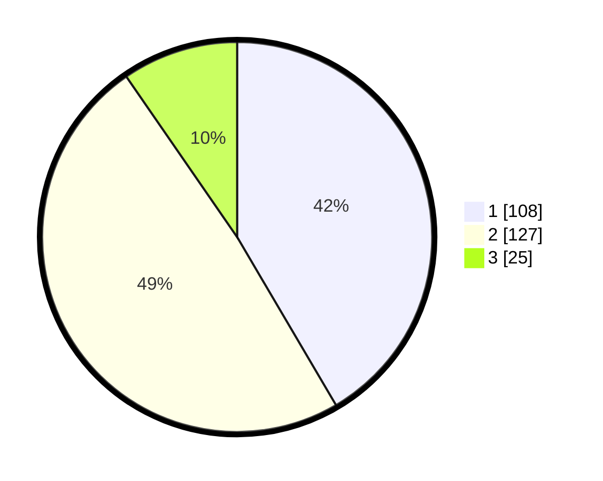

# Hasil

## Grafik

## Tabel

| No. | Nama Paslon    | Suara | Suara (raw) | Persentase |
|:--- |:-------------- | -----:| -----------:| ----------:|
| 1   | ANIES MUHAIMIN | 108   | [108][p-1]  | 41,54      |
| 2   | PRABOWO GIBRAN | 127   | [127][p-2]  | 48,85      |
| 3   | GANJAR MAHFUD  | 25    | [25][p-3]   | 9,62       |

[p-1]: https://github.com/gigit-pemilu/pemilu-2024/blob/main/pilpres/hitung-suara/sub/35-jawa-timur/sub/26-bangkalan/sub/06-geger/sub/2009-kampak/sub/022-tps/sub/paslon-1.txt
[p-2]: https://github.com/gigit-pemilu/pemilu-2024/blob/main/pilpres/hitung-suara/sub/35-jawa-timur/sub/26-bangkalan/sub/06-geger/sub/2009-kampak/sub/022-tps/sub/paslon-2.txt
[p-3]: https://github.com/gigit-pemilu/pemilu-2024/blob/main/pilpres/hitung-suara/sub/35-jawa-timur/sub/26-bangkalan/sub/06-geger/sub/2009-kampak/sub/022-tps/sub/paslon-3.txt

## Foto C Plano

https://sirekap-obj-formc.kpu.go.id/a40a/pemilu/ppwp/35/26/06/20/09/3526062009022-20240215-081435--289a4fea-51b1-4a85-83b9-bcfb43aa85c5.jpg

https://sirekap-obj-formc.kpu.go.id/a40a/pemilu/ppwp/35/26/06/20/09/3526062009022-20240215-082102--a4af4b09-9ddb-47a3-811e-8c81377b2dae.jpg

https://sirekap-obj-formc.kpu.go.id/a40a/pemilu/ppwp/35/26/06/20/09/3526062009022-20240215-081909--b0342f62-4169-49c6-93d7-3d9a345f6fd7.jpg

## Metadata

| Key        | Value               |
| ---------- | ------------------- |
| Time Stamp | 2024-02-21 21:00:04 |

