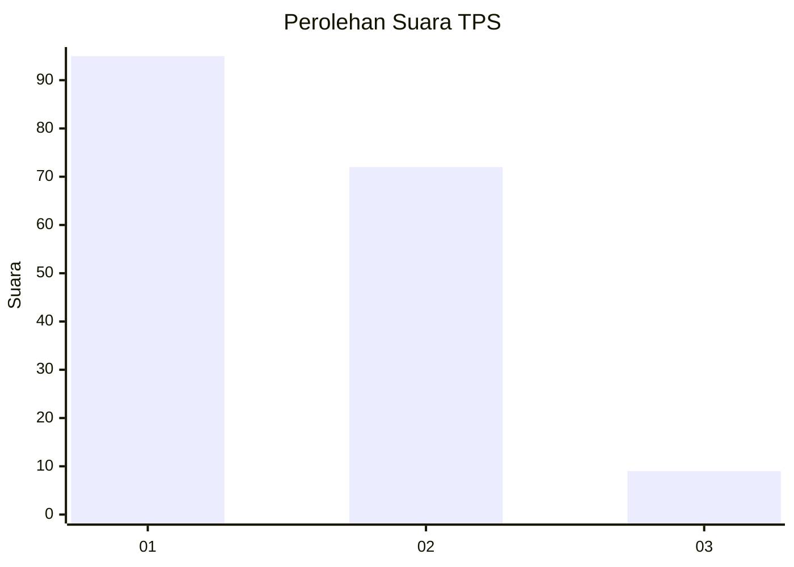
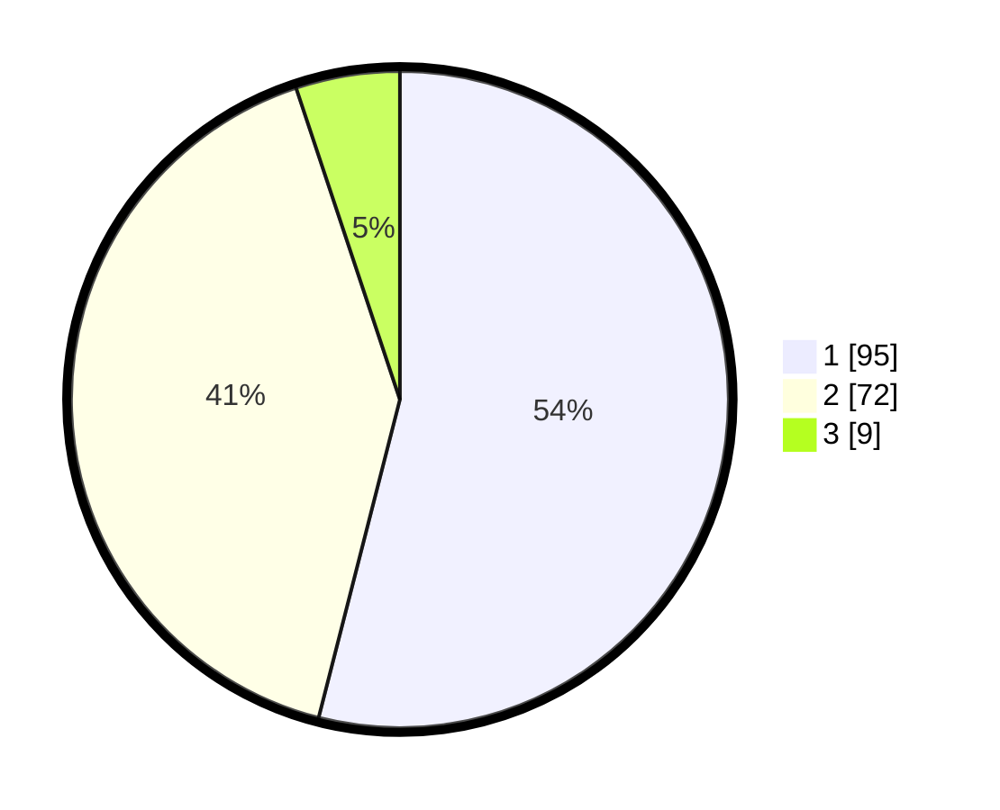

# Hasil

## Grafik

## Tabel

| No. | Nama Paslon    | Suara | Suara (raw) | Persentase |
|:--- |:-------------- | -----:| -----------:| ----------:|
| 1   | ANIES MUHAIMIN | 95    | [95][p-1]   | 53,98      |
| 2   | PRABOWO GIBRAN | 72    | [72][p-2]   | 40,91      |
| 3   | GANJAR MAHFUD  | 9     | [9][p-3]    | 5,11       |

[p-1]: https://github.com/gigit-pemilu/pemilu-2024-35-jawa-timur/blob/main/pilpres/hitung-suara/sub/35-jawa-timur/sub/26-bangkalan/sub/06-geger/sub/2009-kampak/sub/024-tps/sub/paslon-1.txt
[p-2]: https://github.com/gigit-pemilu/pemilu-2024-35-jawa-timur/blob/main/pilpres/hitung-suara/sub/35-jawa-timur/sub/26-bangkalan/sub/06-geger/sub/2009-kampak/sub/024-tps/sub/paslon-2.txt
[p-3]: https://github.com/gigit-pemilu/pemilu-2024-35-jawa-timur/blob/main/pilpres/hitung-suara/sub/35-jawa-timur/sub/26-bangkalan/sub/06-geger/sub/2009-kampak/sub/024-tps/sub/paslon-3.txt

## Foto C Plano

https://sirekap-obj-formc.kpu.go.id/0cd5/pemilu/ppwp/35/26/06/20/09/3526062009024-20240215-114616--739f9a0b-9cee-46a5-91f8-90c05dc8ec26.jpg

https://sirekap-obj-formc.kpu.go.id/0cd5/pemilu/ppwp/35/26/06/20/09/3526062009024-20240215-113753--4384cab2-e769-4d83-96a0-f4fabc748345.jpg

https://sirekap-obj-formc.kpu.go.id/0cd5/pemilu/ppwp/35/26/06/20/09/3526062009024-20240215-114100--5ee5b9f5-59ea-479b-bfe9-e924cd2160bf.jpg

## Metadata

| Key        | Value               |
| ---------- | ------------------- |
| Time Stamp | 2024-02-21 21:00:04 |

