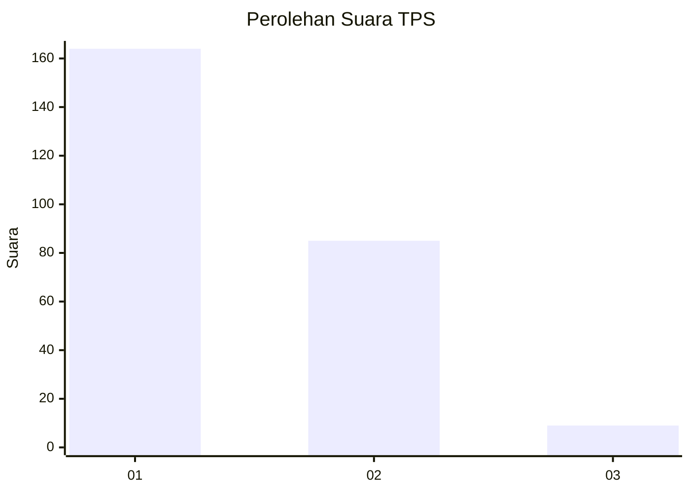
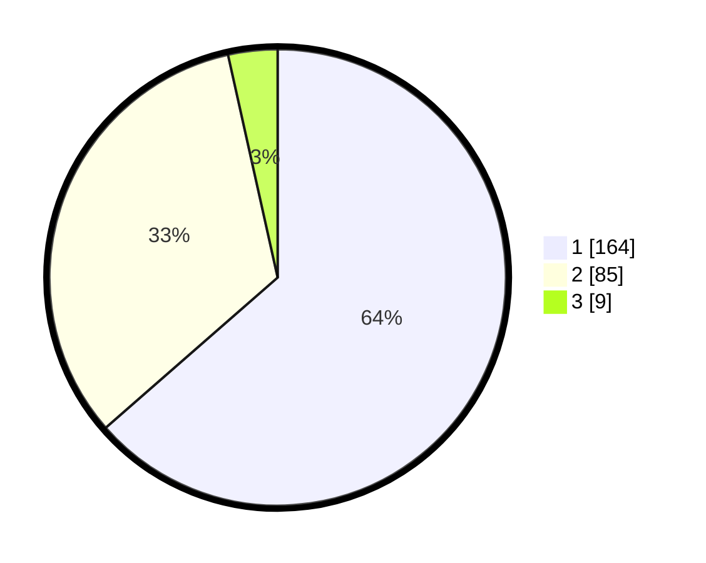

# Hasil

## Grafik

## Tabel

| No. | Nama Paslon    | Suara | Suara (raw) | Persentase |
|:--- |:-------------- | -----:| -----------:| ----------:|
| 1   | ANIES MUHAIMIN | 164   | [164][p-1]  | 63,57      |
| 2   | PRABOWO GIBRAN | 85    | [85][p-2]   | 32,95      |
| 3   | GANJAR MAHFUD  | 9     | [9][p-3]    | 3,49       |

[p-1]: https://github.com/gigit-pemilu/pemilu-2024-35-jawa-timur/blob/main/pilpres/hitung-suara/sub/35-jawa-timur/sub/26-bangkalan/sub/06-geger/sub/2009-kampak/sub/028-tps/sub/paslon-1.txt
[p-2]: https://github.com/gigit-pemilu/pemilu-2024-35-jawa-timur/blob/main/pilpres/hitung-suara/sub/35-jawa-timur/sub/26-bangkalan/sub/06-geger/sub/2009-kampak/sub/028-tps/sub/paslon-2.txt
[p-3]: https://github.com/gigit-pemilu/pemilu-2024-35-jawa-timur/blob/main/pilpres/hitung-suara/sub/35-jawa-timur/sub/26-bangkalan/sub/06-geger/sub/2009-kampak/sub/028-tps/sub/paslon-3.txt

## Foto C Plano

https://sirekap-obj-formc.kpu.go.id/8ddf/pemilu/ppwp/35/26/06/20/09/3526062009028-20240215-101413--ac697d71-ff2b-4e3e-b466-5c0a1229b3e4.jpg

https://sirekap-obj-formc.kpu.go.id/8ddf/pemilu/ppwp/35/26/06/20/09/3526062009028-20240215-095329--1ea5987d-b6d6-4967-b316-7f6b0ff83f26.jpg

https://sirekap-obj-formc.kpu.go.id/8ddf/pemilu/ppwp/35/26/06/20/09/3526062009028-20240215-102013--5ed04263-404b-4aa8-82a1-7424fca6ddae.jpg

## Metadata

| Key        | Value               |
| ---------- | ------------------- |
| Time Stamp | 2024-02-19 06:16:00 |

