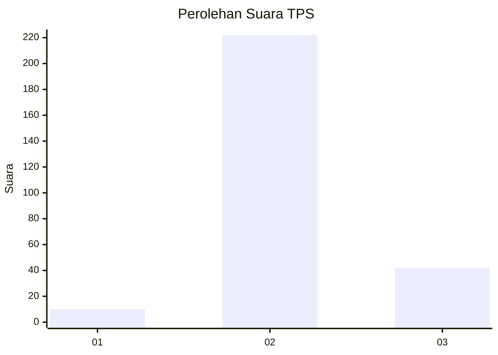
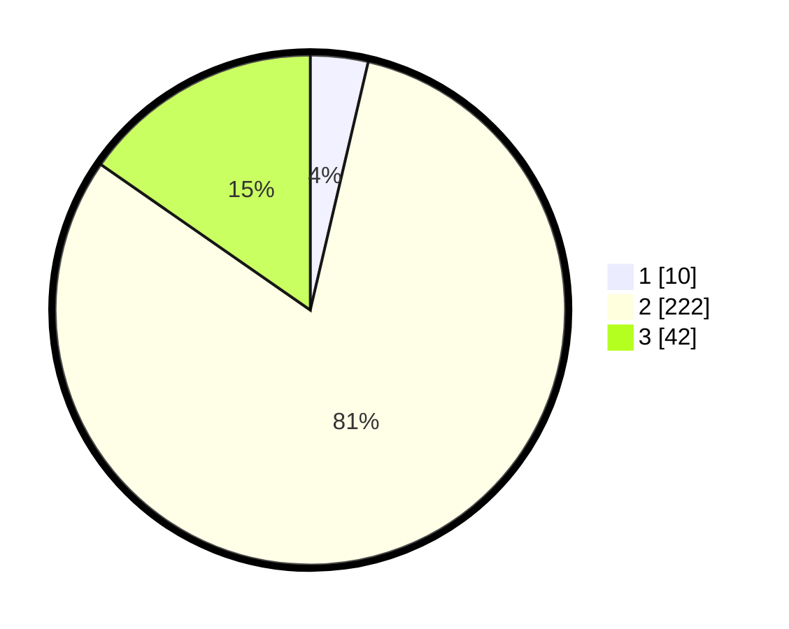

# Hasil

## Grafik

## Tabel

| No. | Nama Paslon    | Suara | Suara (raw) | Persentase |
|:--- |:-------------- | -----:| -----------:| ----------:|
| 1   | ANIES MUHAIMIN | 10    | [10][p-1]   | 3,65       |
| 2   | PRABOWO GIBRAN | 222   | [222][p-2]  | 81,02      |
| 3   | GANJAR MAHFUD  | 42    | [42][p-3]   | 15,33      |

[p-1]: https://github.com/gigit-pemilu/pemilu-2024/blob/main/pilpres/hitung-suara/sub/35-jawa-timur/sub/26-bangkalan/sub/06-geger/sub/2010-campor/sub/005-tps/sub/paslon-1.txt
[p-2]: https://github.com/gigit-pemilu/pemilu-2024/blob/main/pilpres/hitung-suara/sub/35-jawa-timur/sub/26-bangkalan/sub/06-geger/sub/2010-campor/sub/005-tps/sub/paslon-2.txt
[p-3]: https://github.com/gigit-pemilu/pemilu-2024/blob/main/pilpres/hitung-suara/sub/35-jawa-timur/sub/26-bangkalan/sub/06-geger/sub/2010-campor/sub/005-tps/sub/paslon-3.txt

## Foto C Plano

https://sirekap-obj-formc.kpu.go.id/b9fc/pemilu/ppwp/35/26/06/20/10/3526062010005-20240214-193322--6f0a30f7-8f43-4d96-bc41-e3b066aa0788.jpg

https://sirekap-obj-formc.kpu.go.id/b9fc/pemilu/ppwp/35/26/06/20/10/3526062010005-20240214-193457--47f51cca-523a-47f2-853d-436ef13aa80c.jpg

https://sirekap-obj-formc.kpu.go.id/b9fc/pemilu/ppwp/35/26/06/20/10/3526062010005-20240214-193622--72464192-0c6d-4cb4-8022-3dfa7acc15ee.jpg

## Metadata

| Key        | Value               |
| ---------- | ------------------- |
| Time Stamp | 2024-02-19 06:16:00 |

