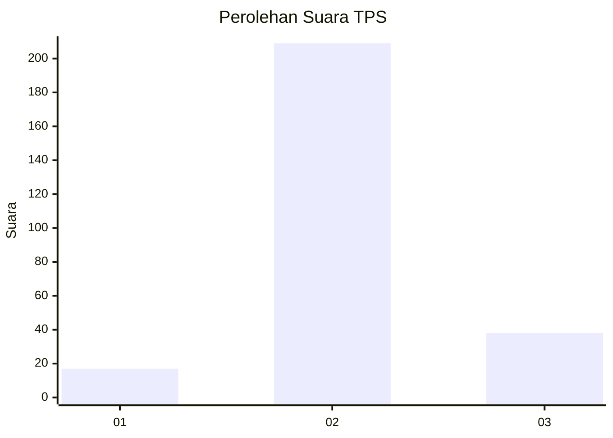

# Hasil

## Grafik

## Tabel

| No. | Nama Paslon    | Suara | Suara (raw) | Persentase |
|:--- |:-------------- | -----:| -----------:| ----------:|
| 1   | ANIES MUHAIMIN | 17    | [17][p-1]   | 6,44       |
| 2   | PRABOWO GIBRAN | 209   | [209][p-2]  | 79,17      |
| 3   | GANJAR MAHFUD  | 38    | [38][p-3]   | 14,39      |

[p-1]: https://github.com/gigit-pemilu/pemilu-2024-35-jawa-timur/blob/main/pilpres/hitung-suara/sub/35-jawa-timur/sub/26-bangkalan/sub/06-geger/sub/2010-campor/sub/006-tps/sub/paslon-1.txt
[p-2]: https://github.com/gigit-pemilu/pemilu-2024-35-jawa-timur/blob/main/pilpres/hitung-suara/sub/35-jawa-timur/sub/26-bangkalan/sub/06-geger/sub/2010-campor/sub/006-tps/sub/paslon-2.txt
[p-3]: https://github.com/gigit-pemilu/pemilu-2024-35-jawa-timur/blob/main/pilpres/hitung-suara/sub/35-jawa-timur/sub/26-bangkalan/sub/06-geger/sub/2010-campor/sub/006-tps/sub/paslon-3.txt

## Foto C Plano

https://sirekap-obj-formc.kpu.go.id/6d4e/pemilu/ppwp/35/26/06/20/10/3526062010006-20240216-220647--f2d6e85b-27a9-42ca-86f1-d5c2c37a24f9.jpg

https://sirekap-obj-formc.kpu.go.id/6d4e/pemilu/ppwp/35/26/06/20/10/3526062010006-20240216-221114--1a1663d2-5a87-4a0b-854d-8beb2117d54c.jpg

https://sirekap-obj-formc.kpu.go.id/6d4e/pemilu/ppwp/35/26/06/20/10/3526062010006-20240216-221344--a7f65a73-3058-4fde-b763-a50582e502d9.jpg

## Metadata

| Key        | Value               |
| ---------- | ------------------- |
| Time Stamp | 2024-02-19 06:16:00 |

