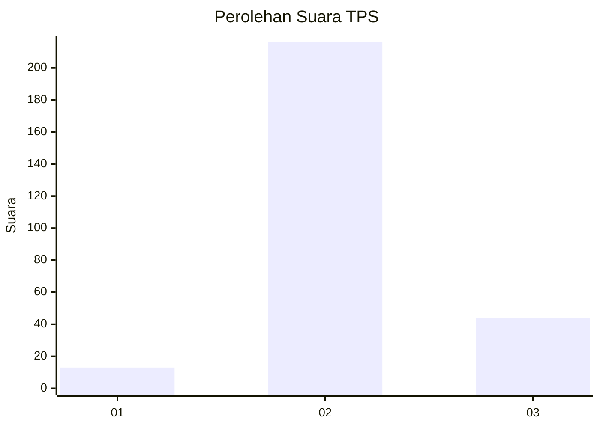
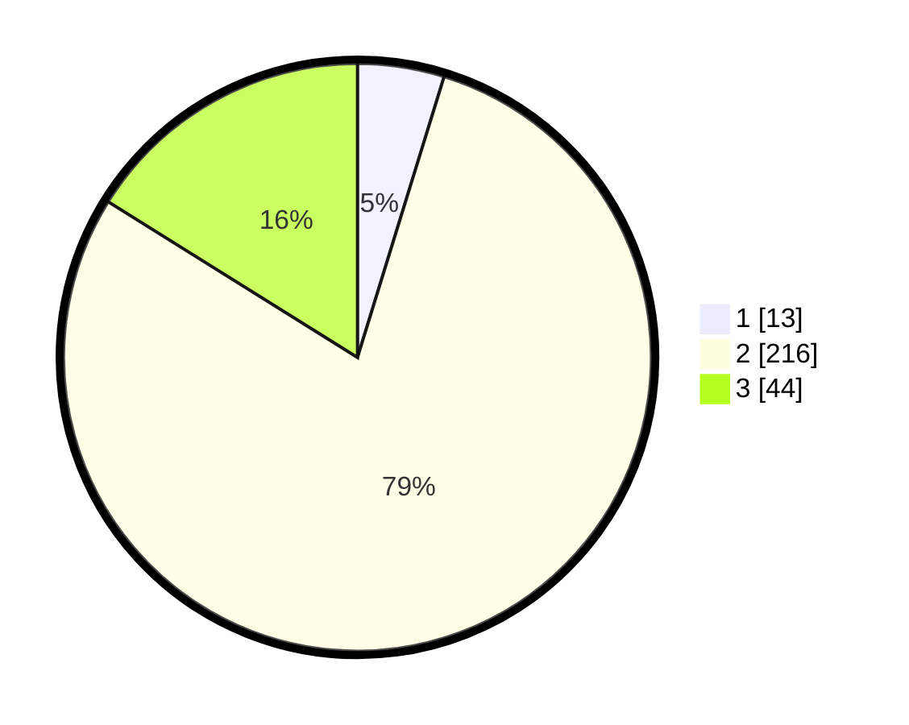

# Hasil

## Grafik

## Tabel

| No. | Nama Paslon    | Suara | Suara (raw) | Persentase |
|:--- |:-------------- | -----:| -----------:| ----------:|
| 1   | ANIES MUHAIMIN | 13    | [13][p-1]   | 4,76       |
| 2   | PRABOWO GIBRAN | 216   | [216][p-2]  | 79,12      |
| 3   | GANJAR MAHFUD  | 44    | [44][p-3]   | 16,12      |

[p-1]: https://github.com/gigit-pemilu/pemilu-2024-35-jawa-timur/blob/main/pilpres/hitung-suara/sub/35-jawa-timur/sub/26-bangkalan/sub/06-geger/sub/2010-campor/sub/007-tps/sub/paslon-1.txt
[p-2]: https://github.com/gigit-pemilu/pemilu-2024-35-jawa-timur/blob/main/pilpres/hitung-suara/sub/35-jawa-timur/sub/26-bangkalan/sub/06-geger/sub/2010-campor/sub/007-tps/sub/paslon-2.txt
[p-3]: https://github.com/gigit-pemilu/pemilu-2024-35-jawa-timur/blob/main/pilpres/hitung-suara/sub/35-jawa-timur/sub/26-bangkalan/sub/06-geger/sub/2010-campor/sub/007-tps/sub/paslon-3.txt

## Foto C Plano

https://sirekap-obj-formc.kpu.go.id/582e/pemilu/ppwp/35/26/06/20/10/3526062010007-20240216-211139--158a13dc-ea58-472a-acd8-c77c194e6060.jpg

https://sirekap-obj-formc.kpu.go.id/582e/pemilu/ppwp/35/26/06/20/10/3526062010007-20240216-211054--d90a8662-b27a-4181-8ebd-2dcdcac9a6d9.jpg

https://sirekap-obj-formc.kpu.go.id/582e/pemilu/ppwp/35/26/06/20/10/3526062010007-20240215-075245--715be8c9-5acf-4356-9239-7b1e405edc0b.jpg

## Metadata

| Key        | Value               |
| ---------- | ------------------- |
| Time Stamp | 2024-02-19 06:16:00 |

