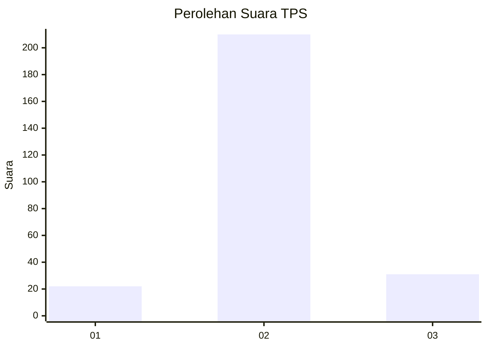
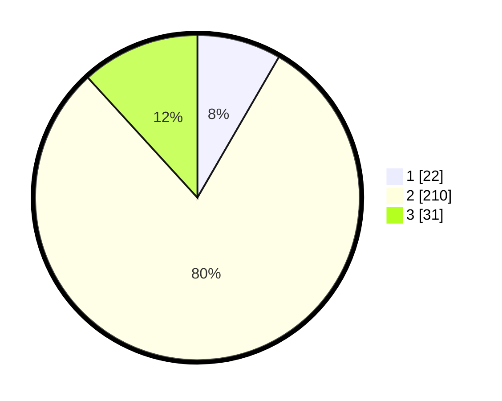

# Hasil

## Grafik

## Tabel

| No. | Nama Paslon    | Suara | Suara (raw) | Persentase |
|:--- |:-------------- | -----:| -----------:| ----------:|
| 1   | ANIES MUHAIMIN | 22    | [22][p-1]   | 8,37       |
| 2   | PRABOWO GIBRAN | 210   | [210][p-2]  | 79,85      |
| 3   | GANJAR MAHFUD  | 31    | [31][p-3]   | 11,79      |

[p-1]: https://github.com/gigit-pemilu/pemilu-2024/blob/main/pilpres/hitung-suara/sub/35-jawa-timur/sub/26-bangkalan/sub/06-geger/sub/2010-campor/sub/011-tps/sub/paslon-1.txt
[p-2]: https://github.com/gigit-pemilu/pemilu-2024/blob/main/pilpres/hitung-suara/sub/35-jawa-timur/sub/26-bangkalan/sub/06-geger/sub/2010-campor/sub/011-tps/sub/paslon-2.txt
[p-3]: https://github.com/gigit-pemilu/pemilu-2024/blob/main/pilpres/hitung-suara/sub/35-jawa-timur/sub/26-bangkalan/sub/06-geger/sub/2010-campor/sub/011-tps/sub/paslon-3.txt

## Foto C Plano

https://sirekap-obj-formc.kpu.go.id/9ed7/pemilu/ppwp/35/26/06/20/10/3526062010011-20240216-170604--7f8edfd8-0d1d-46a4-bc28-eace49dd7bbc.jpg

https://sirekap-obj-formc.kpu.go.id/9ed7/pemilu/ppwp/35/26/06/20/10/3526062010011-20240215-151637--6b25862d-90c0-467b-bda2-fb8794b72310.jpg

https://sirekap-obj-formc.kpu.go.id/9ed7/pemilu/ppwp/35/26/06/20/10/3526062010011-20240215-151808--d1399cf6-7495-4922-87f3-9f665573594b.jpg

## Metadata

| Key        | Value               |
| ---------- | ------------------- |
| Time Stamp | 2024-02-19 06:16:00 |

