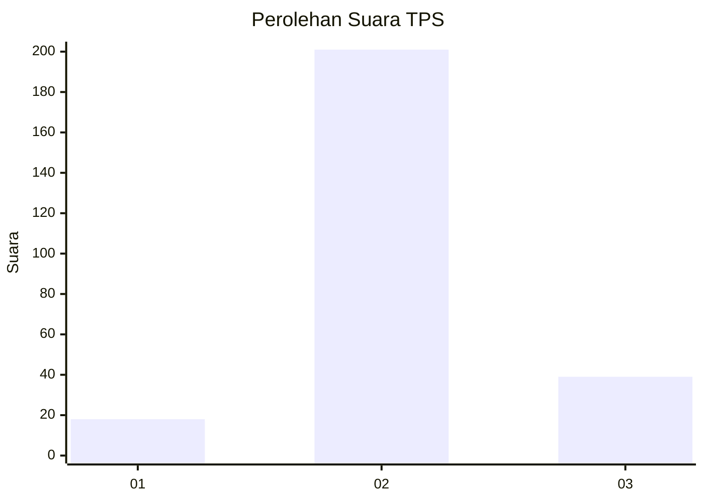
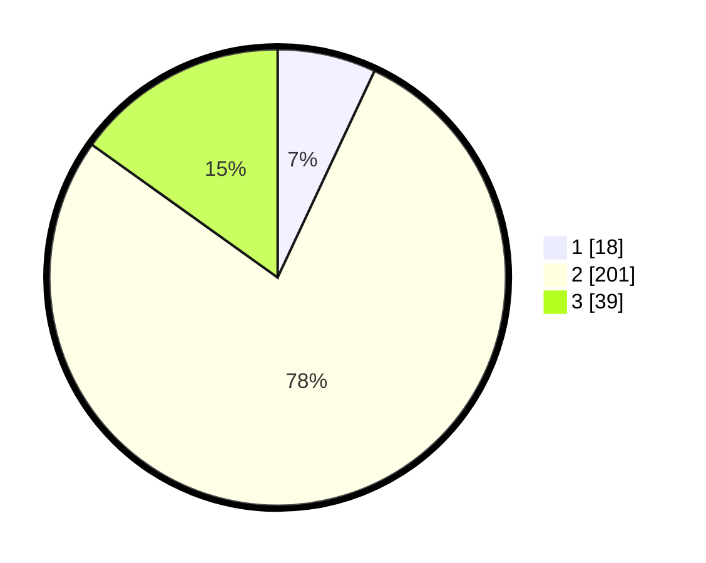

# Hasil

## Grafik

## Tabel

| No. | Nama Paslon    | Suara | Suara (raw) | Persentase |
|:--- |:-------------- | -----:| -----------:| ----------:|
| 1   | ANIES MUHAIMIN | 18    | [18][p-1]   | 6,98       |
| 2   | PRABOWO GIBRAN | 201   | [201][p-2]  | 77,91      |
| 3   | GANJAR MAHFUD  | 39    | [39][p-3]   | 15,12      |

[p-1]: https://github.com/gigit-pemilu/pemilu-2024/blob/main/pilpres/hitung-suara/sub/35-jawa-timur/sub/26-bangkalan/sub/06-geger/sub/2010-campor/sub/012-tps/sub/paslon-1.txt
[p-2]: https://github.com/gigit-pemilu/pemilu-2024/blob/main/pilpres/hitung-suara/sub/35-jawa-timur/sub/26-bangkalan/sub/06-geger/sub/2010-campor/sub/012-tps/sub/paslon-2.txt
[p-3]: https://github.com/gigit-pemilu/pemilu-2024/blob/main/pilpres/hitung-suara/sub/35-jawa-timur/sub/26-bangkalan/sub/06-geger/sub/2010-campor/sub/012-tps/sub/paslon-3.txt

## Foto C Plano

https://sirekap-obj-formc.kpu.go.id/ab49/pemilu/ppwp/35/26/06/20/10/3526062010012-20240214-212419--eea9b1fd-98d4-4c79-89ce-cbb67f14c4ee.jpg

https://sirekap-obj-formc.kpu.go.id/ab49/pemilu/ppwp/35/26/06/20/10/3526062010012-20240214-212540--ed39b87f-78d6-4bef-8e6a-ae9b1b74efed.jpg

https://sirekap-obj-formc.kpu.go.id/ab49/pemilu/ppwp/35/26/06/20/10/3526062010012-20240214-213222--c32742f5-ddfe-41b1-8ef7-a3bf1d60d7bb.jpg

## Metadata

| Key        | Value               |
| ---------- | ------------------- |
| Time Stamp | 2024-02-19 06:16:00 |

