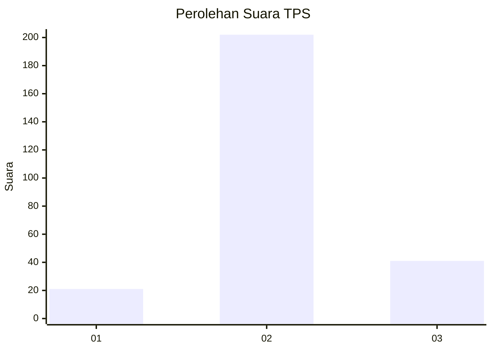

# Hasil

## Grafik

## Tabel

| No. | Nama Paslon    | Suara | Suara (raw) | Persentase |
|:--- |:-------------- | -----:| -----------:| ----------:|
| 1   | ANIES MUHAIMIN | 21    | [21][p-1]   | 7,95       |
| 2   | PRABOWO GIBRAN | 202   | [202][p-2]  | 76,52      |
| 3   | GANJAR MAHFUD  | 41    | [41][p-3]   | 15,53      |

[p-1]: https://github.com/gigit-pemilu/pemilu-2024-35-jawa-timur/blob/main/pilpres/hitung-suara/sub/35-jawa-timur/sub/26-bangkalan/sub/06-geger/sub/2010-campor/sub/014-tps/sub/paslon-1.txt
[p-2]: https://github.com/gigit-pemilu/pemilu-2024-35-jawa-timur/blob/main/pilpres/hitung-suara/sub/35-jawa-timur/sub/26-bangkalan/sub/06-geger/sub/2010-campor/sub/014-tps/sub/paslon-2.txt
[p-3]: https://github.com/gigit-pemilu/pemilu-2024-35-jawa-timur/blob/main/pilpres/hitung-suara/sub/35-jawa-timur/sub/26-bangkalan/sub/06-geger/sub/2010-campor/sub/014-tps/sub/paslon-3.txt

## Foto C Plano

https://sirekap-obj-formc.kpu.go.id/db8c/pemilu/ppwp/35/26/06/20/10/3526062010014-20240215-095811--5e3b441f-21fe-4271-b539-2cdfa8a4668b.jpg

https://sirekap-obj-formc.kpu.go.id/db8c/pemilu/ppwp/35/26/06/20/10/3526062010014-20240215-095844--33275d24-5f3f-406f-88d1-aff4a86343a6.jpg

https://sirekap-obj-formc.kpu.go.id/db8c/pemilu/ppwp/35/26/06/20/10/3526062010014-20240215-095920--bc62c92c-4e56-4dca-865c-2a0197c114ab.jpg

## Metadata

| Key        | Value               |
| ---------- | ------------------- |
| Time Stamp | 2024-02-19 06:16:00 |

