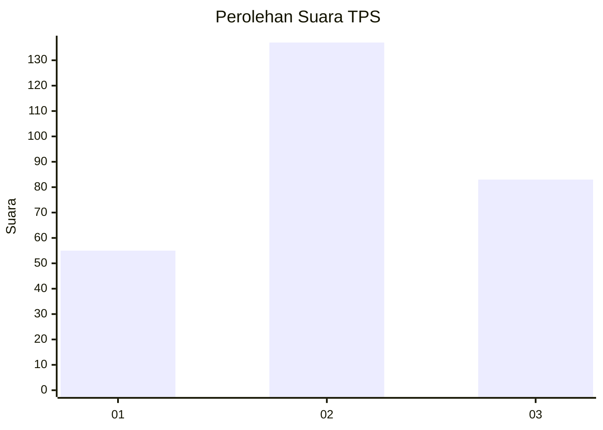
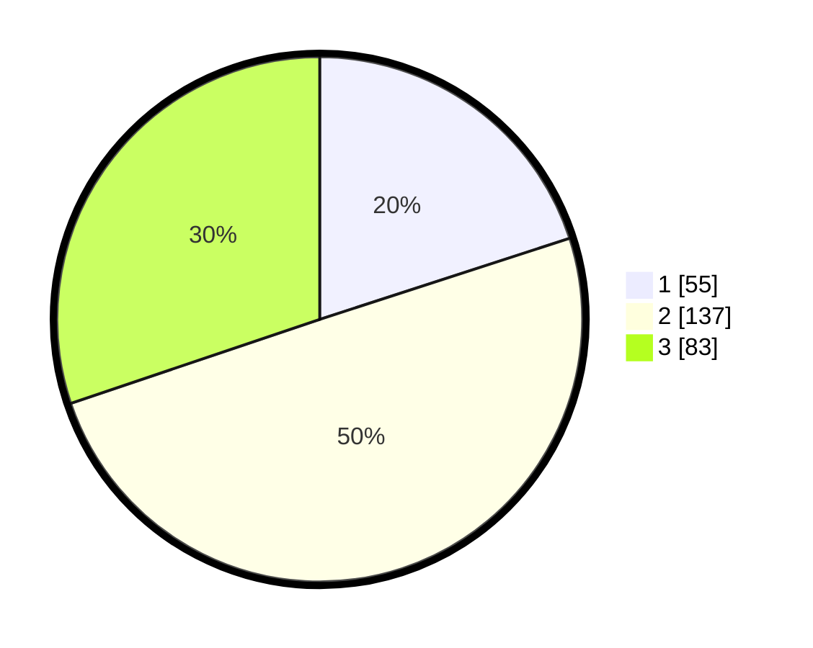

# Hasil

## Grafik

## Tabel

| No. | Nama Paslon    | Suara | Suara (raw) | Persentase |
|:--- |:-------------- | -----:| -----------:| ----------:|
| 1   | ANIES MUHAIMIN | 55    | [55][p-1]   | 20,00      |
| 2   | PRABOWO GIBRAN | 137   | [137][p-2]  | 49,82      |
| 3   | GANJAR MAHFUD  | 83    | [83][p-3]   | 30,18      |

[p-1]: https://github.com/gigit-pemilu/pemilu-2024/blob/main/pilpres/hitung-suara/sub/35-jawa-timur/sub/26-bangkalan/sub/06-geger/sub/2011-kompol/sub/001-tps/sub/paslon-1.txt
[p-2]: https://github.com/gigit-pemilu/pemilu-2024/blob/main/pilpres/hitung-suara/sub/35-jawa-timur/sub/26-bangkalan/sub/06-geger/sub/2011-kompol/sub/001-tps/sub/paslon-2.txt
[p-3]: https://github.com/gigit-pemilu/pemilu-2024/blob/main/pilpres/hitung-suara/sub/35-jawa-timur/sub/26-bangkalan/sub/06-geger/sub/2011-kompol/sub/001-tps/sub/paslon-3.txt

## Foto C Plano

https://sirekap-obj-formc.kpu.go.id/8c1f/pemilu/ppwp/35/26/06/20/11/3526062011001-20240215-075925--80dc7db2-0790-4306-a32d-98ce4bddded7.jpg

https://sirekap-obj-formc.kpu.go.id/8c1f/pemilu/ppwp/35/26/06/20/11/3526062011001-20240215-080036--56656b7f-4608-4500-a2ba-7473692cb396.jpg

https://sirekap-obj-formc.kpu.go.id/8c1f/pemilu/ppwp/35/26/06/20/11/3526062011001-20240215-080220--9eb0b0cc-e82e-45c0-abe3-6b1e7b09dcfb.jpg

## Metadata

| Key        | Value               |
| ---------- | ------------------- |
| Time Stamp | 2024-02-19 06:16:00 |

