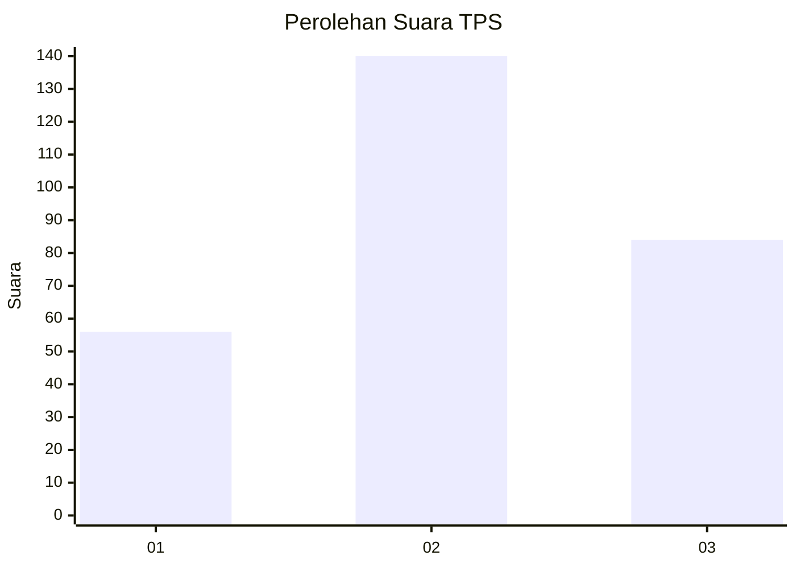
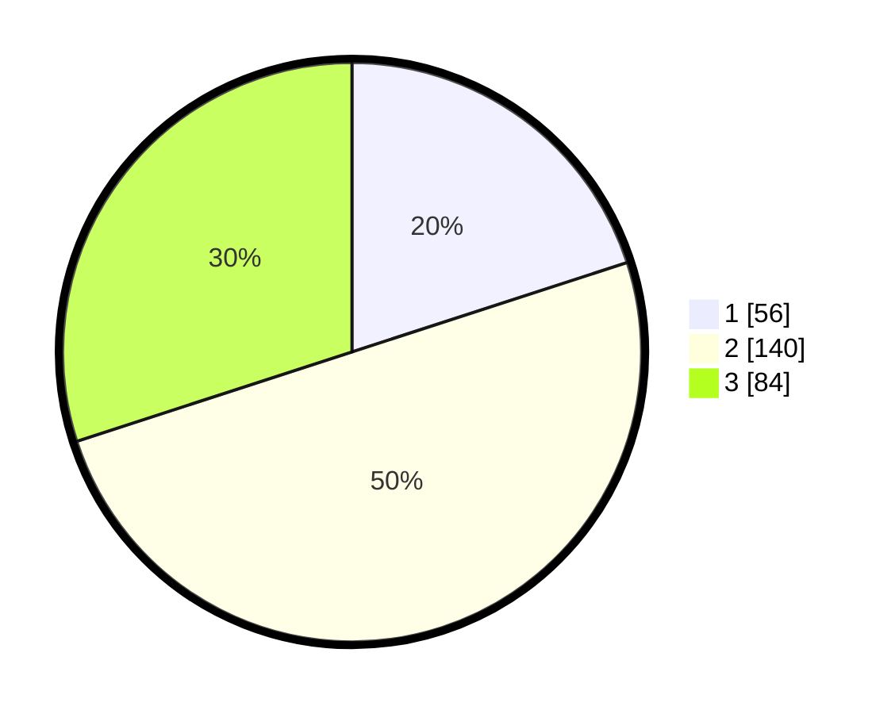

# Hasil

## Grafik

## Tabel

| No. | Nama Paslon    | Suara | Suara (raw) | Persentase |
|:--- |:-------------- | -----:| -----------:| ----------:|
| 1   | ANIES MUHAIMIN | 56    | [56][p-1]   | 20,00      |
| 2   | PRABOWO GIBRAN | 140   | [140][p-2]  | 50,00      |
| 3   | GANJAR MAHFUD  | 84    | [84][p-3]   | 30,00      |

[p-1]: https://github.com/gigit-pemilu/pemilu-2024-35-jawa-timur/blob/main/pilpres/hitung-suara/sub/35-jawa-timur/sub/26-bangkalan/sub/06-geger/sub/2011-kompol/sub/002-tps/sub/paslon-1.txt
[p-2]: https://github.com/gigit-pemilu/pemilu-2024-35-jawa-timur/blob/main/pilpres/hitung-suara/sub/35-jawa-timur/sub/26-bangkalan/sub/06-geger/sub/2011-kompol/sub/002-tps/sub/paslon-2.txt
[p-3]: https://github.com/gigit-pemilu/pemilu-2024-35-jawa-timur/blob/main/pilpres/hitung-suara/sub/35-jawa-timur/sub/26-bangkalan/sub/06-geger/sub/2011-kompol/sub/002-tps/sub/paslon-3.txt

## Foto C Plano

https://sirekap-obj-formc.kpu.go.id/1d8a/pemilu/ppwp/35/26/06/20/11/3526062011002-20240214-215027--7456f797-2a0c-4a76-9bbd-c7cd38943875.jpg

https://sirekap-obj-formc.kpu.go.id/1d8a/pemilu/ppwp/35/26/06/20/11/3526062011002-20240214-204725--c99ece6e-b3f2-4c57-96d7-67db8817d315.jpg

https://sirekap-obj-formc.kpu.go.id/1d8a/pemilu/ppwp/35/26/06/20/11/3526062011002-20240214-204730--b5c0057c-7beb-4eea-b1c4-e7fdc5b12c47.jpg

## Metadata

| Key        | Value               |
| ---------- | ------------------- |
| Time Stamp | 2024-02-21 21:00:04 |

