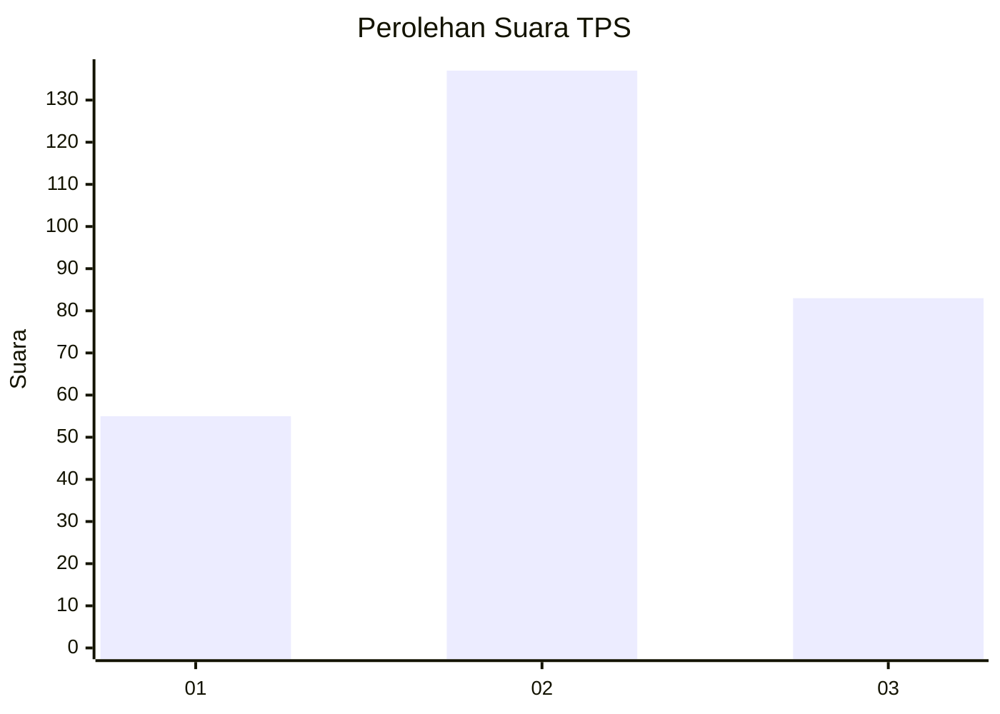
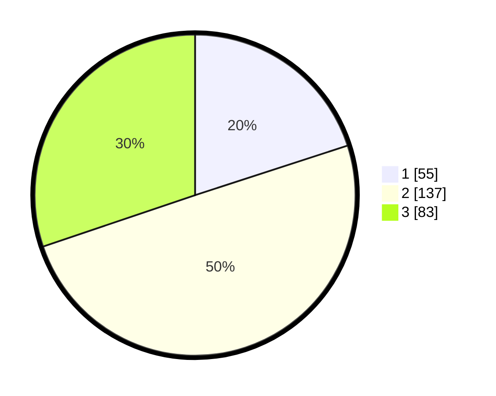

# Hasil

## Grafik

## Tabel

| No. | Nama Paslon    | Suara | Suara (raw) | Persentase |
|:--- |:-------------- | -----:| -----------:| ----------:|
| 1   | ANIES MUHAIMIN | 55    | [55][p-1]   | 20,00      |
| 2   | PRABOWO GIBRAN | 137   | [137][p-2]  | 49,82      |
| 3   | GANJAR MAHFUD  | 83    | [83][p-3]   | 30,18      |

[p-1]: https://github.com/gigit-pemilu/pemilu-2024-35-jawa-timur/blob/main/pilpres/hitung-suara/sub/35-jawa-timur/sub/26-bangkalan/sub/06-geger/sub/2011-kompol/sub/011-tps/sub/paslon-1.txt
[p-2]: https://github.com/gigit-pemilu/pemilu-2024-35-jawa-timur/blob/main/pilpres/hitung-suara/sub/35-jawa-timur/sub/26-bangkalan/sub/06-geger/sub/2011-kompol/sub/011-tps/sub/paslon-2.txt
[p-3]: https://github.com/gigit-pemilu/pemilu-2024-35-jawa-timur/blob/main/pilpres/hitung-suara/sub/35-jawa-timur/sub/26-bangkalan/sub/06-geger/sub/2011-kompol/sub/011-tps/sub/paslon-3.txt

## Foto C Plano

https://sirekap-obj-formc.kpu.go.id/ad74/pemilu/ppwp/35/26/06/20/11/3526062011011-20240214-214752--e6ea5c50-ee1d-4834-a51d-9570cd90b8e3.jpg

https://sirekap-obj-formc.kpu.go.id/ad74/pemilu/ppwp/35/26/06/20/11/3526062011011-20240214-214758--04b906bf-717f-4bd6-bcaf-29aca3796a52.jpg

https://sirekap-obj-formc.kpu.go.id/ad74/pemilu/ppwp/35/26/06/20/11/3526062011011-20240214-214804--7cd02dcd-66f5-46e7-a92b-22a248a81750.jpg

## Metadata

| Key        | Value               |
| ---------- | ------------------- |
| Time Stamp | 2024-02-19 06:16:00 |

