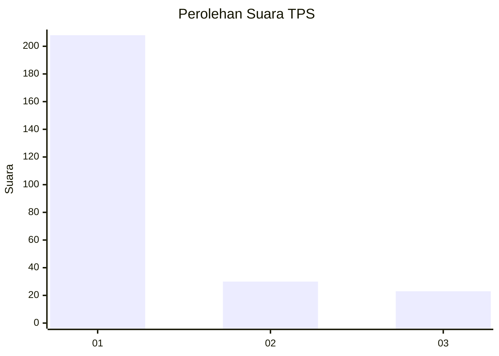
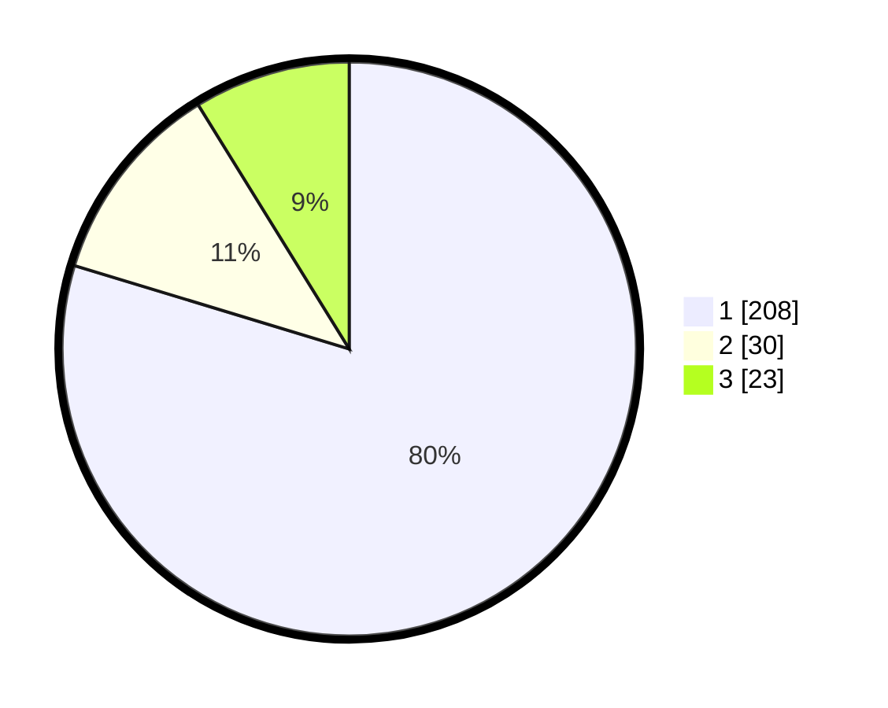

# Hasil

## Grafik

## Tabel

| No. | Nama Paslon    | Suara | Suara (raw) | Persentase |
|:--- |:-------------- | -----:| -----------:| ----------:|
| 1   | ANIES MUHAIMIN | 208   | [208][p-1]  | 79,69      |
| 2   | PRABOWO GIBRAN | 30    | [30][p-2]   | 11,49      |
| 3   | GANJAR MAHFUD  | 23    | [23][p-3]   | 8,81       |

[p-1]: https://github.com/gigit-pemilu/pemilu-2024-35-jawa-timur/blob/main/pilpres/hitung-suara/sub/35-jawa-timur/sub/26-bangkalan/sub/06-geger/sub/2012-tegar-priyah/sub/002-tps/sub/paslon-1.txt
[p-2]: https://github.com/gigit-pemilu/pemilu-2024-35-jawa-timur/blob/main/pilpres/hitung-suara/sub/35-jawa-timur/sub/26-bangkalan/sub/06-geger/sub/2012-tegar-priyah/sub/002-tps/sub/paslon-2.txt
[p-3]: https://github.com/gigit-pemilu/pemilu-2024-35-jawa-timur/blob/main/pilpres/hitung-suara/sub/35-jawa-timur/sub/26-bangkalan/sub/06-geger/sub/2012-tegar-priyah/sub/002-tps/sub/paslon-3.txt

## Foto C Plano

https://sirekap-obj-formc.kpu.go.id/324b/pemilu/ppwp/35/26/06/20/12/3526062012002-20240214-222642--89488cb3-1e32-4d35-8844-ce31f1adf828.jpg

https://sirekap-obj-formc.kpu.go.id/324b/pemilu/ppwp/35/26/06/20/12/3526062012002-20240214-222844--3b998111-065f-40b3-81ae-afa17147d44f.jpg

https://sirekap-obj-formc.kpu.go.id/324b/pemilu/ppwp/35/26/06/20/12/3526062012002-20240214-223040--6e570fbb-85ea-4fca-bdf5-0d6f127e84b3.jpg

## Metadata

| Key        | Value               |
| ---------- | ------------------- |
| Time Stamp | 2024-02-16 10:00:28 |

