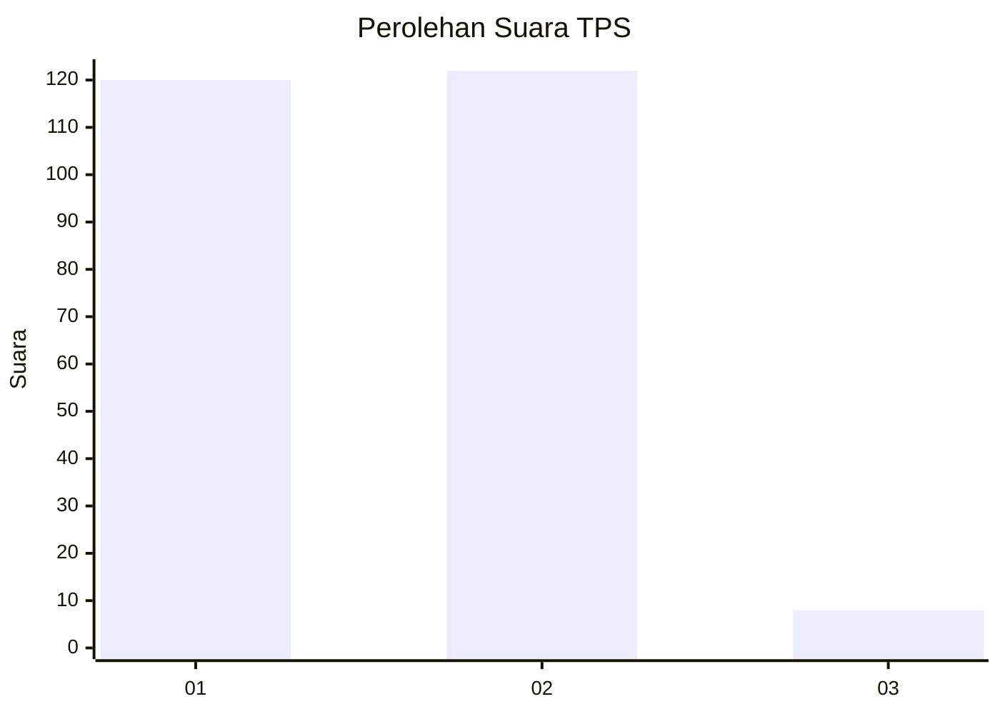
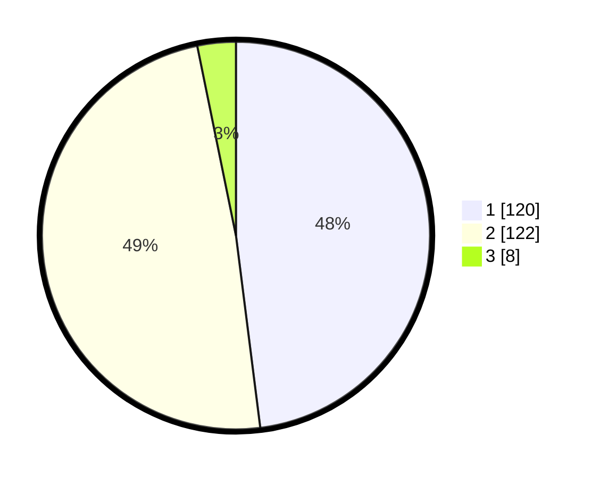

# Hasil

## Grafik

## Tabel

| No. | Nama Paslon    | Suara | Suara (raw) | Persentase |
|:--- |:-------------- | -----:| -----------:| ----------:|
| 1   | ANIES MUHAIMIN | 120   | [120][p-1]  | 48,00      |
| 2   | PRABOWO GIBRAN | 122   | [122][p-2]  | 48,80      |
| 3   | GANJAR MAHFUD  | 8     | [8][p-3]    | 3,20       |

[p-1]: https://github.com/gigit-pemilu/pemilu-2024/blob/main/pilpres/hitung-suara/sub/35-jawa-timur/sub/26-bangkalan/sub/06-geger/sub/2013-banyoneng-dajah/sub/002-tps/sub/paslon-1.txt
[p-2]: https://github.com/gigit-pemilu/pemilu-2024/blob/main/pilpres/hitung-suara/sub/35-jawa-timur/sub/26-bangkalan/sub/06-geger/sub/2013-banyoneng-dajah/sub/002-tps/sub/paslon-2.txt
[p-3]: https://github.com/gigit-pemilu/pemilu-2024/blob/main/pilpres/hitung-suara/sub/35-jawa-timur/sub/26-bangkalan/sub/06-geger/sub/2013-banyoneng-dajah/sub/002-tps/sub/paslon-3.txt

## Foto C Plano

https://sirekap-obj-formc.kpu.go.id/efdf/pemilu/ppwp/35/26/06/20/13/3526062013002-20240215-105553--45b4667d-5314-4d0c-8f0e-3687d2334a48.jpg

https://sirekap-obj-formc.kpu.go.id/efdf/pemilu/ppwp/35/26/06/20/13/3526062013002-20240215-105326--9b795338-ea31-4efc-a301-643f4fa218ac.jpg

https://sirekap-obj-formc.kpu.go.id/efdf/pemilu/ppwp/35/26/06/20/13/3526062013002-20240215-105644--90fa27cb-76f9-4177-a8be-0bf211a59562.jpg

## Metadata

| Key        | Value               |
| ---------- | ------------------- |
| Time Stamp | 2024-02-19 06:16:00 |

