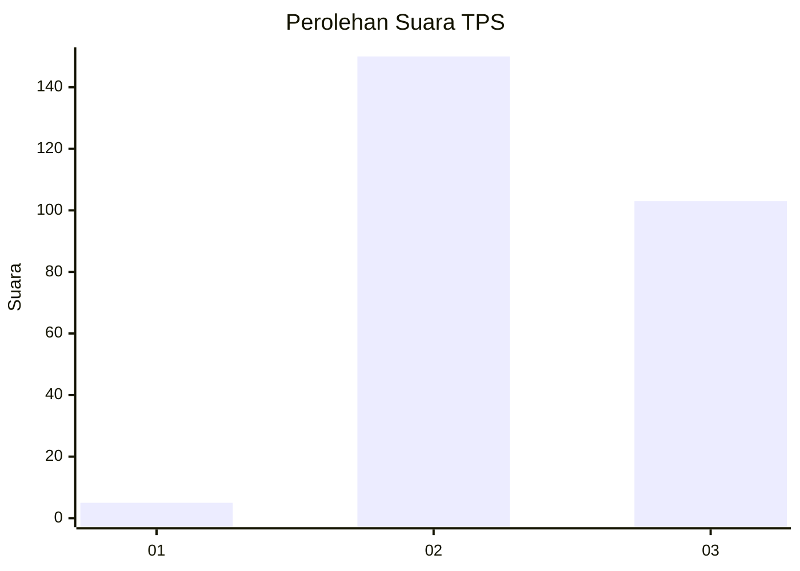
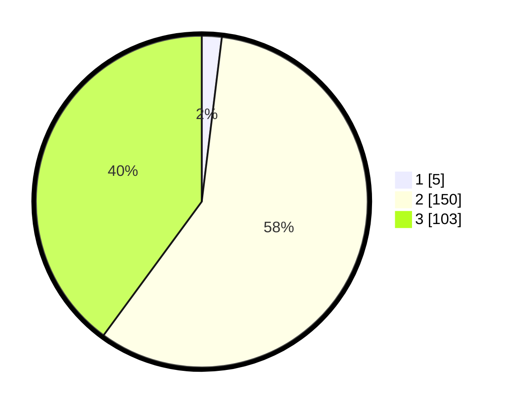

# Hasil

## Grafik

## Tabel

| No. | Nama Paslon    | Suara | Suara (raw) | Persentase |
|:--- |:-------------- | -----:| -----------:| ----------:|
| 1   | ANIES MUHAIMIN | 5     | [5][p-1]    | 1,94       |
| 2   | PRABOWO GIBRAN | 150   | [150][p-2]  | 58,14      |
| 3   | GANJAR MAHFUD  | 103   | [103][p-3]  | 39,92      |

[p-1]: https://github.com/gigit-pemilu/pemilu-2024/blob/main/pilpres/hitung-suara/sub/35-jawa-timur/sub/26-bangkalan/sub/06-geger/sub/2013-banyoneng-dajah/sub/003-tps/sub/paslon-1.txt
[p-2]: https://github.com/gigit-pemilu/pemilu-2024/blob/main/pilpres/hitung-suara/sub/35-jawa-timur/sub/26-bangkalan/sub/06-geger/sub/2013-banyoneng-dajah/sub/003-tps/sub/paslon-2.txt
[p-3]: https://github.com/gigit-pemilu/pemilu-2024/blob/main/pilpres/hitung-suara/sub/35-jawa-timur/sub/26-bangkalan/sub/06-geger/sub/2013-banyoneng-dajah/sub/003-tps/sub/paslon-3.txt

## Foto C Plano

https://sirekap-obj-formc.kpu.go.id/2ca0/pemilu/ppwp/35/26/06/20/13/3526062013003-20240215-111146--d221051a-f2e9-4c0c-bbd1-c56a1f0a43a6.jpg

https://sirekap-obj-formc.kpu.go.id/2ca0/pemilu/ppwp/35/26/06/20/13/3526062013003-20240215-111426--a22d00ed-ee2d-4c85-bb15-32c62cf60d46.jpg

https://sirekap-obj-formc.kpu.go.id/2ca0/pemilu/ppwp/35/26/06/20/13/3526062013003-20240215-111633--018e6bb4-b462-4bf0-b27a-45f6a36614d6.jpg

## Metadata

| Key        | Value               |
| ---------- | ------------------- |
| Time Stamp | 2024-02-19 06:16:00 |

