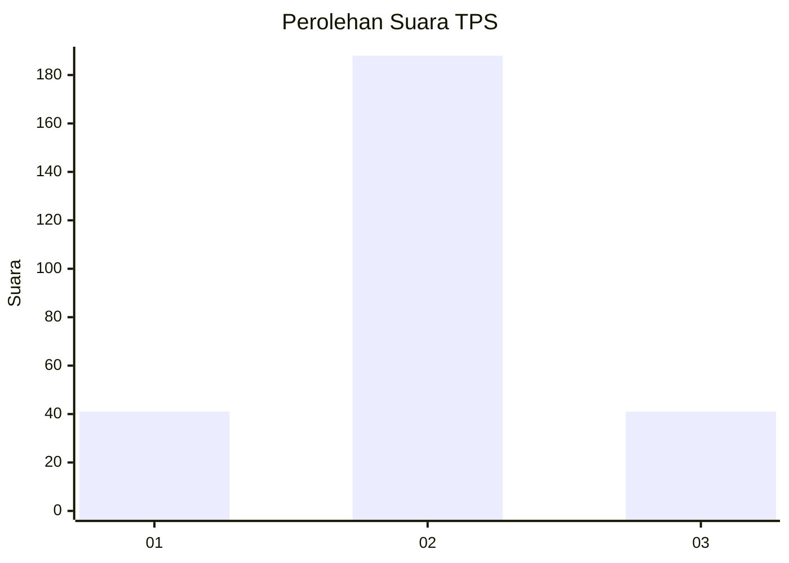

# Hasil

## Grafik

## Tabel

| No. | Nama Paslon    | Suara | Suara (raw) | Persentase |
|:--- |:-------------- | -----:| -----------:| ----------:|
| 1   | ANIES MUHAIMIN | 41    | [41][p-1]   | 15,19      |
| 2   | PRABOWO GIBRAN | 188   | [188][p-2]  | 69,63      |
| 3   | GANJAR MAHFUD  | 41    | [41][p-3]   | 15,19      |

[p-1]: https://github.com/gigit-pemilu/pemilu-2024/blob/main/pilpres/hitung-suara/sub/35-jawa-timur/sub/26-bangkalan/sub/07-klampis/sub/2001-klampis-barat/sub/006-tps/sub/paslon-1.txt
[p-2]: https://github.com/gigit-pemilu/pemilu-2024/blob/main/pilpres/hitung-suara/sub/35-jawa-timur/sub/26-bangkalan/sub/07-klampis/sub/2001-klampis-barat/sub/006-tps/sub/paslon-2.txt
[p-3]: https://github.com/gigit-pemilu/pemilu-2024/blob/main/pilpres/hitung-suara/sub/35-jawa-timur/sub/26-bangkalan/sub/07-klampis/sub/2001-klampis-barat/sub/006-tps/sub/paslon-3.txt

## Foto C Plano

https://sirekap-obj-formc.kpu.go.id/0ab8/pemilu/ppwp/35/26/07/20/01/3526072001006-20240214-204623--670ca765-a18b-4583-a34a-a1c1425f1754.jpg

https://sirekap-obj-formc.kpu.go.id/0ab8/pemilu/ppwp/35/26/07/20/01/3526072001006-20240214-204703--2bf6e57b-ccdb-43cb-98d2-42d94993295b.jpg

https://sirekap-obj-formc.kpu.go.id/0ab8/pemilu/ppwp/35/26/07/20/01/3526072001006-20240214-155326--12845b80-7994-4220-be61-aa693c17529c.jpg

## Metadata

| Key        | Value               |
| ---------- | ------------------- |
| Time Stamp | 2024-02-25 17:00:00 |

