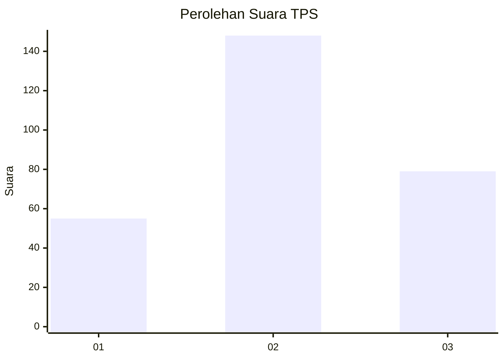
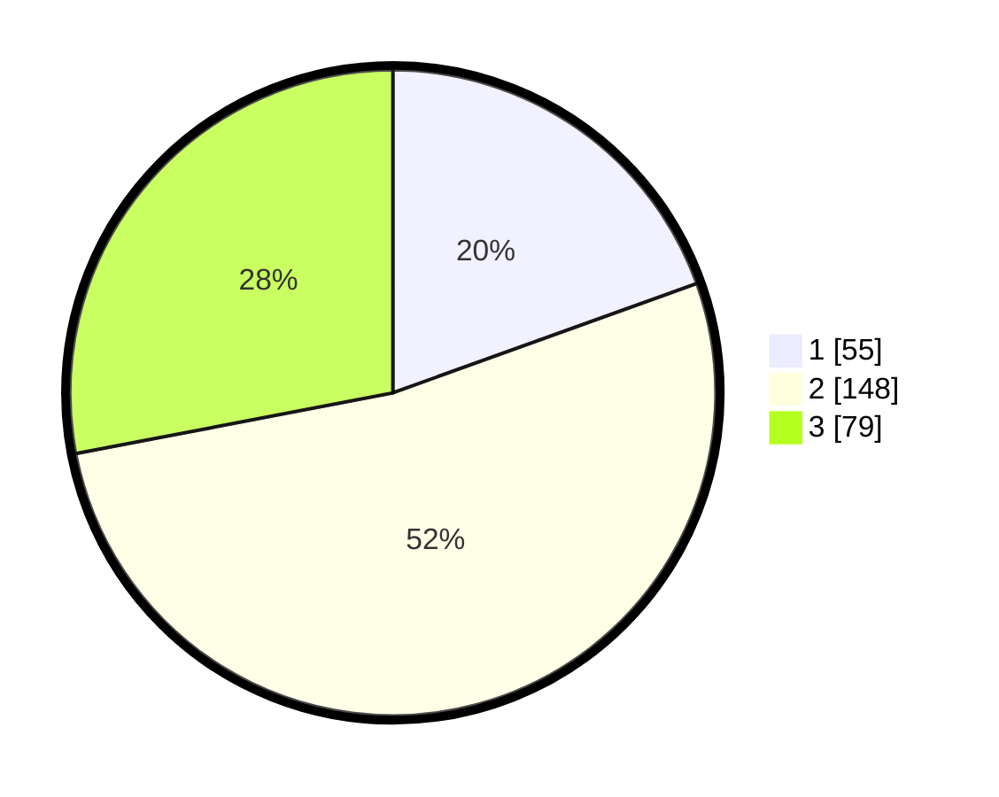

# Hasil

## Grafik

## Tabel

| No. | Nama Paslon    | Suara | Suara (raw) | Persentase |
|:--- |:-------------- | -----:| -----------:| ----------:|
| 1   | ANIES MUHAIMIN | 55    | [55][p-1]   | 19,50      |
| 2   | PRABOWO GIBRAN | 148   | [148][p-2]  | 52,48      |
| 3   | GANJAR MAHFUD  | 79    | [79][p-3]   | 28,01      |

[p-1]: https://github.com/gigit-pemilu/pemilu-2024/blob/main/pilpres/hitung-suara/sub/35-jawa-timur/sub/26-bangkalan/sub/07-klampis/sub/2001-klampis-barat/sub/008-tps/sub/paslon-1.txt
[p-2]: https://github.com/gigit-pemilu/pemilu-2024/blob/main/pilpres/hitung-suara/sub/35-jawa-timur/sub/26-bangkalan/sub/07-klampis/sub/2001-klampis-barat/sub/008-tps/sub/paslon-2.txt
[p-3]: https://github.com/gigit-pemilu/pemilu-2024/blob/main/pilpres/hitung-suara/sub/35-jawa-timur/sub/26-bangkalan/sub/07-klampis/sub/2001-klampis-barat/sub/008-tps/sub/paslon-3.txt

## Foto C Plano

https://sirekap-obj-formc.kpu.go.id/6130/pemilu/ppwp/35/26/07/20/01/3526072001008-20240214-204406--6d7e2b8a-8533-4247-8038-7773f8ccdc92.jpg

https://sirekap-obj-formc.kpu.go.id/6130/pemilu/ppwp/35/26/07/20/01/3526072001008-20240214-204536--ced0c8bc-90cb-44fa-b1a2-fcf3f338bb20.jpg

## Metadata

| Key        | Value               |
| ---------- | ------------------- |
| Time Stamp | 2024-02-25 16:00:00 |

