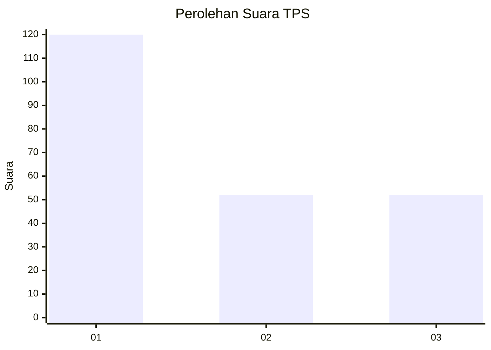
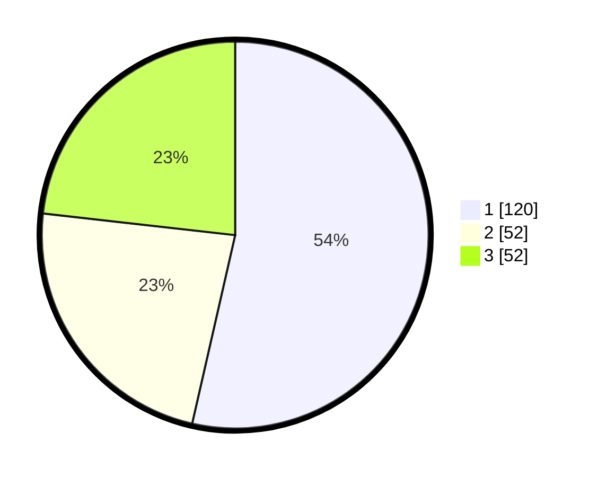

# Hasil

## Grafik

## Tabel

| No. | Nama Paslon    | Suara | Suara (raw) | Persentase |
|:--- |:-------------- | -----:| -----------:| ----------:|
| 1   | ANIES MUHAIMIN | 120   | [120][p-1]  | 53,57      |
| 2   | PRABOWO GIBRAN | 52    | [52][p-2]   | 23,21      |
| 3   | GANJAR MAHFUD  | 52    | [52][p-3]   | 23,21      |

[p-1]: https://github.com/gigit-pemilu/pemilu-2024-35-jawa-timur/blob/main/pilpres/hitung-suara/sub/35-jawa-timur/sub/26-bangkalan/sub/07-klampis/sub/2002-bulukagung/sub/001-tps/sub/paslon-1.txt
[p-2]: https://github.com/gigit-pemilu/pemilu-2024-35-jawa-timur/blob/main/pilpres/hitung-suara/sub/35-jawa-timur/sub/26-bangkalan/sub/07-klampis/sub/2002-bulukagung/sub/001-tps/sub/paslon-2.txt
[p-3]: https://github.com/gigit-pemilu/pemilu-2024-35-jawa-timur/blob/main/pilpres/hitung-suara/sub/35-jawa-timur/sub/26-bangkalan/sub/07-klampis/sub/2002-bulukagung/sub/001-tps/sub/paslon-3.txt

## Foto C Plano

https://sirekap-obj-formc.kpu.go.id/fddd/pemilu/ppwp/35/26/07/20/02/3526072002001-20240214-204413--d8fb949b-f0e0-4b4a-94c0-b968664f502a.jpg

https://sirekap-obj-formc.kpu.go.id/fddd/pemilu/ppwp/35/26/07/20/02/3526072002001-20240214-204911--8e455cd2-bfe4-478c-9eb7-0f11430ccc31.jpg

https://sirekap-obj-formc.kpu.go.id/fddd/pemilu/ppwp/35/26/07/20/02/3526072002001-20240214-205257--6e5d95df-23b5-424c-b323-208cfd6d7b34.jpg

## Metadata

| Key        | Value               |
| ---------- | ------------------- |
| Time Stamp | 2024-02-19 06:16:00 |

