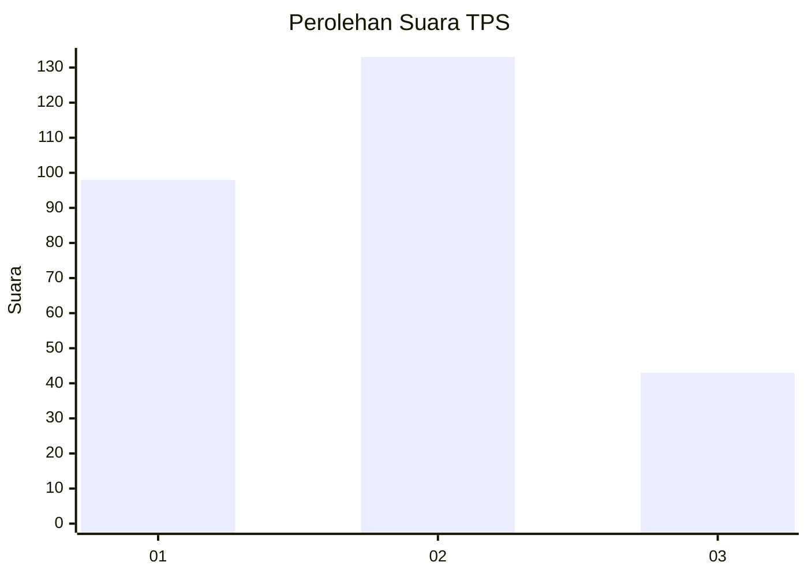
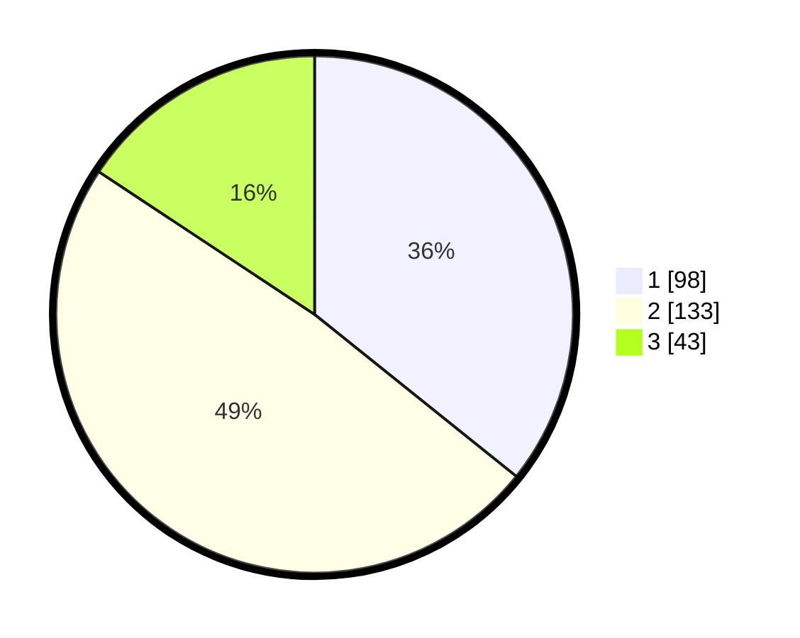

# Hasil

## Grafik

## Tabel

| No. | Nama Paslon    | Suara | Suara (raw) | Persentase |
|:--- |:-------------- | -----:| -----------:| ----------:|
| 1   | ANIES MUHAIMIN | 98    | [98][p-1]   | 35,77      |
| 2   | PRABOWO GIBRAN | 133   | [133][p-2]  | 48,54      |
| 3   | GANJAR MAHFUD  | 43    | [43][p-3]   | 15,69      |

[p-1]: https://github.com/gigit-pemilu/pemilu-2024-35-jawa-timur/blob/main/pilpres/hitung-suara/sub/35-jawa-timur/sub/26-bangkalan/sub/07-klampis/sub/2002-bulukagung/sub/005-tps/sub/paslon-1.txt
[p-2]: https://github.com/gigit-pemilu/pemilu-2024-35-jawa-timur/blob/main/pilpres/hitung-suara/sub/35-jawa-timur/sub/26-bangkalan/sub/07-klampis/sub/2002-bulukagung/sub/005-tps/sub/paslon-2.txt
[p-3]: https://github.com/gigit-pemilu/pemilu-2024-35-jawa-timur/blob/main/pilpres/hitung-suara/sub/35-jawa-timur/sub/26-bangkalan/sub/07-klampis/sub/2002-bulukagung/sub/005-tps/sub/paslon-3.txt

## Foto C Plano

https://sirekap-obj-formc.kpu.go.id/3e30/pemilu/ppwp/35/26/07/20/02/3526072002005-20240214-202541--1fe08f76-71ca-4947-b414-a99463a282b1.jpg

https://sirekap-obj-formc.kpu.go.id/3e30/pemilu/ppwp/35/26/07/20/02/3526072002005-20240214-202618--0f5f1333-bdd4-460a-8075-4c0db66cb0d2.jpg

https://sirekap-obj-formc.kpu.go.id/3e30/pemilu/ppwp/35/26/07/20/02/3526072002005-20240214-202709--da53c433-3626-420a-9075-b05d78b4f6c8.jpg

## Metadata

| Key        | Value               |
| ---------- | ------------------- |
| Time Stamp | 2024-02-19 06:16:00 |

