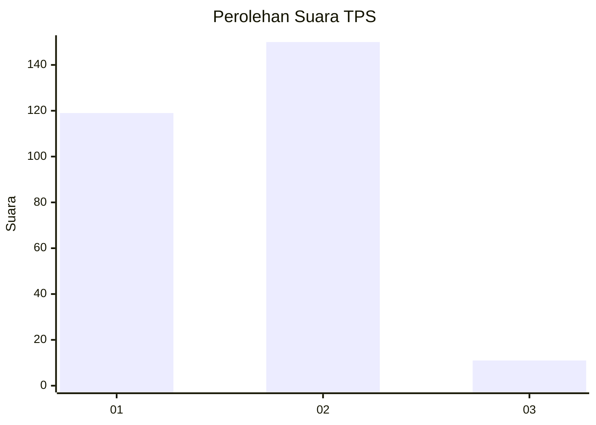
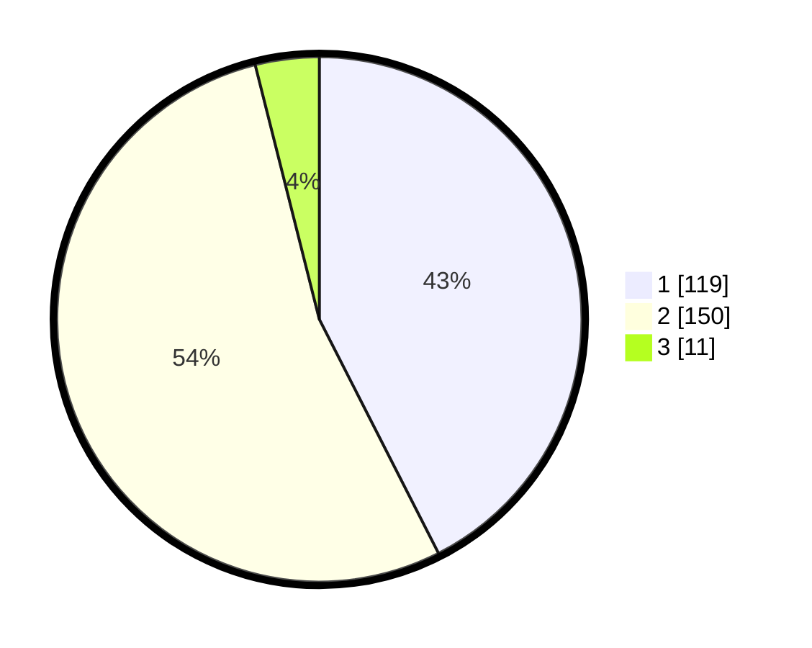

# Hasil

## Grafik

## Tabel

| No. | Nama Paslon    | Suara | Suara (raw) | Persentase |
|:--- |:-------------- | -----:| -----------:| ----------:|
| 1   | ANIES MUHAIMIN | 119   | [119][p-1]  | 42,50      |
| 2   | PRABOWO GIBRAN | 150   | [150][p-2]  | 53,57      |
| 3   | GANJAR MAHFUD  | 11    | [11][p-3]   | 3,93       |

[p-1]: https://github.com/gigit-pemilu/pemilu-2024/blob/main/pilpres/hitung-suara/sub/35-jawa-timur/sub/26-bangkalan/sub/07-klampis/sub/2002-bulukagung/sub/007-tps/sub/paslon-1.txt
[p-2]: https://github.com/gigit-pemilu/pemilu-2024/blob/main/pilpres/hitung-suara/sub/35-jawa-timur/sub/26-bangkalan/sub/07-klampis/sub/2002-bulukagung/sub/007-tps/sub/paslon-2.txt
[p-3]: https://github.com/gigit-pemilu/pemilu-2024/blob/main/pilpres/hitung-suara/sub/35-jawa-timur/sub/26-bangkalan/sub/07-klampis/sub/2002-bulukagung/sub/007-tps/sub/paslon-3.txt

## Foto C Plano

https://sirekap-obj-formc.kpu.go.id/3472/pemilu/ppwp/35/26/07/20/02/3526072002007-20240214-203136--17fa3fa3-490c-4762-b57f-8e4727c9f191.jpg

https://sirekap-obj-formc.kpu.go.id/3472/pemilu/ppwp/35/26/07/20/02/3526072002007-20240214-203305--b71c71c8-c6c5-4df7-b560-25ef45bb70e6.jpg

https://sirekap-obj-formc.kpu.go.id/3472/pemilu/ppwp/35/26/07/20/02/3526072002007-20240214-203343--261f2a09-32bc-43fe-9ca6-d3f5411a0d76.jpg

## Metadata

| Key        | Value               |
| ---------- | ------------------- |
| Time Stamp | 2024-02-19 06:16:00 |

