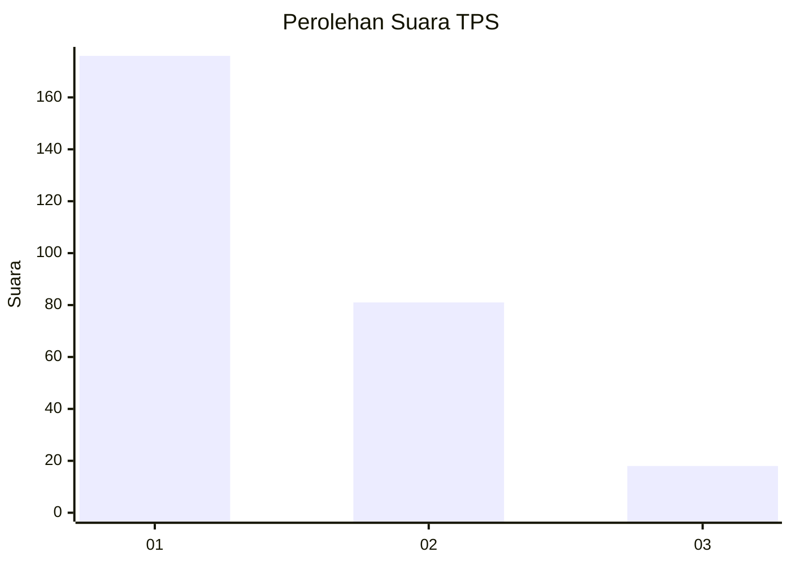
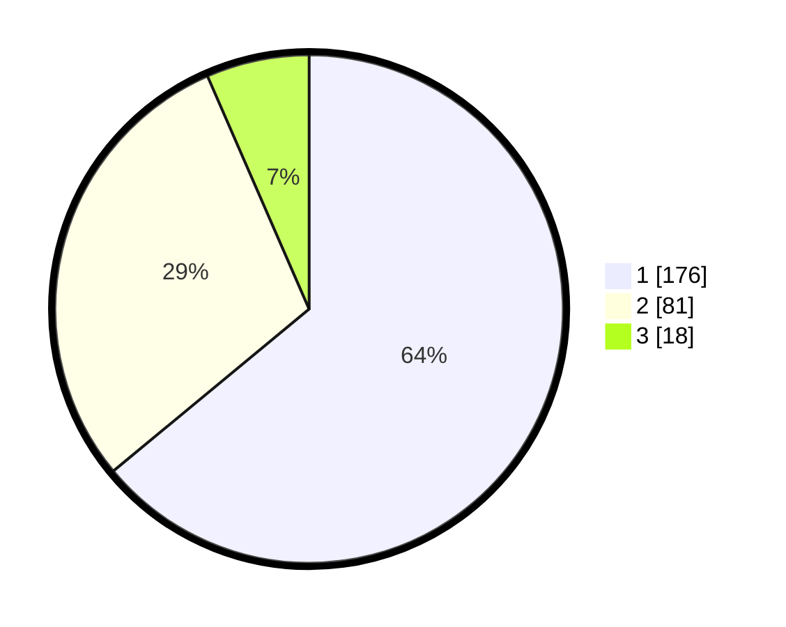

# Hasil

## Grafik

## Tabel

| No. | Nama Paslon    | Suara | Suara (raw) | Persentase |
|:--- |:-------------- | -----:| -----------:| ----------:|
| 1   | ANIES MUHAIMIN | 176   | [176][p-1]  | 64,00      |
| 2   | PRABOWO GIBRAN | 81    | [81][p-2]   | 29,45      |
| 3   | GANJAR MAHFUD  | 18    | [18][p-3]   | 6,55       |

[p-1]: https://github.com/gigit-pemilu/pemilu-2024/blob/main/pilpres/hitung-suara/sub/35-jawa-timur/sub/26-bangkalan/sub/07-klampis/sub/2002-bulukagung/sub/011-tps/sub/paslon-1.txt
[p-2]: https://github.com/gigit-pemilu/pemilu-2024/blob/main/pilpres/hitung-suara/sub/35-jawa-timur/sub/26-bangkalan/sub/07-klampis/sub/2002-bulukagung/sub/011-tps/sub/paslon-2.txt
[p-3]: https://github.com/gigit-pemilu/pemilu-2024/blob/main/pilpres/hitung-suara/sub/35-jawa-timur/sub/26-bangkalan/sub/07-klampis/sub/2002-bulukagung/sub/011-tps/sub/paslon-3.txt

## Foto C Plano

https://sirekap-obj-formc.kpu.go.id/6998/pemilu/ppwp/35/26/07/20/02/3526072002011-20240214-185615--ac647155-f5b2-4afe-9b05-897fd427415e.jpg

https://sirekap-obj-formc.kpu.go.id/6998/pemilu/ppwp/35/26/07/20/02/3526072002011-20240214-185738--2d79a2f3-b903-4195-8661-30e2e1f98ce2.jpg

https://sirekap-obj-formc.kpu.go.id/6998/pemilu/ppwp/35/26/07/20/02/3526072002011-20240214-185231--44c71435-f7af-46af-97f1-ef66210e1a2e.jpg

## Metadata

| Key        | Value               |
| ---------- | ------------------- |
| Time Stamp | 2024-02-17 16:00:02 |

## DATA PEMILIH TETAP

Jumlah pemilih dalam DPT: **204**.
 * L: **133**.
 * P: **151**.

## DATA PENGGUNA HAK PILIH

Jumlah pengguna hak pilih dalam DPT: **280**.
 * L: **132**.
 * P: **148**.

Jumlah pengguna hak pilih dalam DPTb: **0**.
 * L: **884**.
 * P: **0**.

Jumlah pengguna hak pilih dalam DPK: **0**.
 * L: **22**.
 * P: **0**.

Jumlah pengguna hak pilih: **280**.
 * L: **132**.
 * P: **148**.

## JUMLAH SUARA SAH DAN TIDAK SAH

JUMLAH SELURUH SUARA SAH: **280**.

JUMLAH SUARA TIDAK SAH: **10**.

JUMLAH SELURUH SUARA SAH DAN SUARA TIDAK SAH: **290**.

