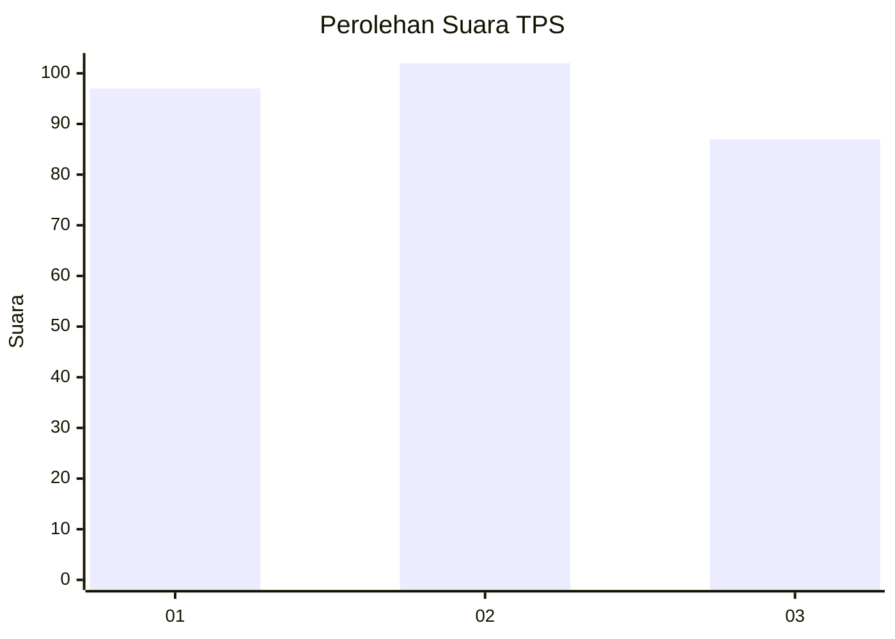
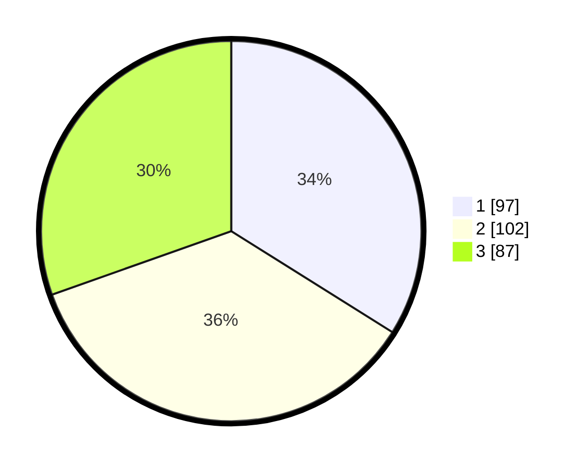

# Hasil

## Grafik

## Tabel

| No. | Nama Paslon    | Suara | Suara (raw) | Persentase |
|:--- |:-------------- | -----:| -----------:| ----------:|
| 1   | ANIES MUHAIMIN | 97    | [97][p-1]   | 33,92      |
| 2   | PRABOWO GIBRAN | 102   | [102][p-2]  | 35,66      |
| 3   | GANJAR MAHFUD  | 87    | [87][p-3]   | 30,42      |

[p-1]: https://github.com/gigit-pemilu/pemilu-2024/blob/main/pilpres/hitung-suara/sub/35-jawa-timur/sub/26-bangkalan/sub/07-klampis/sub/2009-karang-asem/sub/001-tps/sub/paslon-1.txt
[p-2]: https://github.com/gigit-pemilu/pemilu-2024/blob/main/pilpres/hitung-suara/sub/35-jawa-timur/sub/26-bangkalan/sub/07-klampis/sub/2009-karang-asem/sub/001-tps/sub/paslon-2.txt
[p-3]: https://github.com/gigit-pemilu/pemilu-2024/blob/main/pilpres/hitung-suara/sub/35-jawa-timur/sub/26-bangkalan/sub/07-klampis/sub/2009-karang-asem/sub/001-tps/sub/paslon-3.txt

## Foto C Plano

https://sirekap-obj-formc.kpu.go.id/ebb9/pemilu/ppwp/35/26/07/20/09/3526072009001-20240214-204237--00cd1e24-f59f-49e1-a3c7-caee87095e4a.jpg

https://sirekap-obj-formc.kpu.go.id/ebb9/pemilu/ppwp/35/26/07/20/09/3526072009001-20240214-204838--a067916f-2c7c-45d5-a46b-3fd199490872.jpg

https://sirekap-obj-formc.kpu.go.id/ebb9/pemilu/ppwp/35/26/07/20/09/3526072009001-20240214-205009--4cce89f5-d1ad-4bcc-b6f4-e3d1cdd321b2.jpg

## Metadata

| Key        | Value               |
| ---------- | ------------------- |
| Time Stamp | 2024-02-21 21:00:04 |

