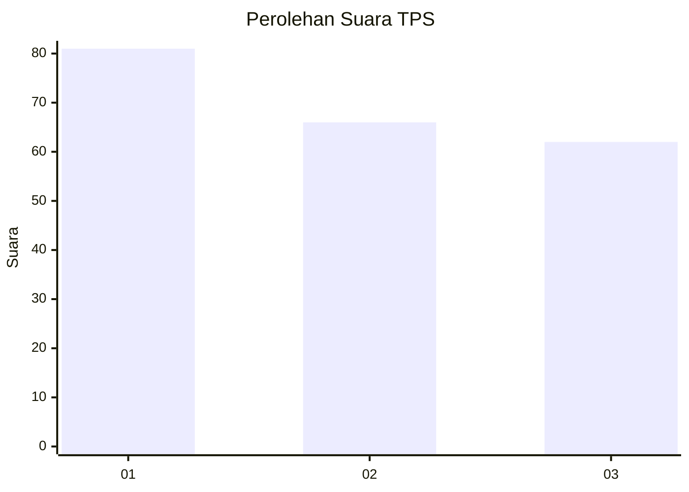
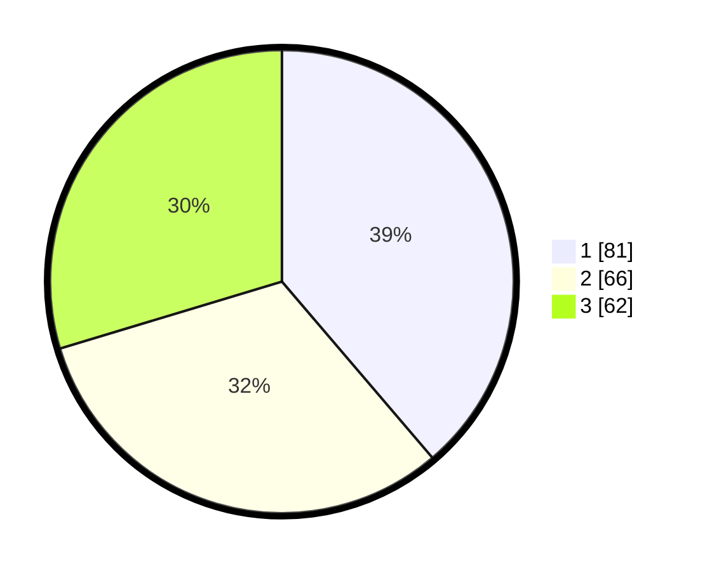

# Hasil

## Grafik

## Tabel

| No. | Nama Paslon    | Suara | Suara (raw) | Persentase |
|:--- |:-------------- | -----:| -----------:| ----------:|
| 1   | ANIES MUHAIMIN | 81    | [81][p-1]   | 38,76      |
| 2   | PRABOWO GIBRAN | 66    | [66][p-2]   | 31,58      |
| 3   | GANJAR MAHFUD  | 62    | [62][p-3]   | 29,67      |

[p-1]: https://github.com/gigit-pemilu/pemilu-2024-35-jawa-timur/blob/main/pilpres/hitung-suara/sub/35-jawa-timur/sub/26-bangkalan/sub/07-klampis/sub/2009-karang-asem/sub/002-tps/sub/paslon-1.txt
[p-2]: https://github.com/gigit-pemilu/pemilu-2024-35-jawa-timur/blob/main/pilpres/hitung-suara/sub/35-jawa-timur/sub/26-bangkalan/sub/07-klampis/sub/2009-karang-asem/sub/002-tps/sub/paslon-2.txt
[p-3]: https://github.com/gigit-pemilu/pemilu-2024-35-jawa-timur/blob/main/pilpres/hitung-suara/sub/35-jawa-timur/sub/26-bangkalan/sub/07-klampis/sub/2009-karang-asem/sub/002-tps/sub/paslon-3.txt

## Foto C Plano

https://sirekap-obj-formc.kpu.go.id/f03b/pemilu/ppwp/35/26/07/20/09/3526072009002-20240214-205423--84a8870c-82fa-47a8-8f70-03a600dcf4ef.jpg

https://sirekap-obj-formc.kpu.go.id/f03b/pemilu/ppwp/35/26/07/20/09/3526072009002-20240214-205615--92a7fda5-a485-44a2-834a-e84acb047e7c.jpg

https://sirekap-obj-formc.kpu.go.id/f03b/pemilu/ppwp/35/26/07/20/09/3526072009002-20240214-205747--16c293d4-8fc1-42ed-a80d-051f1e5ff373.jpg

## Metadata

| Key        | Value               |
| ---------- | ------------------- |
| Time Stamp | 2024-02-21 22:00:00 |

