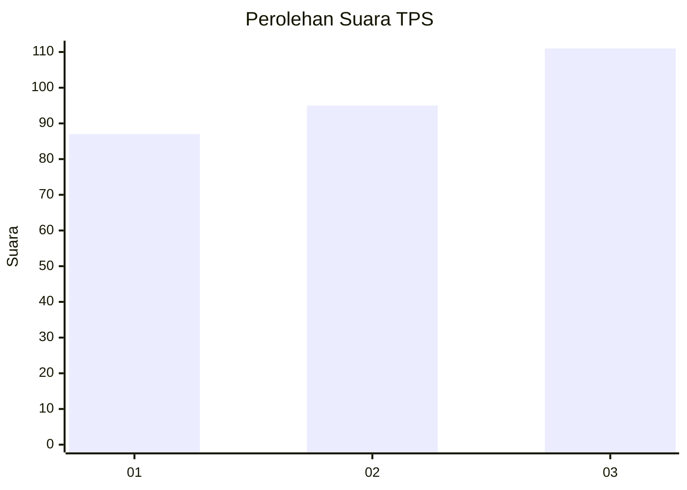
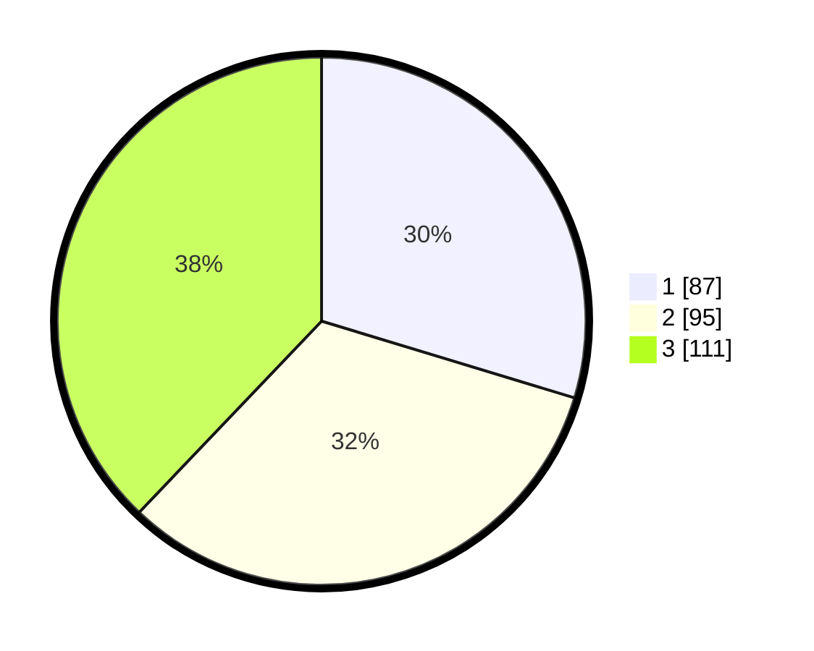

# Hasil

## Grafik

## Tabel

| No. | Nama Paslon    | Suara | Suara (raw) | Persentase |
|:--- |:-------------- | -----:| -----------:| ----------:|
| 1   | ANIES MUHAIMIN | 87    | [87][p-1]   | 29,69      |
| 2   | PRABOWO GIBRAN | 95    | [95][p-2]   | 32,42      |
| 3   | GANJAR MAHFUD  | 111   | [111][p-3]  | 37,88      |

[p-1]: https://github.com/gigit-pemilu/pemilu-2024-35-jawa-timur/blob/main/pilpres/hitung-suara/sub/35-jawa-timur/sub/26-bangkalan/sub/07-klampis/sub/2010-trogan/sub/003-tps/sub/paslon-1.txt
[p-2]: https://github.com/gigit-pemilu/pemilu-2024-35-jawa-timur/blob/main/pilpres/hitung-suara/sub/35-jawa-timur/sub/26-bangkalan/sub/07-klampis/sub/2010-trogan/sub/003-tps/sub/paslon-2.txt
[p-3]: https://github.com/gigit-pemilu/pemilu-2024-35-jawa-timur/blob/main/pilpres/hitung-suara/sub/35-jawa-timur/sub/26-bangkalan/sub/07-klampis/sub/2010-trogan/sub/003-tps/sub/paslon-3.txt

## Foto C Plano

https://sirekap-obj-formc.kpu.go.id/966f/pemilu/ppwp/35/26/07/20/10/3526072010003-20240215-002756--5dc924fa-dca3-43e3-84c3-b2a2d15cd10b.jpg

https://sirekap-obj-formc.kpu.go.id/966f/pemilu/ppwp/35/26/07/20/10/3526072010003-20240215-002926--b7f5ebc8-aa64-4453-bfb1-ef77efbf5fcc.jpg

https://sirekap-obj-formc.kpu.go.id/966f/pemilu/ppwp/35/26/07/20/10/3526072010003-20240215-003032--91ed8d4c-8b96-46ac-99ea-71abd5bb1138.jpg

## Metadata

| Key        | Value               |
| ---------- | ------------------- |
| Time Stamp | 2024-02-19 06:16:00 |

