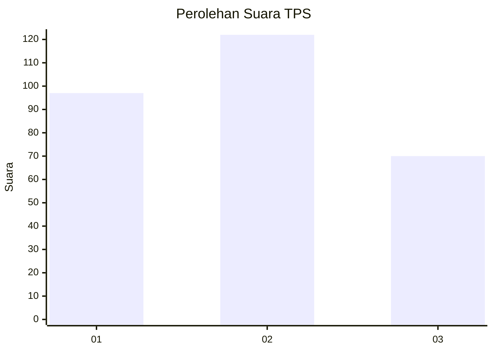
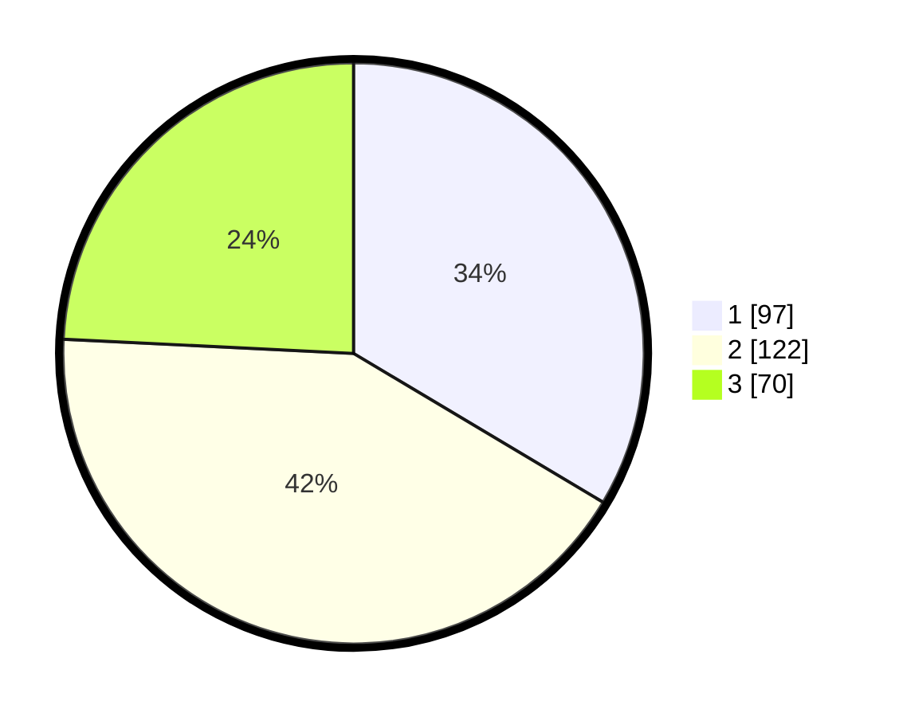

# Hasil

## Grafik

## Tabel

| No. | Nama Paslon    | Suara | Suara (raw) | Persentase |
|:--- |:-------------- | -----:| -----------:| ----------:|
| 1   | ANIES MUHAIMIN | 97    | [97][p-1]   | 33,56      |
| 2   | PRABOWO GIBRAN | 122   | [122][p-2]  | 42,21      |
| 3   | GANJAR MAHFUD  | 70    | [70][p-3]   | 24,22      |

[p-1]: https://github.com/gigit-pemilu/pemilu-2024-35-jawa-timur/blob/main/pilpres/hitung-suara/sub/35-jawa-timur/sub/26-bangkalan/sub/07-klampis/sub/2010-trogan/sub/004-tps/sub/paslon-1.txt
[p-2]: https://github.com/gigit-pemilu/pemilu-2024-35-jawa-timur/blob/main/pilpres/hitung-suara/sub/35-jawa-timur/sub/26-bangkalan/sub/07-klampis/sub/2010-trogan/sub/004-tps/sub/paslon-2.txt
[p-3]: https://github.com/gigit-pemilu/pemilu-2024-35-jawa-timur/blob/main/pilpres/hitung-suara/sub/35-jawa-timur/sub/26-bangkalan/sub/07-klampis/sub/2010-trogan/sub/004-tps/sub/paslon-3.txt

## Foto C Plano

https://sirekap-obj-formc.kpu.go.id/63be/pemilu/ppwp/35/26/07/20/10/3526072010004-20240214-215444--a056bd7a-91bf-4e77-b443-66e0f0cff550.jpg

https://sirekap-obj-formc.kpu.go.id/63be/pemilu/ppwp/35/26/07/20/10/3526072010004-20240214-215540--0f064cbb-8025-4de4-b0ca-b2744ebb1b60.jpg

https://sirekap-obj-formc.kpu.go.id/63be/pemilu/ppwp/35/26/07/20/10/3526072010004-20240214-215643--0e26c3cd-268e-4737-a0ac-9a7f7c085490.jpg

## Metadata

| Key        | Value               |
| ---------- | ------------------- |
| Time Stamp | 2024-02-19 06:16:00 |

