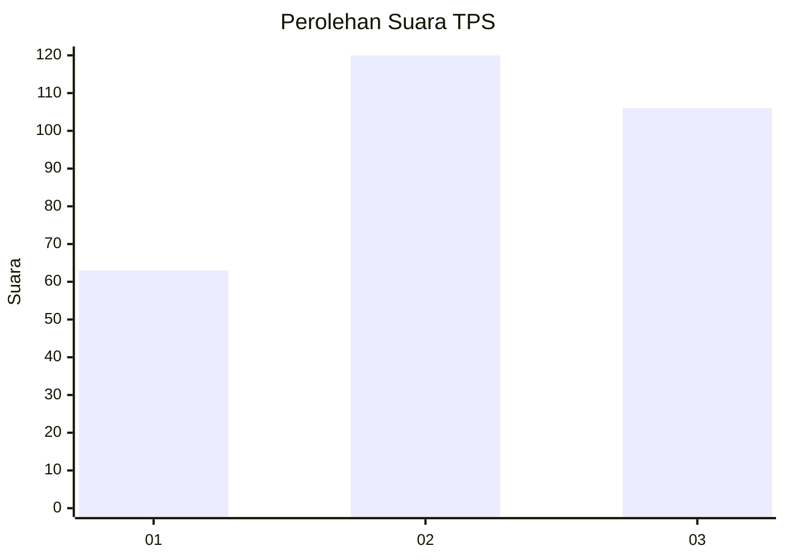
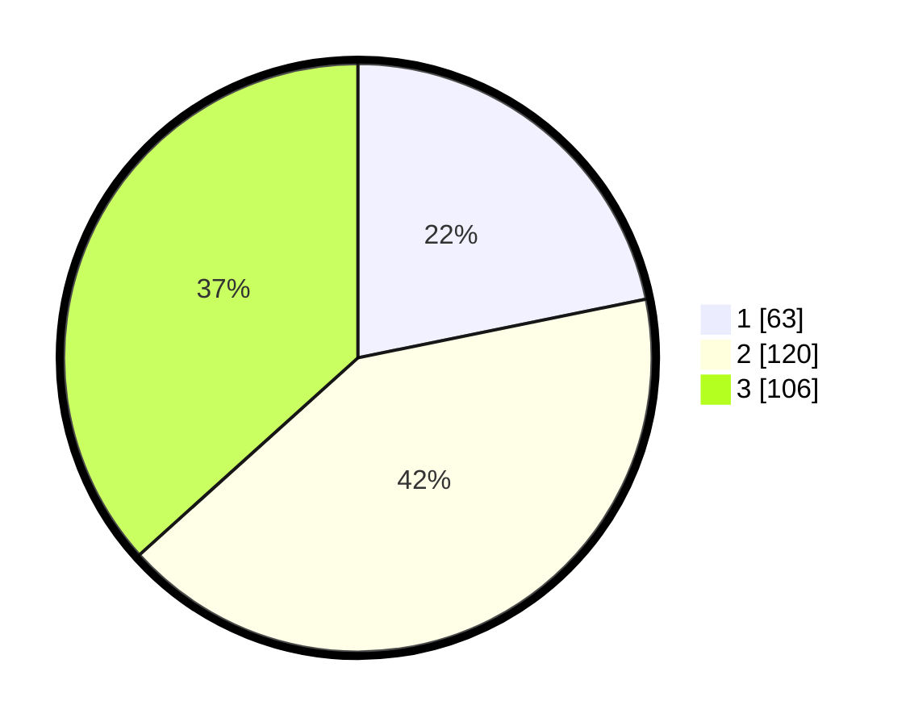

# Hasil

## Grafik

## Tabel

| No. | Nama Paslon    | Suara | Suara (raw) | Persentase |
|:--- |:-------------- | -----:| -----------:| ----------:|
| 1   | ANIES MUHAIMIN | 63    | [63][p-1]   | 21,80      |
| 2   | PRABOWO GIBRAN | 120   | [120][p-2]  | 41,52      |
| 3   | GANJAR MAHFUD  | 106   | [106][p-3]  | 36,68      |

[p-1]: https://github.com/gigit-pemilu/pemilu-2024/blob/main/pilpres/hitung-suara/sub/35-jawa-timur/sub/26-bangkalan/sub/07-klampis/sub/2010-trogan/sub/005-tps/sub/paslon-1.txt
[p-2]: https://github.com/gigit-pemilu/pemilu-2024/blob/main/pilpres/hitung-suara/sub/35-jawa-timur/sub/26-bangkalan/sub/07-klampis/sub/2010-trogan/sub/005-tps/sub/paslon-2.txt
[p-3]: https://github.com/gigit-pemilu/pemilu-2024/blob/main/pilpres/hitung-suara/sub/35-jawa-timur/sub/26-bangkalan/sub/07-klampis/sub/2010-trogan/sub/005-tps/sub/paslon-3.txt

## Foto C Plano

https://sirekap-obj-formc.kpu.go.id/d067/pemilu/ppwp/35/26/07/20/10/3526072010005-20240214-210024--7f8a9df3-4be1-439d-935a-04b3de6ba5bc.jpg

https://sirekap-obj-formc.kpu.go.id/d067/pemilu/ppwp/35/26/07/20/10/3526072010005-20240214-224141--2d2ae20b-36c8-44ab-b4ba-644db6940814.jpg

https://sirekap-obj-formc.kpu.go.id/d067/pemilu/ppwp/35/26/07/20/10/3526072010005-20240214-210428--4c3768b5-75a9-476b-a1fc-d0c86dcccbb5.jpg

## Metadata

| Key        | Value               |
| ---------- | ------------------- |
| Time Stamp | 2024-02-19 06:16:00 |

