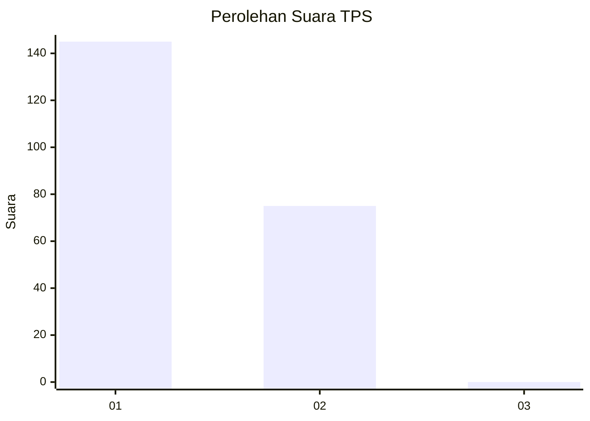
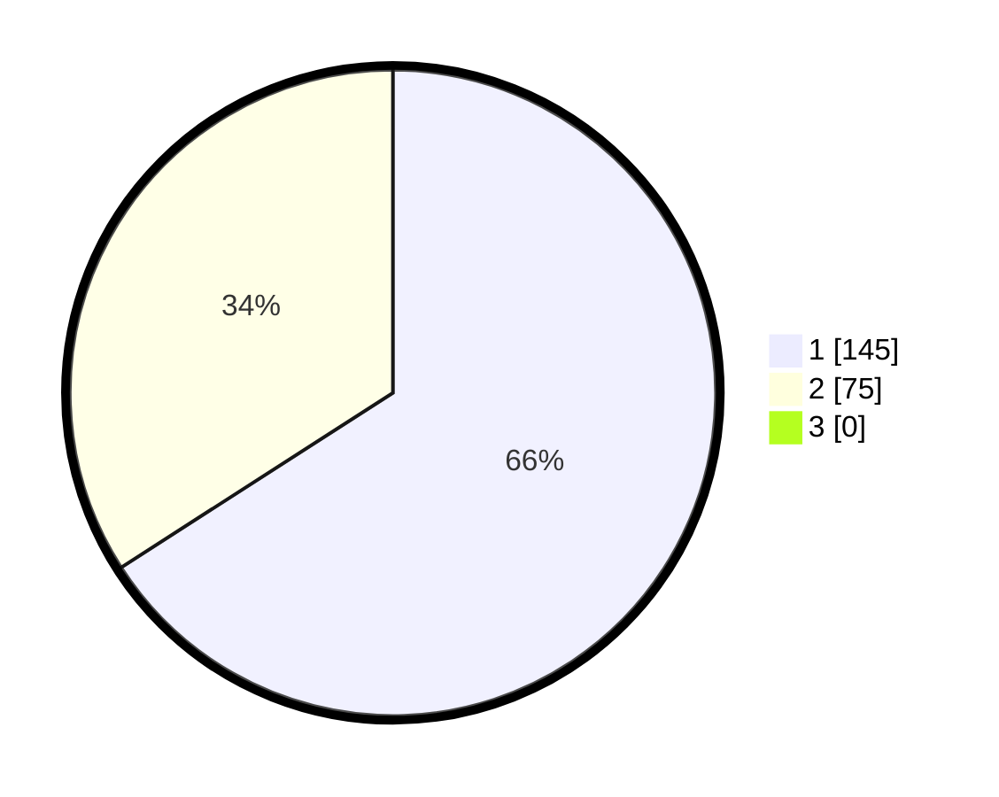

# Hasil

## Grafik

## Tabel

| No. | Nama Paslon    | Suara | Suara (raw) | Persentase |
|:--- |:-------------- | -----:| -----------:| ----------:|
| 1   | ANIES MUHAIMIN | 145   | [145][p-1]  | 65,91      |
| 2   | PRABOWO GIBRAN | 75    | [75][p-2]   | 34,09      |
| 3   | GANJAR MAHFUD  | 0     | [0][p-3]    | 0,00       |

[p-1]: https://github.com/gigit-pemilu/pemilu-2024/blob/main/pilpres/hitung-suara/sub/35-jawa-timur/sub/26-bangkalan/sub/07-klampis/sub/2011-bulung/sub/004-tps/sub/paslon-1.txt
[p-2]: https://github.com/gigit-pemilu/pemilu-2024/blob/main/pilpres/hitung-suara/sub/35-jawa-timur/sub/26-bangkalan/sub/07-klampis/sub/2011-bulung/sub/004-tps/sub/paslon-2.txt
[p-3]: https://github.com/gigit-pemilu/pemilu-2024/blob/main/pilpres/hitung-suara/sub/35-jawa-timur/sub/26-bangkalan/sub/07-klampis/sub/2011-bulung/sub/004-tps/sub/paslon-3.txt

## Foto C Plano

https://sirekap-obj-formc.kpu.go.id/a87d/pemilu/ppwp/35/26/07/20/11/3526072011004-20240214-205815--3752eca1-d79a-49e7-af66-7369b0cbd46a.jpg

https://sirekap-obj-formc.kpu.go.id/a87d/pemilu/ppwp/35/26/07/20/11/3526072011004-20240214-205926--bf36f7aa-ebaa-4ffb-823a-065d5edfc7d4.jpg

https://sirekap-obj-formc.kpu.go.id/a87d/pemilu/ppwp/35/26/07/20/11/3526072011004-20240214-210002--0766a8d8-595a-4959-8214-ab7e9373a53a.jpg

## Metadata

| Key        | Value               |
| ---------- | ------------------- |
| Time Stamp | 2024-02-21 22:00:00 |

