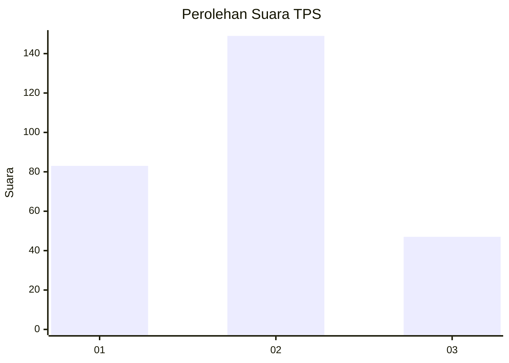
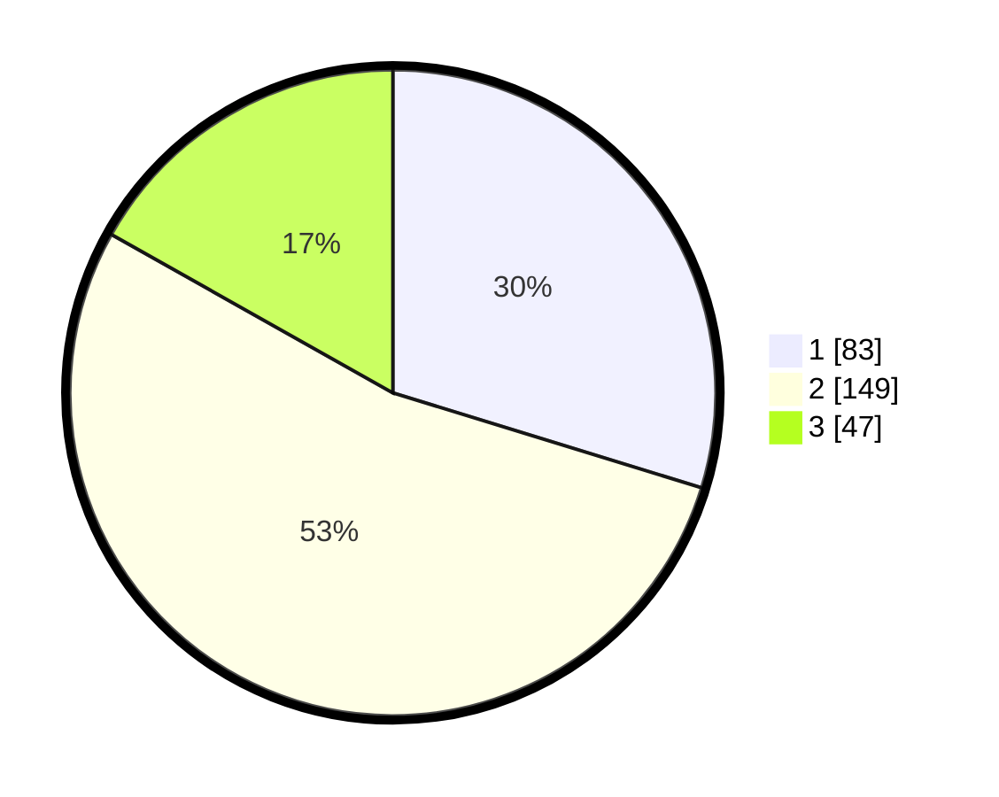

# Hasil

## Grafik

## Tabel

| No. | Nama Paslon    | Suara | Suara (raw) | Persentase |
|:--- |:-------------- | -----:| -----------:| ----------:|
| 1   | ANIES MUHAIMIN | 83    | [83][p-1]   | 29,75      |
| 2   | PRABOWO GIBRAN | 149   | [149][p-2]  | 53,41      |
| 3   | GANJAR MAHFUD  | 47    | [47][p-3]   | 16,85      |

[p-1]: https://github.com/gigit-pemilu/pemilu-2024/blob/main/pilpres/hitung-suara/sub/35-jawa-timur/sub/26-bangkalan/sub/07-klampis/sub/2013-bragang/sub/001-tps/sub/paslon-1.txt
[p-2]: https://github.com/gigit-pemilu/pemilu-2024/blob/main/pilpres/hitung-suara/sub/35-jawa-timur/sub/26-bangkalan/sub/07-klampis/sub/2013-bragang/sub/001-tps/sub/paslon-2.txt
[p-3]: https://github.com/gigit-pemilu/pemilu-2024/blob/main/pilpres/hitung-suara/sub/35-jawa-timur/sub/26-bangkalan/sub/07-klampis/sub/2013-bragang/sub/001-tps/sub/paslon-3.txt

## Foto C Plano

https://sirekap-obj-formc.kpu.go.id/423e/pemilu/ppwp/35/26/07/20/13/3526072013001-20240214-222843--b53b7948-4962-44ef-91e1-1bb21a1bff3a.jpg

https://sirekap-obj-formc.kpu.go.id/423e/pemilu/ppwp/35/26/07/20/13/3526072013001-20240214-202312--d540b950-90bd-4178-8b88-a002efa16e88.jpg

https://sirekap-obj-formc.kpu.go.id/423e/pemilu/ppwp/35/26/07/20/13/3526072013001-20240214-202512--530a0e4d-aac4-4ad2-90f5-c3acc19a3752.jpg

## Metadata

| Key        | Value               |
| ---------- | ------------------- |
| Time Stamp | 2024-02-15 00:41:44 |

