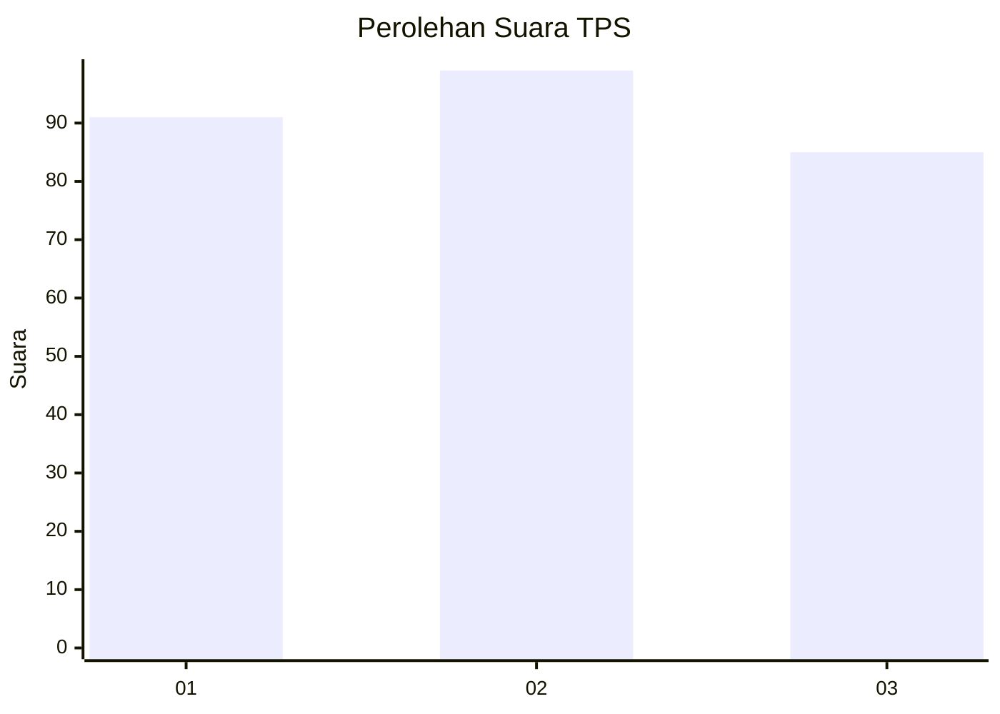
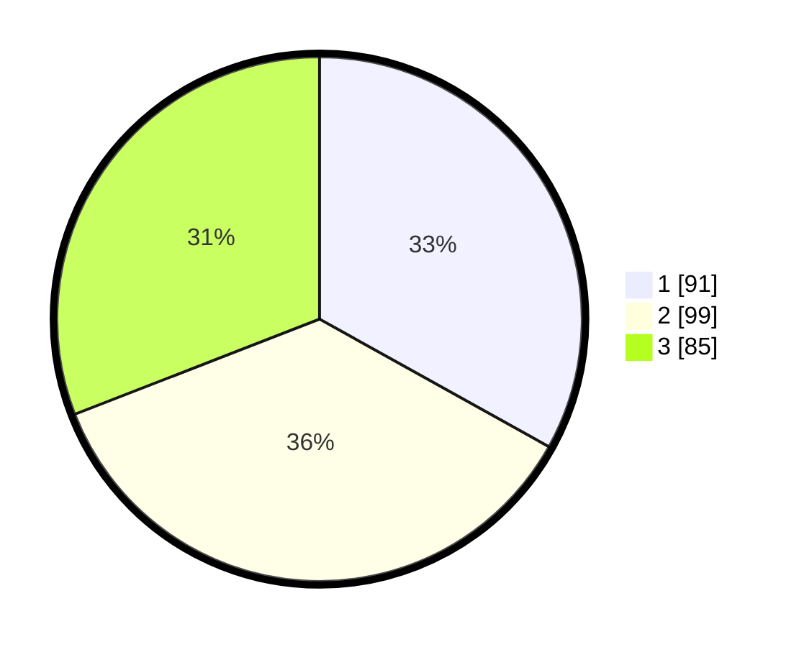

# Hasil

## Grafik

## Tabel

| No. | Nama Paslon    | Suara | Suara (raw) | Persentase |
|:--- |:-------------- | -----:| -----------:| ----------:|
| 1   | ANIES MUHAIMIN | 91    | [91][p-1]   | 33,09      |
| 2   | PRABOWO GIBRAN | 99    | [99][p-2]   | 36,00      |
| 3   | GANJAR MAHFUD  | 85    | [85][p-3]   | 30,91      |

[p-1]: https://github.com/gigit-pemilu/pemilu-2024/blob/main/pilpres/hitung-suara/sub/35-jawa-timur/sub/26-bangkalan/sub/07-klampis/sub/2013-bragang/sub/003-tps/sub/paslon-1.txt
[p-2]: https://github.com/gigit-pemilu/pemilu-2024/blob/main/pilpres/hitung-suara/sub/35-jawa-timur/sub/26-bangkalan/sub/07-klampis/sub/2013-bragang/sub/003-tps/sub/paslon-2.txt
[p-3]: https://github.com/gigit-pemilu/pemilu-2024/blob/main/pilpres/hitung-suara/sub/35-jawa-timur/sub/26-bangkalan/sub/07-klampis/sub/2013-bragang/sub/003-tps/sub/paslon-3.txt

## Foto C Plano

https://sirekap-obj-formc.kpu.go.id/cdf0/pemilu/ppwp/35/26/07/20/13/3526072013003-20240214-193240--534f6215-8f3e-4f62-a41d-207125da4dd6.jpg

https://sirekap-obj-formc.kpu.go.id/cdf0/pemilu/ppwp/35/26/07/20/13/3526072013003-20240214-193343--6d90bb34-30b9-446e-9394-6f19d66bc3e6.jpg

## Metadata

| Key        | Value               |
| ---------- | ------------------- |
| Time Stamp | 2024-02-21 21:00:04 |

