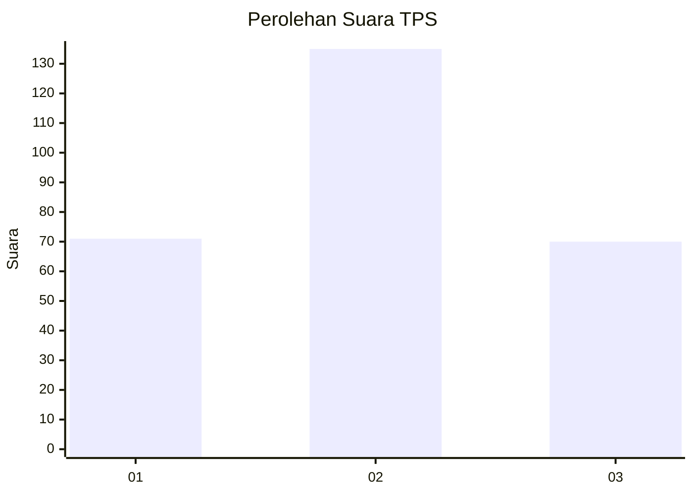
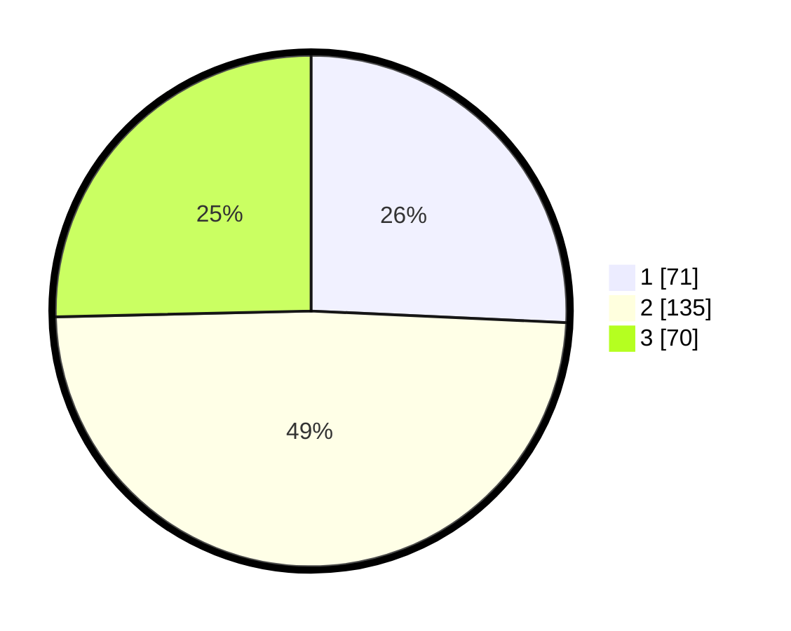

# Hasil

## Grafik

## Tabel

| No. | Nama Paslon    | Suara | Suara (raw) | Persentase |
|:--- |:-------------- | -----:| -----------:| ----------:|
| 1   | ANIES MUHAIMIN | 71    | [71][p-1]   | 25,72      |
| 2   | PRABOWO GIBRAN | 135   | [135][p-2]  | 48,91      |
| 3   | GANJAR MAHFUD  | 70    | [70][p-3]   | 25,36      |

[p-1]: https://github.com/gigit-pemilu/pemilu-2024-35-jawa-timur/blob/main/pilpres/hitung-suara/sub/35-jawa-timur/sub/26-bangkalan/sub/07-klampis/sub/2013-bragang/sub/011-tps/sub/paslon-1.txt
[p-2]: https://github.com/gigit-pemilu/pemilu-2024-35-jawa-timur/blob/main/pilpres/hitung-suara/sub/35-jawa-timur/sub/26-bangkalan/sub/07-klampis/sub/2013-bragang/sub/011-tps/sub/paslon-2.txt
[p-3]: https://github.com/gigit-pemilu/pemilu-2024-35-jawa-timur/blob/main/pilpres/hitung-suara/sub/35-jawa-timur/sub/26-bangkalan/sub/07-klampis/sub/2013-bragang/sub/011-tps/sub/paslon-3.txt

## Foto C Plano

https://sirekap-obj-formc.kpu.go.id/ffae/pemilu/ppwp/35/26/07/20/13/3526072013011-20240214-213825--6fb2a145-84d9-4ed0-a271-6eddb4f7edcf.jpg

https://sirekap-obj-formc.kpu.go.id/ffae/pemilu/ppwp/35/26/07/20/13/3526072013011-20240214-213904--7fd1dd57-5c70-4794-ac22-68f00e071eb4.jpg

https://sirekap-obj-formc.kpu.go.id/ffae/pemilu/ppwp/35/26/07/20/13/3526072013011-20240214-214949--9866789e-dc1d-45d0-9f40-e81ac879b608.jpg

## Metadata

| Key        | Value               |
| ---------- | ------------------- |
| Time Stamp | 2024-02-19 06:16:00 |

