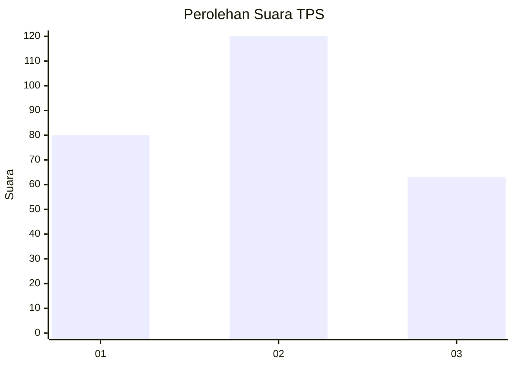
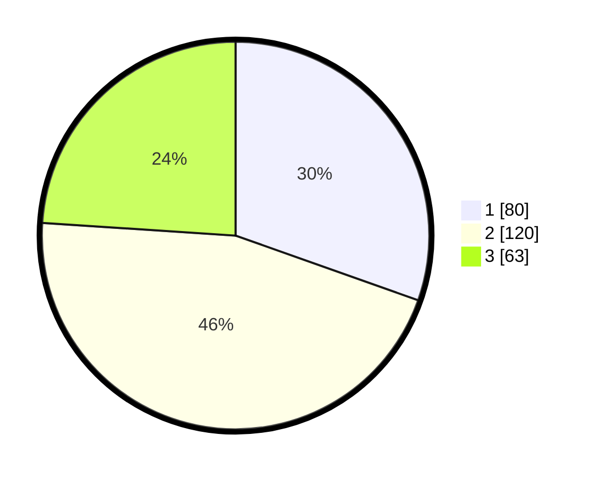

# Hasil

## Grafik

## Tabel

| No. | Nama Paslon    | Suara | Suara (raw) | Persentase |
|:--- |:-------------- | -----:| -----------:| ----------:|
| 1   | ANIES MUHAIMIN | 80    | [80][p-1]   | 30,42      |
| 2   | PRABOWO GIBRAN | 120   | [120][p-2]  | 45,63      |
| 3   | GANJAR MAHFUD  | 63    | [63][p-3]   | 23,95      |

[p-1]: https://github.com/gigit-pemilu/pemilu-2024/blob/main/pilpres/hitung-suara/sub/35-jawa-timur/sub/26-bangkalan/sub/07-klampis/sub/2017-bator/sub/012-tps/sub/paslon-1.txt
[p-2]: https://github.com/gigit-pemilu/pemilu-2024/blob/main/pilpres/hitung-suara/sub/35-jawa-timur/sub/26-bangkalan/sub/07-klampis/sub/2017-bator/sub/012-tps/sub/paslon-2.txt
[p-3]: https://github.com/gigit-pemilu/pemilu-2024/blob/main/pilpres/hitung-suara/sub/35-jawa-timur/sub/26-bangkalan/sub/07-klampis/sub/2017-bator/sub/012-tps/sub/paslon-3.txt

## Foto C Plano

https://sirekap-obj-formc.kpu.go.id/604d/pemilu/ppwp/35/26/07/20/17/3526072017012-20240214-212503--f4ce2c7e-cca0-4290-b89a-817efa63384a.jpg

https://sirekap-obj-formc.kpu.go.id/604d/pemilu/ppwp/35/26/07/20/17/3526072017012-20240214-212702--fc1a77a9-4177-4ef5-a1c4-755948e93508.jpg

https://sirekap-obj-formc.kpu.go.id/604d/pemilu/ppwp/35/26/07/20/17/3526072017012-20240214-213011--372fa36d-7813-4ec2-9639-21d1a307f62a.jpg

## Metadata

| Key        | Value               |
| ---------- | ------------------- |
| Time Stamp | 2024-02-25 17:00:00 |

