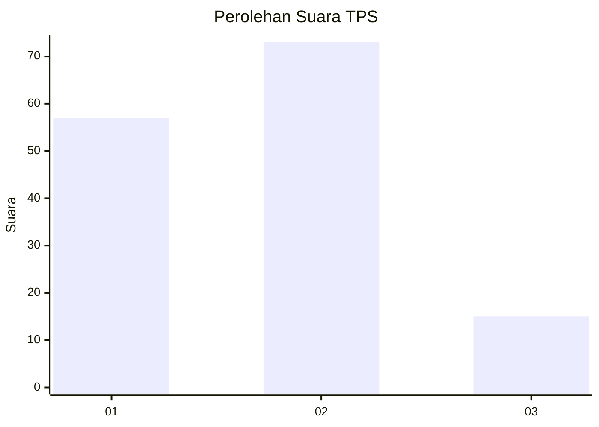
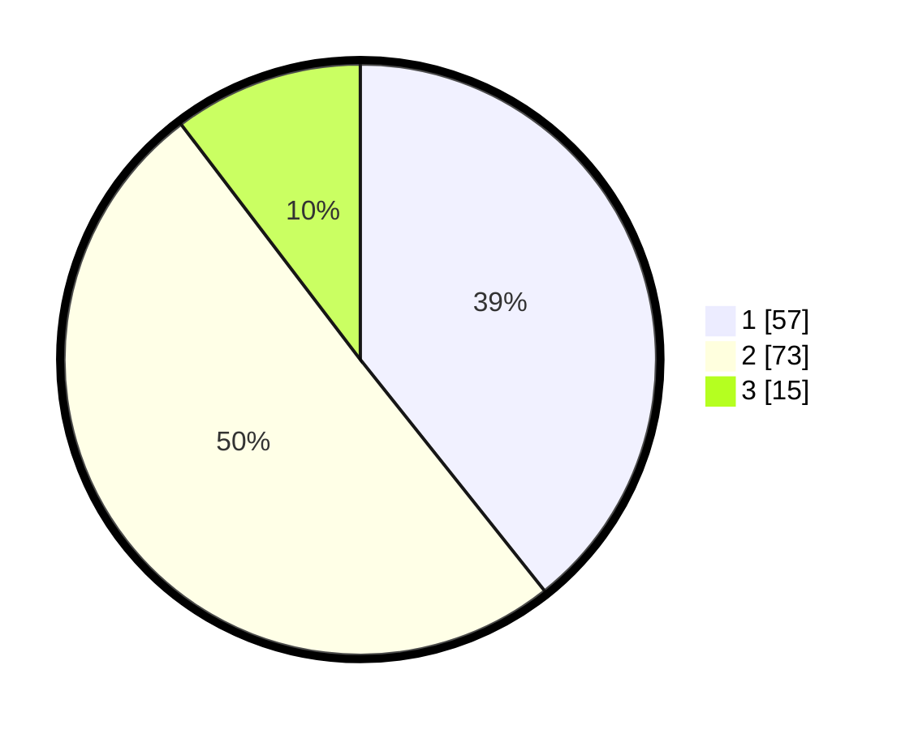

# Hasil

## Grafik

## Tabel

| No. | Nama Paslon    | Suara | Suara (raw) | Persentase |
|:--- |:-------------- | -----:| -----------:| ----------:|
| 1   | ANIES MUHAIMIN | 57    | [57][p-1]   | 39,31      |
| 2   | PRABOWO GIBRAN | 73    | [73][p-2]   | 50,34      |
| 3   | GANJAR MAHFUD  | 15    | [15][p-3]   | 10,34      |

[p-1]: https://github.com/gigit-pemilu/pemilu-2024/blob/main/pilpres/hitung-suara/sub/35-jawa-timur/sub/26-bangkalan/sub/07-klampis/sub/2019-tenggun-dajah/sub/012-tps/sub/paslon-1.txt
[p-2]: https://github.com/gigit-pemilu/pemilu-2024/blob/main/pilpres/hitung-suara/sub/35-jawa-timur/sub/26-bangkalan/sub/07-klampis/sub/2019-tenggun-dajah/sub/012-tps/sub/paslon-2.txt
[p-3]: https://github.com/gigit-pemilu/pemilu-2024/blob/main/pilpres/hitung-suara/sub/35-jawa-timur/sub/26-bangkalan/sub/07-klampis/sub/2019-tenggun-dajah/sub/012-tps/sub/paslon-3.txt

## Foto C Plano

https://sirekap-obj-formc.kpu.go.id/5a55/pemilu/ppwp/35/26/07/20/19/3526072019012-20240214-212752--1ce47723-4606-4001-942f-e91fabf176c1.jpg

https://sirekap-obj-formc.kpu.go.id/5a55/pemilu/ppwp/35/26/07/20/19/3526072019012-20240214-212839--f1b38f37-b063-4028-9736-014b022780ef.jpg

https://sirekap-obj-formc.kpu.go.id/5a55/pemilu/ppwp/35/26/07/20/19/3526072019012-20240214-212927--7e4c47cf-c016-4ee7-9eae-3cc5a145c291.jpg

## Metadata

| Key        | Value               |
| ---------- | ------------------- |
| Time Stamp | 2024-02-24 22:31:28 |

