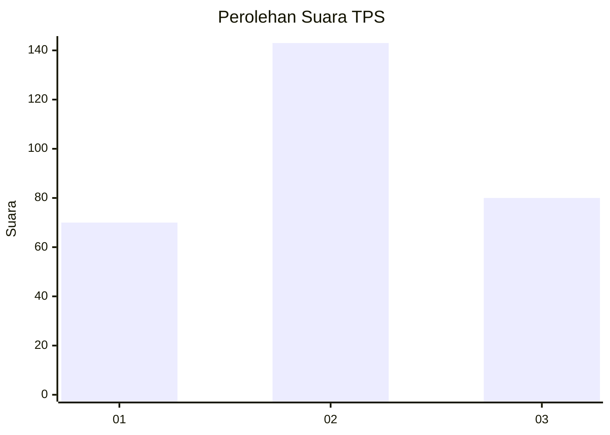
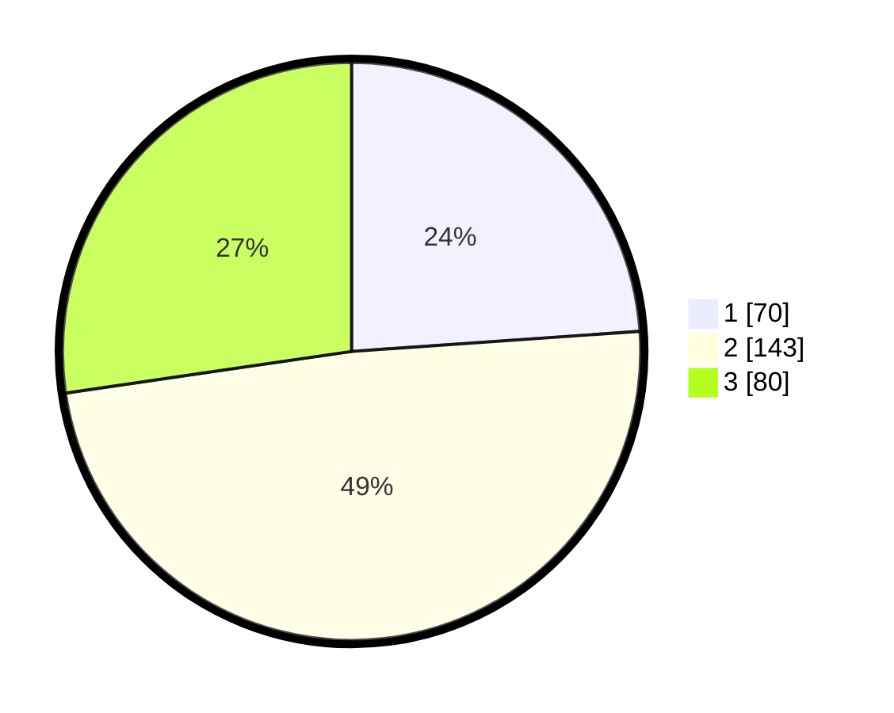

# Hasil

## Grafik

## Tabel

| No. | Nama Paslon    | Suara | Suara (raw) | Persentase |
|:--- |:-------------- | -----:| -----------:| ----------:|
| 1   | ANIES MUHAIMIN | 70    | [70][p-1]   | 23,89      |
| 2   | PRABOWO GIBRAN | 143   | [143][p-2]  | 48,81      |
| 3   | GANJAR MAHFUD  | 80    | [80][p-3]   | 27,30      |

[p-1]: https://github.com/gigit-pemilu/pemilu-2024-35-jawa-timur/blob/main/pilpres/hitung-suara/sub/35-jawa-timur/sub/26-bangkalan/sub/07-klampis/sub/2020-larangan-sorjan/sub/001-tps/sub/paslon-1.txt
[p-2]: https://github.com/gigit-pemilu/pemilu-2024-35-jawa-timur/blob/main/pilpres/hitung-suara/sub/35-jawa-timur/sub/26-bangkalan/sub/07-klampis/sub/2020-larangan-sorjan/sub/001-tps/sub/paslon-2.txt
[p-3]: https://github.com/gigit-pemilu/pemilu-2024-35-jawa-timur/blob/main/pilpres/hitung-suara/sub/35-jawa-timur/sub/26-bangkalan/sub/07-klampis/sub/2020-larangan-sorjan/sub/001-tps/sub/paslon-3.txt

## Foto C Plano

https://sirekap-obj-formc.kpu.go.id/6a47/pemilu/ppwp/35/26/07/20/20/3526072020001-20240214-214708--6dbc3705-c4a8-4670-8b15-f093e56baa57.jpg

https://sirekap-obj-formc.kpu.go.id/6a47/pemilu/ppwp/35/26/07/20/20/3526072020001-20240214-214716--6a21f4b0-5ecd-499b-8c3b-409ea8d16f02.jpg

https://sirekap-obj-formc.kpu.go.id/6a47/pemilu/ppwp/35/26/07/20/20/3526072020001-20240214-214723--e78f535b-a250-4a86-95a3-5f387e859b3e.jpg

## Metadata

| Key        | Value               |
| ---------- | ------------------- |
| Time Stamp | 2024-02-24 22:31:28 |

