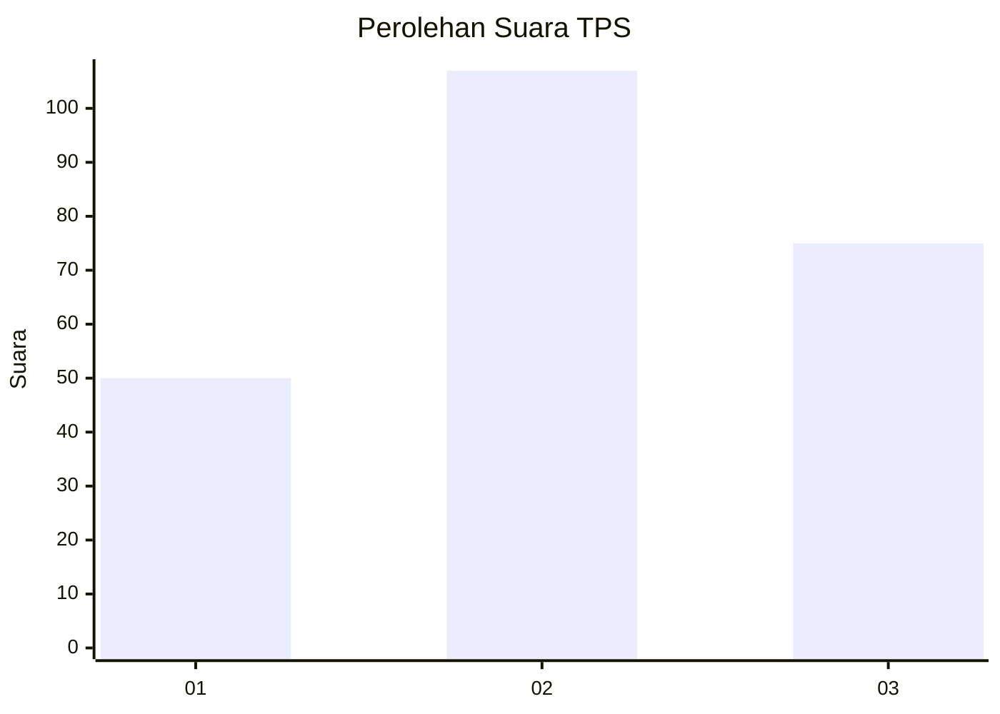
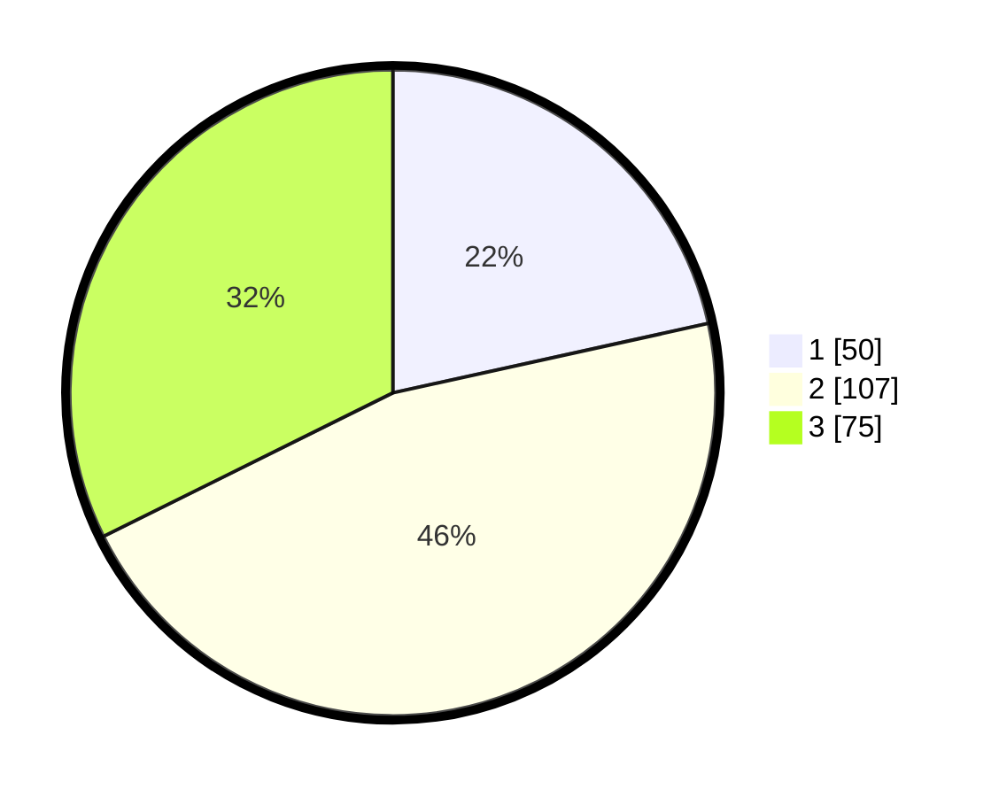

# Hasil

## Grafik

## Tabel

| No. | Nama Paslon    | Suara | Suara (raw) | Persentase |
|:--- |:-------------- | -----:| -----------:| ----------:|
| 1   | ANIES MUHAIMIN | 50    | [50][p-1]   | 21,55      |
| 2   | PRABOWO GIBRAN | 107   | [107][p-2]  | 46,12      |
| 3   | GANJAR MAHFUD  | 75    | [75][p-3]   | 32,33      |

[p-1]: https://github.com/gigit-pemilu/pemilu-2024-35-jawa-timur/blob/main/pilpres/hitung-suara/sub/35-jawa-timur/sub/26-bangkalan/sub/07-klampis/sub/2020-larangan-sorjan/sub/002-tps/sub/paslon-1.txt
[p-2]: https://github.com/gigit-pemilu/pemilu-2024-35-jawa-timur/blob/main/pilpres/hitung-suara/sub/35-jawa-timur/sub/26-bangkalan/sub/07-klampis/sub/2020-larangan-sorjan/sub/002-tps/sub/paslon-2.txt
[p-3]: https://github.com/gigit-pemilu/pemilu-2024-35-jawa-timur/blob/main/pilpres/hitung-suara/sub/35-jawa-timur/sub/26-bangkalan/sub/07-klampis/sub/2020-larangan-sorjan/sub/002-tps/sub/paslon-3.txt

## Foto C Plano

https://sirekap-obj-formc.kpu.go.id/c584/pemilu/ppwp/35/26/07/20/20/3526072020002-20240214-205032--16786959-d9ad-4c4f-84ef-94dafff413f3.jpg

https://sirekap-obj-formc.kpu.go.id/c584/pemilu/ppwp/35/26/07/20/20/3526072020002-20240214-205401--38ce1ff6-461a-4c58-a2bd-7e0d47aa8269.jpg

https://sirekap-obj-formc.kpu.go.id/c584/pemilu/ppwp/35/26/07/20/20/3526072020002-20240214-205532--d111e403-f71f-4bc7-9405-1f63df1f8d1b.jpg

## Metadata

| Key        | Value               |
| ---------- | ------------------- |
| Time Stamp | 2024-02-19 06:16:00 |

