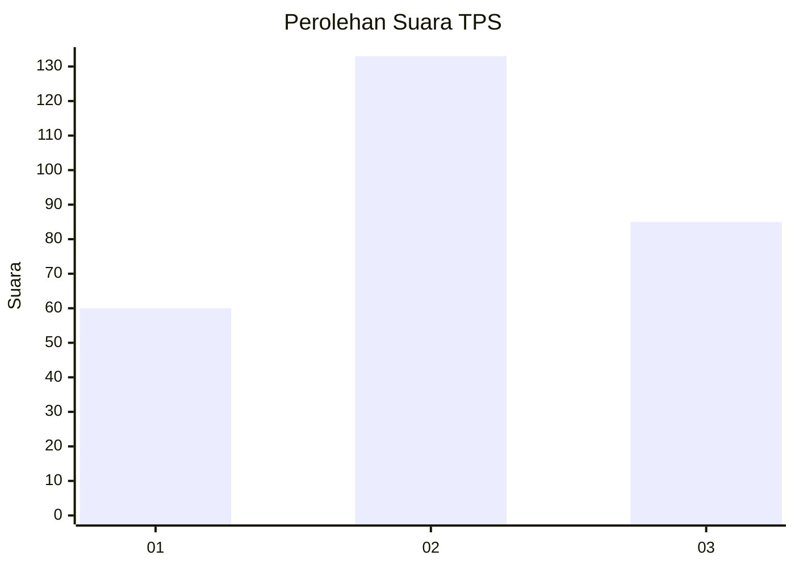
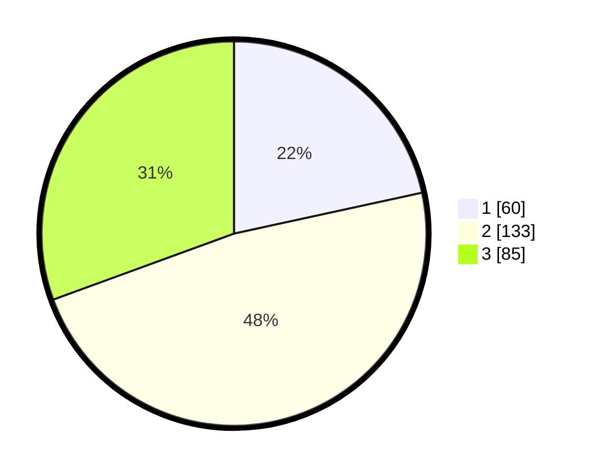

# Hasil

## Grafik

## Tabel

| No. | Nama Paslon    | Suara | Suara (raw) | Persentase |
|:--- |:-------------- | -----:| -----------:| ----------:|
| 1   | ANIES MUHAIMIN | 60    | [60][p-1]   | 21,58      |
| 2   | PRABOWO GIBRAN | 133   | [133][p-2]  | 47,84      |
| 3   | GANJAR MAHFUD  | 85    | [85][p-3]   | 30,58      |

[p-1]: https://github.com/gigit-pemilu/pemilu-2024-35-jawa-timur/blob/main/pilpres/hitung-suara/sub/35-jawa-timur/sub/26-bangkalan/sub/07-klampis/sub/2020-larangan-sorjan/sub/004-tps/sub/paslon-1.txt
[p-2]: https://github.com/gigit-pemilu/pemilu-2024-35-jawa-timur/blob/main/pilpres/hitung-suara/sub/35-jawa-timur/sub/26-bangkalan/sub/07-klampis/sub/2020-larangan-sorjan/sub/004-tps/sub/paslon-2.txt
[p-3]: https://github.com/gigit-pemilu/pemilu-2024-35-jawa-timur/blob/main/pilpres/hitung-suara/sub/35-jawa-timur/sub/26-bangkalan/sub/07-klampis/sub/2020-larangan-sorjan/sub/004-tps/sub/paslon-3.txt

## Foto C Plano

https://sirekap-obj-formc.kpu.go.id/f6d6/pemilu/ppwp/35/26/07/20/20/3526072020004-20240214-215944--c8b5b9d2-12d2-4b74-9766-cdc8fc5d8c2a.jpg

https://sirekap-obj-formc.kpu.go.id/f6d6/pemilu/ppwp/35/26/07/20/20/3526072020004-20240214-220023--603cfb1e-b882-4b29-a1dd-8ffb02600a3b.jpg

https://sirekap-obj-formc.kpu.go.id/f6d6/pemilu/ppwp/35/26/07/20/20/3526072020004-20240214-220105--4f953bf2-cb0b-4dbe-8b88-9e0c305b7a68.jpg

## Metadata

| Key        | Value               |
| ---------- | ------------------- |
| Time Stamp | 2024-02-25 13:00:00 |

