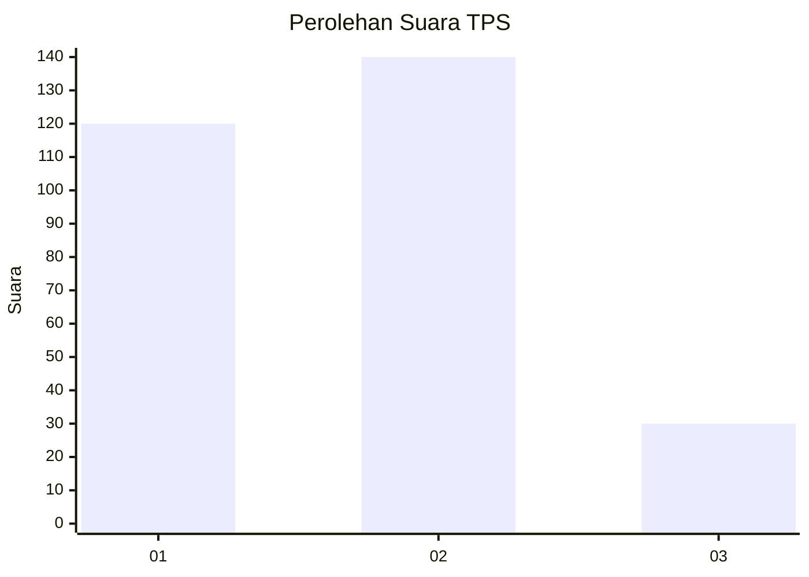
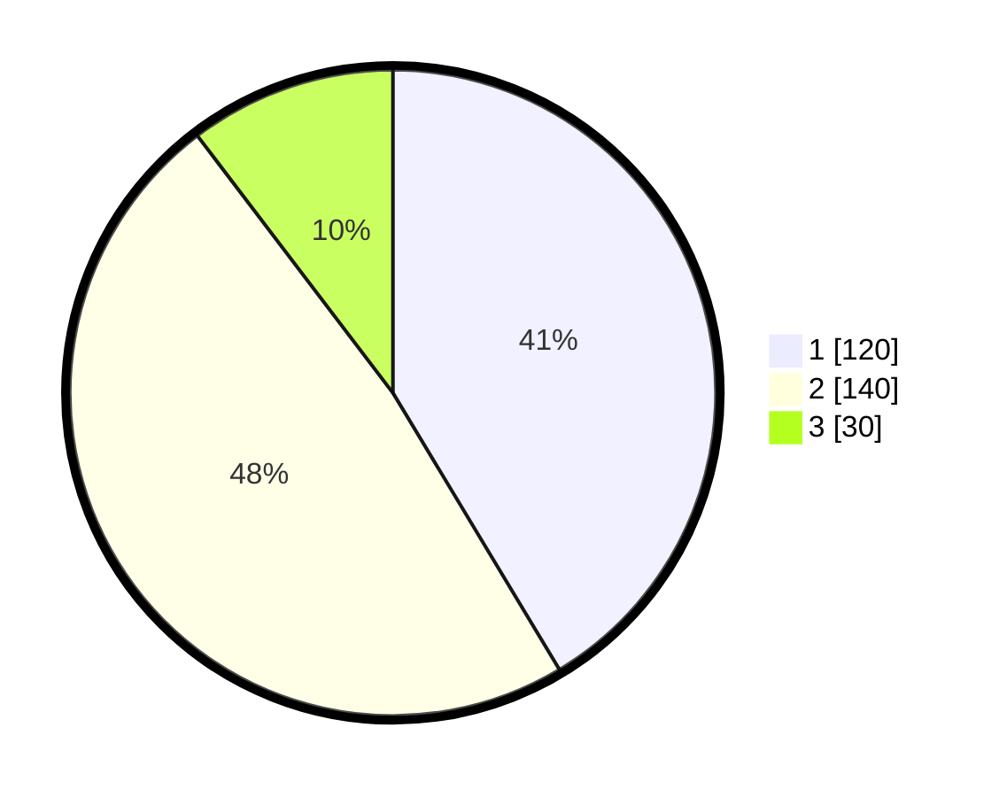

# Hasil

## Grafik

## Tabel

| No. | Nama Paslon    | Suara | Suara (raw) | Persentase |
|:--- |:-------------- | -----:| -----------:| ----------:|
| 1   | ANIES MUHAIMIN | 120   | [120][p-1]  | 41,38      |
| 2   | PRABOWO GIBRAN | 140   | [140][p-2]  | 48,28      |
| 3   | GANJAR MAHFUD  | 30    | [30][p-3]   | 10,34      |

[p-1]: https://github.com/gigit-pemilu/pemilu-2024-35-jawa-timur/blob/main/pilpres/hitung-suara/sub/35-jawa-timur/sub/26-bangkalan/sub/07-klampis/sub/2021-larangan-glintong/sub/002-tps/sub/paslon-1.txt
[p-2]: https://github.com/gigit-pemilu/pemilu-2024-35-jawa-timur/blob/main/pilpres/hitung-suara/sub/35-jawa-timur/sub/26-bangkalan/sub/07-klampis/sub/2021-larangan-glintong/sub/002-tps/sub/paslon-2.txt
[p-3]: https://github.com/gigit-pemilu/pemilu-2024-35-jawa-timur/blob/main/pilpres/hitung-suara/sub/35-jawa-timur/sub/26-bangkalan/sub/07-klampis/sub/2021-larangan-glintong/sub/002-tps/sub/paslon-3.txt

## Foto C Plano

https://sirekap-obj-formc.kpu.go.id/ed80/pemilu/ppwp/35/26/07/20/21/3526072021002-20240215-015807--df635da1-ff06-4399-8b4d-7a59f348265f.jpg

https://sirekap-obj-formc.kpu.go.id/ed80/pemilu/ppwp/35/26/07/20/21/3526072021002-20240215-015919--f24321bc-0d55-4547-b7fb-98f36b6a44aa.jpg

https://sirekap-obj-formc.kpu.go.id/ed80/pemilu/ppwp/35/26/07/20/21/3526072021002-20240215-020039--fdc58aad-19a6-4693-9c69-582612128057.jpg

## Metadata

| Key        | Value               |
| ---------- | ------------------- |
| Time Stamp | 2024-02-16 10:00:28 |

