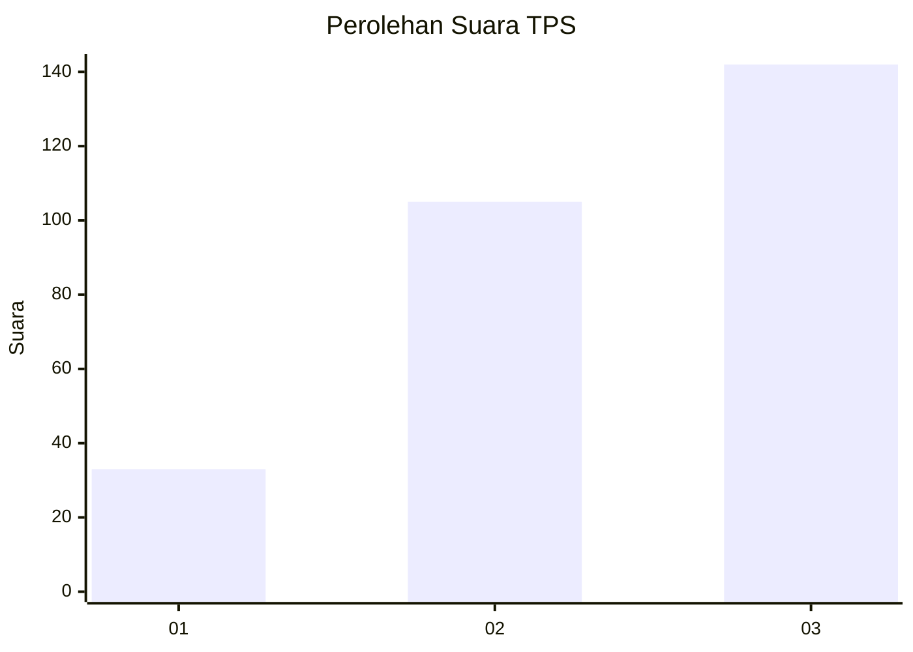
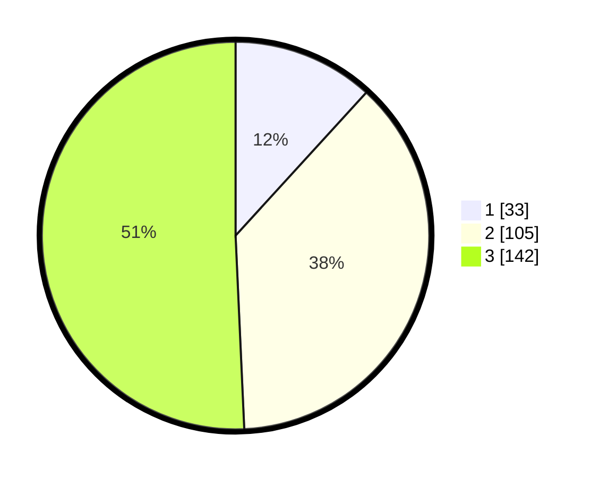

# Hasil

## Grafik

## Tabel

| No. | Nama Paslon    | Suara | Suara (raw) | Persentase |
|:--- |:-------------- | -----:| -----------:| ----------:|
| 1   | ANIES MUHAIMIN | 33    | [33][p-1]   | 11,79      |
| 2   | PRABOWO GIBRAN | 105   | [105][p-2]  | 37,50      |
| 3   | GANJAR MAHFUD  | 142   | [142][p-3]  | 50,71      |

[p-1]: https://github.com/gigit-pemilu/pemilu-2024-35-jawa-timur/blob/main/pilpres/hitung-suara/sub/35-jawa-timur/sub/26-bangkalan/sub/07-klampis/sub/2021-larangan-glintong/sub/004-tps/sub/paslon-1.txt
[p-2]: https://github.com/gigit-pemilu/pemilu-2024-35-jawa-timur/blob/main/pilpres/hitung-suara/sub/35-jawa-timur/sub/26-bangkalan/sub/07-klampis/sub/2021-larangan-glintong/sub/004-tps/sub/paslon-2.txt
[p-3]: https://github.com/gigit-pemilu/pemilu-2024-35-jawa-timur/blob/main/pilpres/hitung-suara/sub/35-jawa-timur/sub/26-bangkalan/sub/07-klampis/sub/2021-larangan-glintong/sub/004-tps/sub/paslon-3.txt

## Foto C Plano

https://sirekap-obj-formc.kpu.go.id/bd27/pemilu/ppwp/35/26/07/20/21/3526072021004-20240214-220339--6ed331bd-a565-48fa-84ca-c20de56d172c.jpg

https://sirekap-obj-formc.kpu.go.id/bd27/pemilu/ppwp/35/26/07/20/21/3526072021004-20240214-220709--eee7897d-7678-497a-a89d-c709b3cb4ddd.jpg

https://sirekap-obj-formc.kpu.go.id/bd27/pemilu/ppwp/35/26/07/20/21/3526072021004-20240214-221029--a4c9490c-542a-4153-b773-8d9b3918ec5c.jpg

## Metadata

| Key        | Value               |
| ---------- | ------------------- |
| Time Stamp | 2024-02-19 06:16:00 |

